## Machine Information

- **Machine Name:** Nibbles
- **Machine IP:** 10.10.10.75
- **Machine Type:** Easy
- **Machine OS:** Linux

## Reconnaissance - gathering information

Reconnaissance might sound boring, but if you perform it correctly then there is no machine that cannot get hacked by you. It is a very crucial step before starting anything, because from this step you will gather information about the target, and information is the source of all vulnerabilities.

> *"The more an information is valuable, the more it is vulnerable"*

### Ports and Services Scan

Imagine a situation, where you are told to rob a royal palace and the only thing you are given is the *address* of that royal palace. What would be your next step? If you are thinking to go to the address and try looking for *open doors or ports* then you are correct. Similarly, the best way to start our hacking journey is to find out open ports and services that are available to communicate with the world.

**Command I performed:**
- `sudo nmap -sV -sC -p- -O 10.10.10.75 | tee nmapNibbles.txt`

**Understanding the command:**
- `-sV` - Used to scan for service versions
- `-sC` - Used to scan for default NSE scripts on services
- `-p-` - Used to scan all ports
- `-O` - Used for OS detection

**Output:**
```
Starting Nmap 7.94SVN ( [https://nmap.org](https://nmap.org) ) at 2025-04-08 22:26 EDT
Nmap scan report for 10.10.10.75
Host is up (0.020s latency).
Not shown: 65533 closed tcp ports (reset)
PORT   STATE SERVICE VERSION
22/tcp open  ssh     OpenSSH 7.2p2 Ubuntu 4ubuntu2.2 (Ubuntu Linux; protocol 2.0)
| ssh-hostkey:
|   2048 c4:f8:ad:e8:f8:04:77:de:cf:15:0d:63:0a:18:7e:49 (RSA)
|   256 22:8f:b1:97:bf:0f:17:08:fc:7e:2c:8f:e9:77:3a:48 (ECDSA)
|_  256 e6:ac:27:a3:b5:a9:f1:12:3c:34:a5:5d:5b:eb:3d:e9 (ED25519)
80/tcp open  http    Apache httpd 2.4.18 ((Ubuntu))
|_http-title: Site doesn't have a title (text/html).
|_http-server-header: Apache/2.4.18 (Ubuntu)
No exact OS matches for host (If you know what OS is running on it, see [https://nmap.org/submit/](https://nmap.org/submit/) ).
TCP/IP fingerprint:
OS:SCAN(V=7.94SVN%E=4%D=4/8%OT=22%CT=1%CU=43521%PV=Y%DS=2%DC=I%G=Y%TM=67F5D
OS:B13%P=x86_64-pc-linux-gnu)SEQ(SP=100%GCD=1%ISR=10F%TI=Z%CI=I%II=I%TS=8)S
OS:EQ(SP=100%GCD=1%ISR=110%TI=Z%CI=I%II=I%TS=8)OPS(O1=M53CST11NW7%O2=M53CST
OS:11NW7%O3=M53CNNT11NW7%O4=M53CST11NW7%O5=M53CST11NW7%O6=M53CST11)WIN(W1=7
OS:120%W2=7120%W3=7120%W4=7120%W5=7120%W6=7120)ECN(R=Y%DF=Y%T=40%W=7210%O=M
OS:53CNNSNW7%CC=Y%Q=)T1(R=Y%DF=Y%T=40%S=O%A=S+%F=AS%RD=0%Q=)T2(R=N)T3(R=N)T
OS:4(R=Y%DF=Y%T=40%W=0%S=A%A=Z%F=R%O=%RD=0%Q=)T5(R=Y%DF=Y%T=40%W=0%S=Z%A=S+
OS:%F=AR%O=%RD=0%Q=)T6(R=Y%DF=Y%T=40%W=0%S=A%A=Z%F=R%O=%RD=0%Q=)T7(R=Y%DF=Y
OS:%T=40%W=0%S=Z%A=S+%F=AR%O=%RD=0%Q=)U1(R=Y%DF=N%T=40%IPL=164%UN=0%RIPL=G%
OS:RID=G%RIPCK=G%RUCK=G%RUD=G)IE(R=Y%DFI=N%T=40%CD=S)
Network Distance: 2 hops
Service Info: OS: Linux; CPE: cpe:/o:linux:linux_kernel
OS and Service detection performed. Please report any incorrect results at [https://nmap.org/submit/](https://nmap.org/submit/) .
Nmap done: 1 IP address (1 host up) scanned in 39.04 seconds
```

Analyzing the output we can say that there are two ports/services open, and they are 22/tcp - ssh and 80/tcp - http. On port 80, the apache version running is **Apache 2.4.18**, and on port 22 we have **OpenSSH 7.2p2** which doesn't look vulnerable. With the first glance, I will try analyzing website rather than SSH.

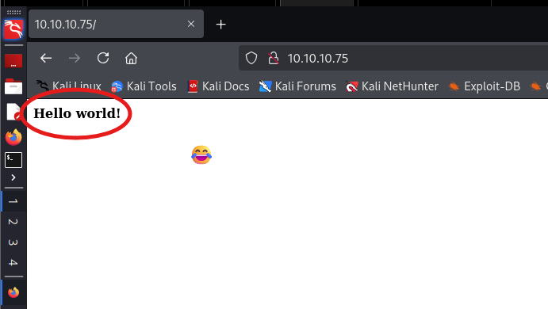

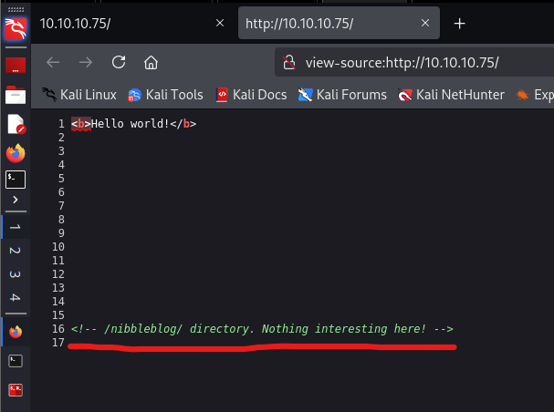

Well, a page displaying "Hello world!", that could not have gone more wrong. Was this page built by a student from HTML class? Anyways, we directly moved to the source code without wasting our time and we found a very interesting comment. It was indirectly pointing to a subdirectory named /nibbleblog.

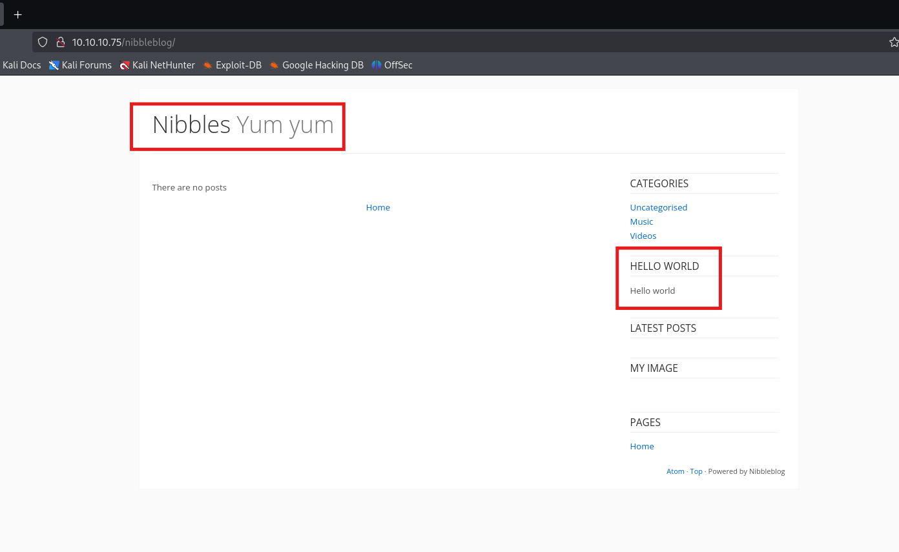

We found a home page, that looks like a home page of a blogpost site, and on the bottom right corner there is a string stating "Powered by nibbleblog", which means that the CMS used for this webpage is actually nibbleblog. I had no idea about this CMS, so after some googling I found that it is used for blogging sites.

**Command I performed:**
- `gobuster dir --url http://10.10.10.75/nibbleblog/ --wordlist /usr/share/wordlists/dirb/small.txt -x .php`

**Understanding the command:**
- `dir` - doing a directory search
- `--url` - used for providing a URL
- `--wordlist` - used for providing a wordlist
- `-x` - used to mention what specific extension to search for

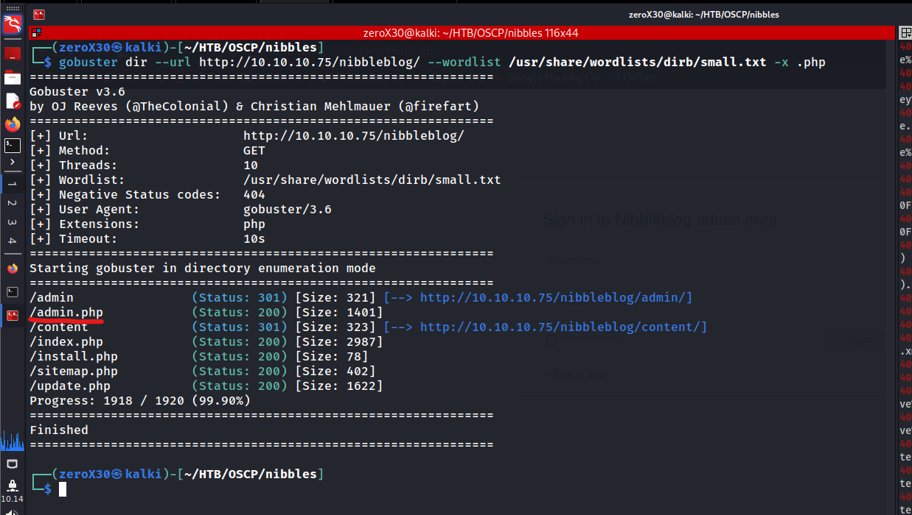

The scan was finished quick because I used a small wordlist, but we did found few interesting things. My focus was primarily on admin.php and update.php, but I still analyzed other things and found nothing to focus upon. 

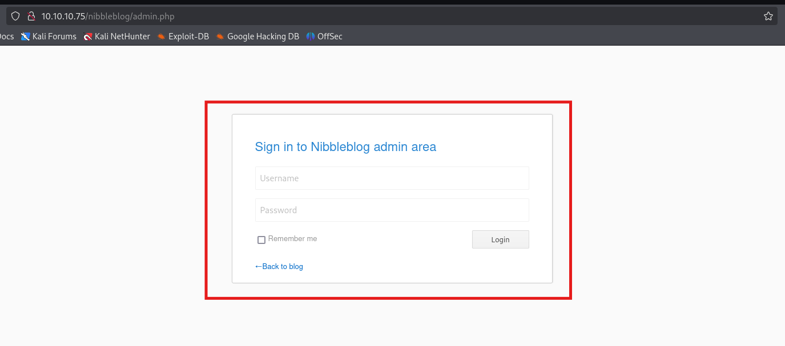

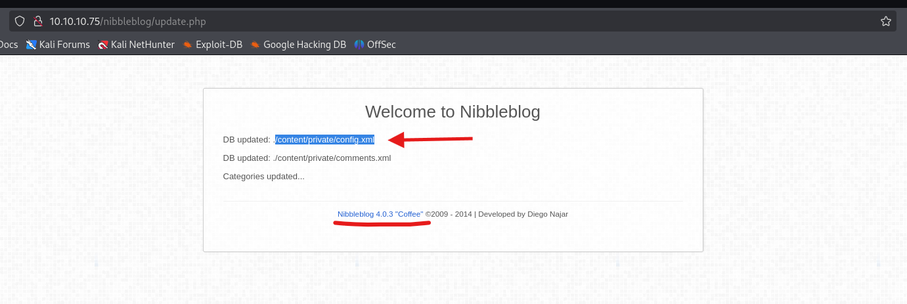

When I was looking through admin.php, I found a admin login portal which looked similar like a wordpress login page. I wanted to try default passwords (admin/admin admin/password admin/nibbles) on it, but I first checked update.php and found a message that stated *"DB updated: /content/private/config.xml"* and it also displayed the version *"Nibbleblog 4.0.3 Coffee"*. 

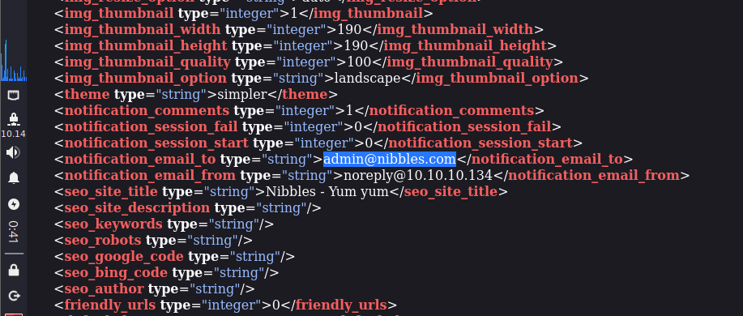

I was curious to check config.xml file so I opened it on my browser and found a email address. This can be useful so I noted it down and then decided to run feroxbuster recursively to find something.

**Command I performed:**
- `feroxbuster --url http://10.10.10.75/nibbleblog/content/private/ --wordlist /usr/share/wordlists/dirbuster/directory-list-2.3-medium.txt -x .xml`

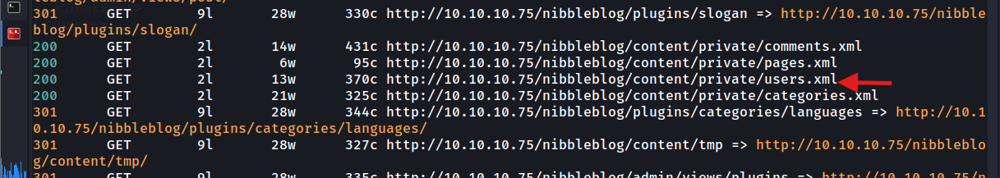

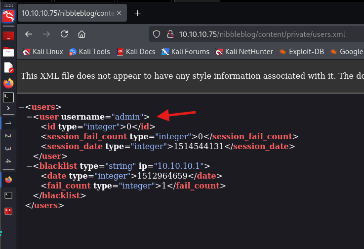

I found a *users.xml* file that seems like storing some information, because files that have common names like users, admin, password and logs are generally storing some kind of useful information. After opening the xml file, I was confirmed that the user is admin. Now I just wanted the password, so I tried everything but did not found anything, so I decided to go with default passwords and guess what, it is *nibbles*.

I was successfully able to login to the nibbleblog dashboard with the following credentials:
- **Username:** admin
- **Password:** nibbles

## Exploitation - breaking the system

We are inside the admin dashboard, and we now have enough information to break the system. Exploitation simply means when you perform something that gives you access within the system. As far as my knowledge goes, this machine has a section of privilege escalation, it means that the first foothold will be of a normal user.

### Initial Foothold

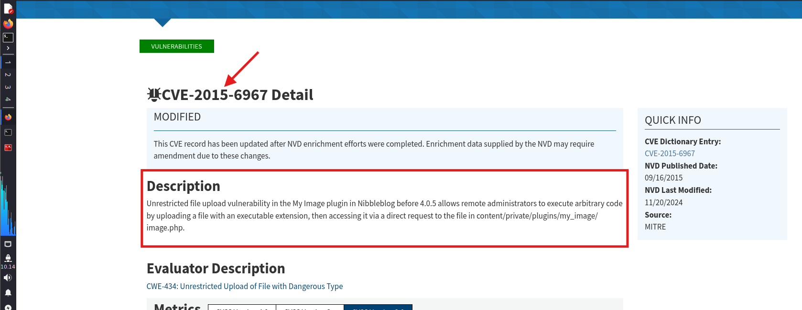

I started looking for vulnerabilities in nibbleblog 4.0.3, and found a vulnerability to execute arbitrary code by uploading a malicious file. It can be performed manually (which I will upload soon as second part), but in this part we will perform it through tools by understanding them properly. 

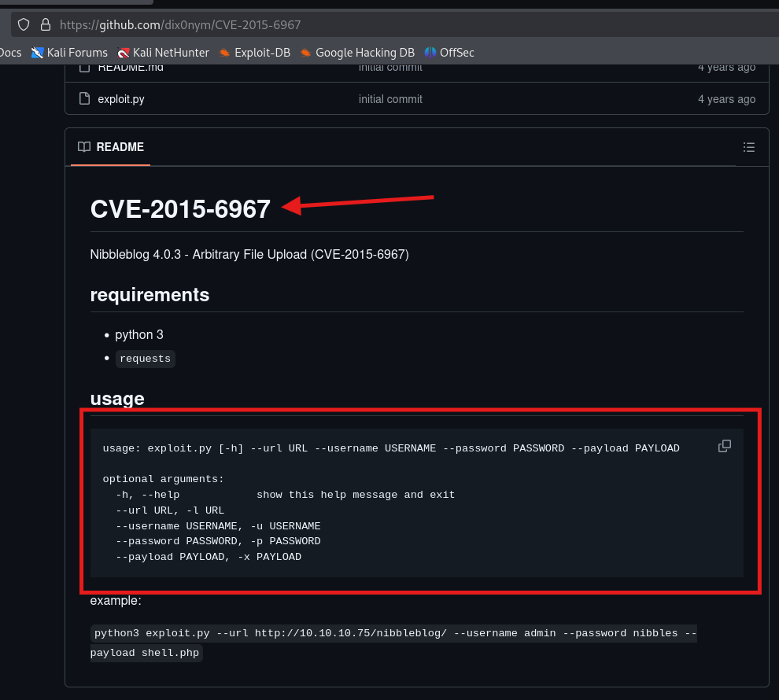

I was finally able to find a exploit for the vulnerability and I immediately downloaded it in my system. I will be modifying it as per my own taste, but you can run it without putting any chances. Just make sure you put the arguments for the exploit correctly.

**Links:**
1. [CVE-2015-6967](https://nvd.nist.gov/vuln/detail/CVE-2015-6967)
2. [Exploit](https://github.com/dix0nym/CVE-2015-6967)

**Command I performed (for exploit):**
- `nc -lnvp 1234`
- `python3 exploit.py --url http://10.10.10.75/nibbleblog/ --username admin --password nibbles --payload php-reverse-shell.php`

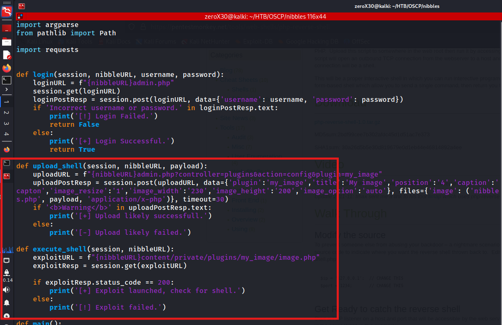

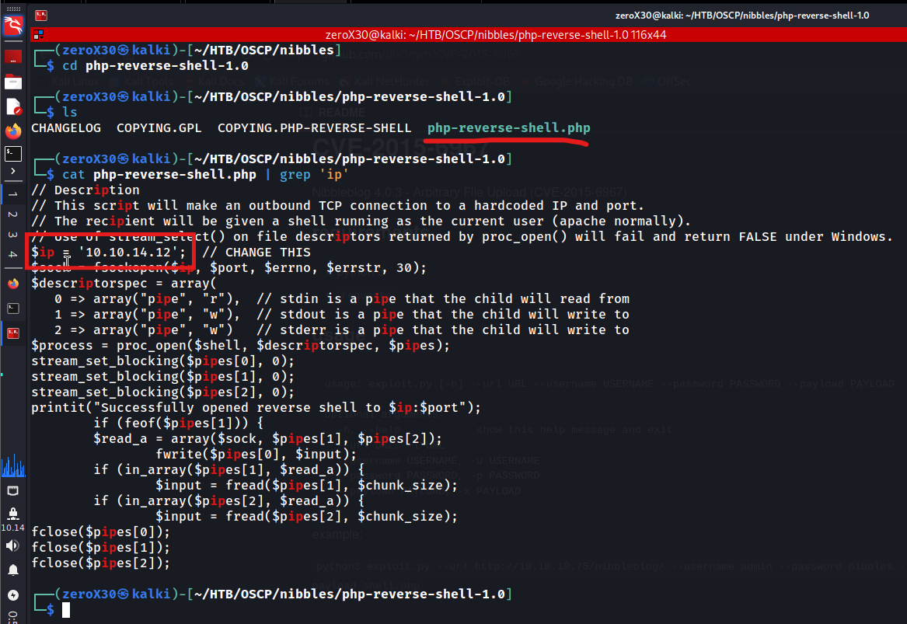

The exploit uploads a malicious executable (php in this case) file on the target and we will get a reverse shell on our listerner. You can create your own payload (will show that soon) or you can download the payload from [PentestMonkey](https://pentestmonkey.net/) and edit down your source IP there (as marked in red). The default port that the payload uses is 1234, you can change that too if you want.

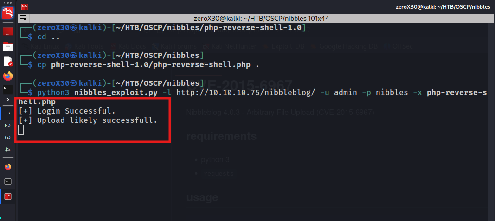

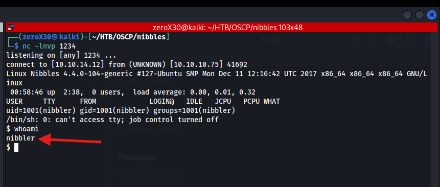

First I establish a listener on one of my terminal and then I execute the exploit, we can see that it was successful in uploading the file and we get a reverse connection on our listener. At first, we get a user level access, so I immediately print down the user flag.

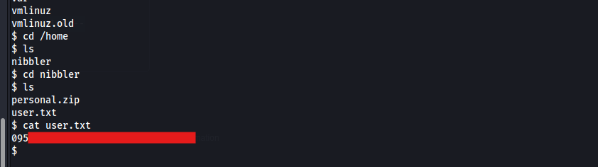

After getting the user flag, I started my search for binaries that can be used for privilege escalation. 

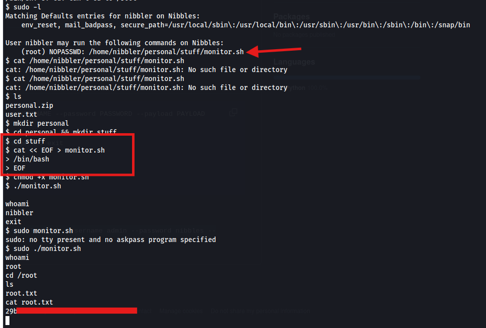

Honestly, this privilege escalation was smooth. I did took a little research but I was able to pull it in a short time. You can see that user nibbler has rights to execute monitor.sh file with NOPASSWD attribute. I looked for that file and it was not there, which means I can create an exact same file with the same name and the system will take that as the monitor.sh file (NOPASSWD).

I create a file with that name and write a basic shell executable instruction. I run the monitor.sh with sudo and I get root access, and was successful to get the root flag.

## Conclusion - what was learned

It is very important to review all the things you have performed and go through deeply in all the exploits and vulnerabilities that you encountered during the hack. I recommend that if you have time then definitely go deep in errors also, and rabbit holes because they will give you a deeper understanding about the architecture of the target system. Sometimes, a firewall might be blocking your connection, and by analyzing it you may find ways to bypass it or even get a good knowledge on how the firewall is actually working.

### Vulnerabilities - what was exploited

In this section, I will be going through all the vulnerabilities that lead me to the root of the system. There might be more vulnerabilities, or other ways through which this target can get hacked, I would love if you guys can ping me those techniques on my discord's HTB channel, link of the discord will be below.

#### Exposing sensitive files - descriptive messages

When we were performing gobuster on the URL http://10.10.10.75/nibbleblog/, we did found two interesting things. One was admin.php which is not the issue, but the second one update.php was revealing too much information. It gave us the location of the **config.xml** file which was holding sensitive information related to the software configuration. 

We also did directory search on http://10.10.10.75/nibbleblog/content/private/, which lead us to the **users.xml**. It was again a sensitive file, and private directories should be kept forbidden from the public access. Fortunately, we were able to access users.xml file and were able to determine the exact username for the admin panel.

##### Fix - what can be done
There is only one possible way to fix this issue, and it is to allocate file and directory permission wisely and now giving access to sensitive files/directories to the world

#### Default credentials - not using strong credentials

After our user enumeration, we were easily able to guess the password for the admin user, because it was one of the default password used by the nibbleblog service. It might sound weird but there are so many organizations and individuals who do not care to change the default password of their services or products.

> *"Just because it is password protected does not mean it is secure"*

Guessing a regularly used password "drowssap" (reverse of password) is easy to hack in just few seconds, guessing a most common password (name@birthdate) is again easier to guess. Unfortunately, using the default password and getting hacked is complete disaster. Honestly, I do not even call this actual hacking, even a kid from school can guess the default credential.

##### Fix - what can be done
The most recommended advice is to go in configuration files of all the services/products that are available on your system and changes their default passwords to something secure and memorable. 

In this system, log into your admin account > go to settings section of admin panel > Look for the option of **Change Password** > and change the password to something secure.

#### Malicious File Upload - someone uploaded a php!

It might sound weird but if you have a site that takes user input for file upload, then a user can possibly upload a php and get access to your system. If you do not have a service or product that uses proper sanitization of the files uploaded, then it is pretty easy to hack your system. 

> *"Never trust user inputs, not all users are innocent and not all innocents can be your user"*

I have shown how to exploit this vulnerability using an exploit, but this can be done manually and I will be soon posting on that. So, a hacker will not even need exploit or payload to hack this, it is more simpler.

##### Fix - what can be done
If you are using nibbleblog CMS below the version of 4.0.5, then this vulnerability exists and the recommended advice is to update your nibbleblog above 4.0.5 version, because the organization has patched the service after 4.0.5.

If you still wish to use nibbleblog 4.0.3, then it is suggested not to reveal it to public and keep the access limited to few people and change the default password to something secure. If an attacker cannot access admin login portal or admin dashboard, he cannot perform this attack. To perform this attack, it is required to have login credentials, so it is strongly advised to change the credentials to something secure.

#### Privilege Escalation - non-existing file given high permission

After getting the initial foothold, we found that the sudo permissions were for our user were linked to an executable file that was not there. This could be used by an attacker to create the same file and escalate his privileges.

##### Fix - what can be done
The following are solution for this situation:
1. Do not use a user with sensitive information for your website, create a special user with lowest privileges that is used behind a website.
2. Never use NOPASSWD attribute of the sudo permission if not needed.
3. Set sudo permissions to a file wisely.

That's it for this hack, I will soon release the part 2 (which will only demonstrate the manual exploit) and for more detail on exploit, follow my discord:
[Discord - CYBER X ARMY](https://discord.gg/wyfwSxn3YB)
