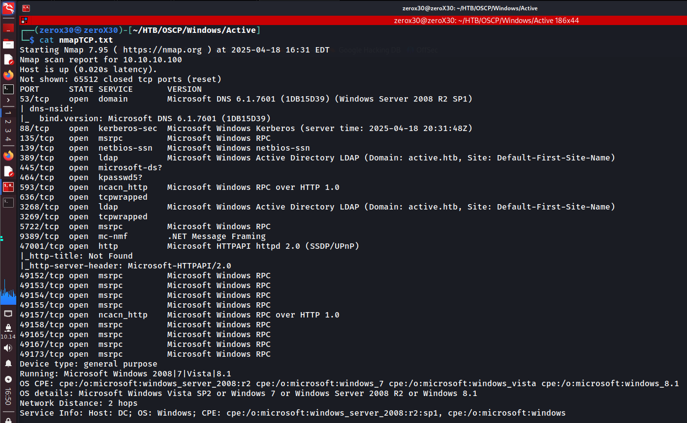

## Machine Information

- **Machine Name:** Active
- **Machine IP:** 10.10.10.100
- **Machine Diff:** Easy
- **Machine OS:** Windows

---

## Reconnaissance - Information gathering

The first and foremost thing we must do before hijacking a system, is to gather as much information as possible about that system. Information gathering is very crucial part regardless of what hat you wear as a hacker, because at the end it is the information that makes the exploit run.

> *"Information is the private key to the server, make sure to extract it""*

### Ports & Services Scan

Initially, we will begin with a port scanning technique, because we do not have a heap of information on this target and it is always a good start to know what ports are open and what services are running on the target system. It is like when you go to rob a palace with only its *address* then you would naturally look for *open doors* that will help you to get access within the palace.

**Command:**
- `sudo nmap -sVC -p- -O 10.10.10.100 -oG nmapActive`



**Output:**

```
Starting Nmap 7.95 ( [https://nmap.org](https://nmap.org) ) at 2025-04-18 16:31 EDT
Nmap scan report for 10.10.10.100
Host is up (0.020s latency).
Not shown: 65512 closed tcp ports (reset)
PORT      STATE SERVICE       VERSION
53/tcp    open  domain        Microsoft DNS 6.1.7601 (1DB15D39) (Windows Server 2008 R2 SP1)
| dns-nsid:
|_  bind.version: Microsoft DNS 6.1.7601 (1DB15D39)
88/tcp    open  kerberos-sec  Microsoft Windows Kerberos (server time: 2025-04-18 20:31:48Z)
135/tcp   open  msrpc         Microsoft Windows RPC
139/tcp   open  netbios-ssn   Microsoft Windows netbios-ssn
389/tcp   open  ldap          Microsoft Windows Active Directory LDAP (Domain: active.htb, Site: Default-First-Site-Name)
445/tcp   open  microsoft-ds?
464/tcp   open  kpasswd5?
593/tcp   open  ncacn_http    Microsoft Windows RPC over HTTP 1.0
636/tcp   open  tcpwrapped
3268/tcp  open  ldap          Microsoft Windows Active Directory LDAP (Domain: active.htb, Site: Default-First-Site-Name)
3269/tcp  open  tcpwrapped
5722/tcp  open  msrpc         Microsoft Windows RPC
9389/tcp  open  mc-nmf        .NET Message Framing
47001/tcp open  http          Microsoft HTTPAPI httpd 2.0 (SSDP/UPnP)
|_http-title: Not Found
|_http-server-header: Microsoft-HTTPAPI/2.0
49152/tcp open  msrpc         Microsoft Windows RPC
49153/tcp open  msrpc         Microsoft Windows RPC
49154/tcp open  msrpc         Microsoft Windows RPC
49155/tcp open  msrpc         Microsoft Windows RPC
49157/tcp open  ncacn_http    Microsoft Windows RPC over HTTP 1.0
49158/tcp open  msrpc         Microsoft Windows RPC
49165/tcp open  msrpc         Microsoft Windows RPC
49167/tcp open  msrpc         Microsoft Windows RPC
49173/tcp open  msrpc         Microsoft Windows RPC
Device type: general purpose
Running: Microsoft Windows 2008|7|Vista|8.1
OS CPE: cpe:/o:microsoft:windows_server_2008:r2 cpe:/o:microsoft:windows_7 cpe:/o:microsoft:windows_vista cpe:/o:microsoft:windows_8.1
OS details: Microsoft Windows Vista SP2 or Windows 7 or Windows Server 2008 R2 or Windows 8.1
Network Distance: 2 hops
Service Info: Host: DC; OS: Windows; CPE: cpe:/o:microsoft:windows_server_2008:r2:sp1, cpe:/o:microsoft:windows
Host script results:
| smb2-time:
|   date: 2025-04-18T20:32:46
|_  start_date: 2025-04-16T22:45:19
| smb2-security-mode:
|   2:1:0:
|_    Message signing enabled and required
|_clock-skew: 1s
OS and Service detection performed. Please report any incorrect results at [https://nmap.org/submit/](https://nmap.org/submit/) .
Nmap done: 1 IP address (1 host up) scanned in 109.95 seconds
```

### DNS Recon

Before enumerating known services like smb, ldap, and kerberos we will first enumerate DNS. We do not find a lot of information here, but it is always a good practice to enumerate things. I will be using some utilities like `nslookup` and `dnsrecon` for this task, you can use your preferred tools.

**Commands:**

```
$ nslookup
> server 10.10.10.100
> 10.10.10.100
> host -l active.htb 10.10.10.100
```

```
$ dnsrecon -d active.htb
$ dnsrecon -d 10.10.10.100
$ whois 10.10.10.100
```


We failed to receive anything out of DNS, and I also regretted why I did that. Nevertheless, we gathered some information through `whois` command and it might be useful in future so let's keep that in mind.

***Note: While writing this, I realised that at this point I had not written active.htb in /etc/hosts file. I am still not confirmed, but if you are doing this then make sure to add that first. Hehe! Dumb me***

### SMB Recon

Aftering getting nothing out of DNS, the obvious step was to do some SMB reconnaissance, and there are many tools for that but currently I will be using `smbmap` because it has a nice flowery output. 

```
Tools you can use for this step:
~$ smbmap
~$ smbclient
~$ crackmapexec smb
```

**Command:**
- `smbmap -H 10.10.10.100`


Well Done! We have one share with read-only permission. I do not know what Replication shares are used for, but looking at the name it feels like we are doing something with domain replication? Anyways, atleast we now have something more to look for so we will directly focus on this share and look for any suspicious thing.

Do remember, that these tools by-default use anonymous credentials so if you see a read-only permission that means you do not need any credentials to view that (until and unless you mention certain creds).

## Initial Foothold - let me in!

It is time we direct our action towards getting our initial foothold on the system, because we have enough information to start with. I know we still are left to scan ldap and other services, but if you find something interesting in one service then it is better to start finding a way through it, because that will save a lot of time.

### SMB access

We did found a Replication share with read-only permission, and I explored the share for a while through which I found something really interesting. I will suggest look the entire share by yourself and use google to search things, you will soon land on a very useful information.

```
Tools you can use for this step:
~$ smbclient
~$ crackmapexec
```

**Command:**
- `smbclient //10.10.10.100/Replication -N`

`-N` option will tell `smbclient` to not use any credentials.


So by using `smbclient`, we were successfully able to log into Replication share using anonymous credentials. Then I did some digging and found a file named `Groups.xml`. This file was the only one which was human-readable that I found so I searched it on google.


I referred to these two sites, and on one of the official Microsoft site I saw they have published the AES key by which the password are encrypted. Now you might say what is `Groups.xml`? It is a file that stores groups information and it is known to stores AES encrypted passwords also of users but for some reason Microsoft has released this AES key and now we can decrypt any password we find in that file.

### Cracking the password - let me in, please

**Command:**
- `gpp-decrypt "HASH"`


I extracted that file to my local system and when I read it, I found the following information:
1. Username - `SVC_TGS`
2. Password - `edBSH...` (not gonna type that)
3. Plaintext Pass - `GPPstillStandingStrong2k18` (If you decrypt the password)

I used `gpp-decrypt` tool to decrypt this password, because the AES key is already published so it is easy to get the plaintext password.

### User flag - got access

Now it is time to login through SMB by using those credentials, and to see if we can get access to any particular shares or get more information. Or next, we would try winrm using this credentials for getting a shell.

**Commands:**
- `smbmap -H 10.10.10.100 -u 'SVC_TGS' -p 'GPPstillStandingStrong2k18'`
- `smbclient -W active-htb //10.10.10.100/Users -U SVC_TGS --password GPPstillStandingStrong2k18`


I scanned for possible shares that I can view using that credentials and found `Users` share which looked interesting. If you dig down a bit then you will find SVC_TGS user's directory where you will find `user.txt`.

## Privilege Escalation - get the root!

This is the final step of our machine, where we will try to access to `root` or `administrator` user. There are many ways to elevate your privileges on a domain through TGT, TGS, or abusing kerberos but we will be using one method that worked for me.

### Kerberoasting - Roast the kerberos

Kerberoasting is a post-exploitation attack technique used against Microsoft Active Directory environments. It allows an attacker to extract service account credentials (especially those with high privileges) by abusing the Kerberos authentication protocol.

#### How Kerberoasting works

1. **Attacker gets a TGT:** After compromising a normal user account, the attacker authenticates and gets a valid TGT from the Domain Controller.
2. **Attacker requests service tickets (TGS) for SPNs:** The attacker requests TGS tickets for services with Service Principal Names (SPNs), which often run under service accounts. These TGS tickets are encrypted with NTLM hash of service account's password.
3. **TGS tickets are saved locally:** The attacker extracts the TGS ticket from memory or disk (using Rubeus, impacket, or GetUserSPNs.py)
4. **Offline password cracking:** Since the ticket is encrypted with the service account's password hash, the attacker can brute-force the hash offline to recover the password.

#### Basic Steps are:
1. Identify an account with SPN
2. Request a kerberos service ticket (TGS) for that user
3. Decrypt the received ticket

**Commands:**
- `impacket-GetUserSPNs active.htb/SVC_TGS:GPPstillStandingStrong2k18 -dc-ip 10.10.10.100`
- `impacket-GetUserSPNs active.htb/SVC_TGS:GPPstillStandingStrong2k18 -request-user Administrator -dc-ip 10.10.10.100`


Here we found Administrator account with SPN and we were successfully able to receive an encrypted TGS for Administrator user. I copied the hash and kept in a file for further decryption process.

### Cracking TGS - John is best!

We have locally saved the hash in our system and now we will try to crack it with dictionary attack, and for wordlist we will initially begin with the well-known rockyou.txt wordlist. 

> *"It was the year 2009, when the well-known rockyou was breached and it was found that it stored credentials in plaintext, whom can we trust?"*

**Command:**
- `john --format=krb5tgs --wordlist=/usr/share/wordlists/rockyou.txt spnAdminKer.txt`
- `smbclient -W active-htb //10.10.10.100/Users -U Administrator --password Ticketmaster1968`


I was able to crack the hash password and get the plaintext password which was `Ticketmaster1968` and then I used those credentials to get root.txt through SMB.

## Conclusion - lesson learned

The **"Active"** machine on HTB highlights several real-world misconfigurations and vulnerabilities commonly found in Windows Active Directory environments. Throughout the exploitation process, we leveraged:

1. **Insecure SMB shares** - Allowing anonymous access to file shares can expose sensitive configuration files to unauthenticated users. In our case, we were able to retrieve a `Groups.xml` file without credentials.
2. **Group Policy Preferences (GPP) password disclosure** - The `Groups.xml` file contained an encrypted password set via Group Policy Preferences. Although this feature was deprecated, the AES encryption key used to secure the password was publicly disclosed by Microsoft, allowing us to decrypt the password with tools like `gpp-decrypt`
3. **Kerberoasting** - With a valid domain user account, we requested Kerberos TGS for accounts with Service Principal Names (SPNs). These tickets, encrypted with the NTLM hash of the service account's password, were extracted and cracked offline, ultimately leading to privilege escalation.

### Lesson Learned & Mitigations

- **Disable anonymous access** to sensitive shares unless explicitly required, and tightly control permissions to prevent data leakage.
- **Avoid using Group Policy Preferences** to store credentials. Microsoft has long deprecated this method, and its use remains a critical security risk.
- **Use complex, non-reusable passwords** for all service accounts, especially those associated with SPNs. Prefer Group Managed Service Accounts (gMSAs) which rotate passwords automatically.
- **Monitor and limit Kerberos ticket requests,** and implement detection rules for unusual TGS-REQ activity.
- **Regularly audit AD permissions, shares, and GPOs** to identify and remediate weak configurations.

This machine serves as a reminder of how layered weaknesses - even without remote code execution - can be chained together to compromise a domain. If you liked my writeup and want to learn more, do consider joining my socials:

- [DISCORD](https://discord.gg/wyfwSxn3YB)
- [INSTAGRAM](https://www.instagram.com/_0x30_/#)


