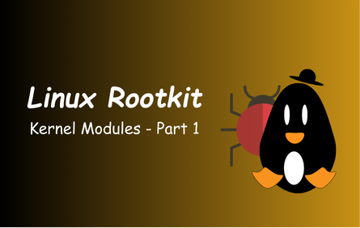
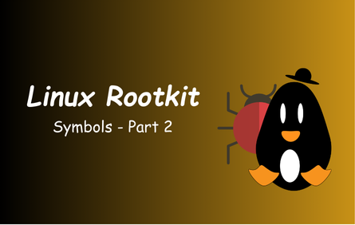

## Malwares

A collection of notes towards learning how to develop and analysis particular types of malwares by ***Z3R0***.

| [Linux-Rootkit: Kernel-Modules-1](Linux-rootkit-kernel-modules-1.md) | [Linux-Rootkit-Symbols-2](Linux-rootkit-symbols-2.md) |
| -------------------------------------------------------------------- | ----------------------------------------------------- |
|                                                  |                                   |

