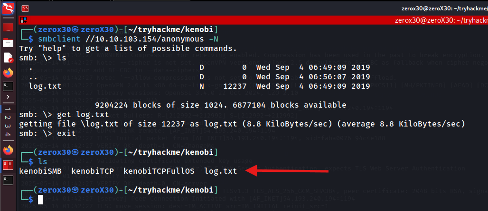

## Machine Information

**Machine Name:** Kenobi
**Machine OS:** Linux

## Reconnaissance - Information gathering

This stage is very crucial regardless of what type of hacking you are doing, because in this step we gather as much information as possible about the target. Information is the foundation of all hacks, and without information no hack is possible.

>*"Performing a small attack? - gather information, performing a huge attack? - gather information"*

### Ports and Services Scan

**Command:**
- `sudo nmap -sT [IP] -oG kenobiTCP`
- `grep "Ports:" kenobiTCP | sed -n 's/.*Ports: //p' | tr ', ' '\n' | grep "/open" | cut -d '/' -f1 | paste -sd,`

In this step, I perform a normal TCP SYN scan through the system and find open ports, simultaneously it saves to a greppable file. I then extract all port numbers from the greppable file.

**Command:**
- `sudo nmap -sVC -p [list of ports] -O [IP] -oG kenobiTCPFullOs`

Last step of ports scan include me scanning through all the found open ports and find their version information, executing default NSE scripts on them and performing an OS detection scan. Looking at the scan, I can feel that ProFTPd is vulnerable, Samba might be useful, rpcbind might be useful, and like always OpenSSH is not vulnerable or useful to us for initial exploitation.

### SMB Enumeration

Samba is an open-source suite that implements the Server Message Block (SMB) protocol, enabling file and print sharing between Linux/Unix systems and Windows clients. We can utilize this to access available shares and find more information before initial attack. We will achieve this by doing SMB enumeration.

**Command:**
- `sudo nmap -p445 --script=smb-enum-shares.nse,smb-enum-users.nse [IP] -oG kenobiSMB`

Using the above command, I looked for available shares and users that were configured on the given IP address. IPC is a default share, but **anonymous** share is different and probably it is hiding something suspicious. Unfortunately, we do not have access to look under print share.

**Command:**
- `smbclient //IP/anonymous -N`

I was successfully able to access the anonymous share with no password and there I found a file named `log.txt` which contained many information, but one information that was useful to me was the location of SSH private key stored on the system. This is important because I know a vulnerability in ProFTPd which can help me get this private key and I can use it to get my initial access.
### NFS Enumeration

NFS stands for "Network File Sharing" and you might have probably guessed what it can do. In case you are living under a rock, let me introduce it to you. It is used in sharing files between systems through a network.

**Command:**
- `sudo nmap -p111 --script=nfs-* [IP] -oG kenobiNFS`

Using the above command, I scanned all the NSE scripts for NFS on port 111 of the target system, and this gave me one particular directory in the target system that we can mount and access it.

## Initial Access - Opensezme!

In this stage, we will try to get our normal user level access by exploiting the known vulnerabilities, and if we got lucky then we will also find the user flag here. This stage involves, finding vulnerabilities, building weapons and exploiting the system.

**Command:**
- `searchsploit ProFTP 1.3.5`
- `git clone https://github.com/Z3R0-0x30/CVE-2015-3306.git`

Previously, I mentioned that ProFTPd looks vulnerable and I was correct. This specific version of ProFTPd has a vulnerability in `mod_copy` attribute due to which an unauthenticated user can copy a particular file to another location within the system. By using searchsploit I was able to find the exploit, but it was not useful for us because it is using web server file upload technique and executing a shell, but here we will be copying SSH private key and copy it in `/var/tmp/` and then we will mount it to our system.

To do this task, I wrote my own exploit which you can find in this github repository:
- [CVE-2015-3306 ProFTP Exploit](https://github.com/Z3R0-0x30/CVE-2015-3306)

**Command:**
- `python3 Z3R0_ProFTPexploit.py [IP] [private key SSH location] /var/tmp/id_rsa`

This exploit will use vulnerability in `mod_copy` attribute of ProFTP 1.3.5 and will copy the id_rsa file to /var/tmp/id_rsa. It will then mount /var to /mnt/testdir/ in your local system and by doing that now you can access the private key and use it for further access.

I was able to access `kenobi` user using SSH private key, and lastly we do found the user flag. In this stage you can refer to my exploit and build your own or you can use mine for this TryHackMe machine.

## Privilege Escalation - gimme root!

This stage is fun for all hackers, because we are tired of using normal users and now we are hungry for the root privilege. Imagine, that you hacked a system and were also able to become GOD of that system, how terrifying will that look. 

>*"If you wanna hack a system, why not go for the root"*

### Finding the flaw

The first step to get a root access in a linux/unix target is to look for binaries with SUID bit on, because mostly you will find a way in using those vulnerable binaries. SUID bit is a special permission that allows any user to run that binary as root, and we can utilize this if there are any vulnerable binaries available on the system.

As per the official THM walkthrough, they demonstrate an attack with `/usr/bin/menu` binary, but during my research I found another binary which might give us root shell. 

**Command:**
- `git clone https://github.com/Z3R0-0x30/CVE-2021-4034.git`
- `cd CVE-2021-4034`
- `scp -i [private key of SSH] Z3R0_polkitLPE.sh kenobi@[IP]:/home/kenobi/`

Well, I am very fond of building my own exploits so once again I have an exploit that is build by me for this vulnerability. It is a single-file, and most of the exploits that are available on the Internet uses multiple files, so to make it simpler I just made one file exploit. Definitely you can use it to understand it and make your own exploit, which I totally love, but you can also use my exploit for this particular privilege escalation. For now (14-05-2025), I have not seen any one exploit or writeup for this privilege escalation method and this was the main motivation for me to write this writeup.

I transfer the exploit to our target system using scp command, and then simply executed it to get a root shell. Lastly, I was able to achieve the root flag. You can find my exploits below, and use it wisely. If you misuse it, then you are solely responsible for that damage.

## My Exploits

In this lab, I have used two exploits that were build by me and they are totally unique to this lab. I really love writing my own exploits and teaching people how they worked, and you will find my exploits to be much more simpler. So, let's dive to know how they work....

### CVE-2015-3306 - ProFTP mod_copy
**CVE-2015-3306** is a critical vulnerability in **ProFTPd 1.3.5** that was discovered in 2015. ProFTPd is a widely used open-source FTP server, and this particular vulnerability arises from a **buffer overflow** in the way the server handles incoming FTP commands, specifically the `SIZE` command. Buffer overflows occur when more data is written to a buffer than it can handle, leading to memory corruption, which can be exploited to execute arbitrary code.

#### Exploit Mechanism:
1. **FTP Protocol and the `SIZE` Command:**
	The `SIZE` command in FTP is used to request the size of a file stored on the FTP server. It is generally a benign command used for querying the size of files.
2. **Buffer Overflow Vulnerability:**
	In the affected version of ProFTPd, the server fails to properly validate input when processing the `SIZE` command. Specifically, the vulnerability arises from how user-supplied input (the filename passed with `SIZE` command) is handled by the server. If an attacker sends a specially crafted `SIZE` command with a filename that exceeds the expected length, the buffer allocated to store that file can overflow.
3. **Copy file without permission:**
	An attacker can exploit the `SIZE CPFR` and `SIZE CPTO` commands to copy files, even if they don't have normal write permissions.

### CVE-2021-4034 - Pwnkit Local Privilege Escalation
**CVE-2021-4034**, also known as **PwnKit**, is a **local privilege escalation (LPE)** vulnerability discovered in the **Polkit (formerly PolicyKit)** package. This vulnerability allows a low-privileged user to execute arbitrary code with **root privileges,** potentially compromising an entire system. Polkit is a component that provides an interface for controlling system-wide privileges and is commonly used in Linux distributions.
The vulnerability exists in the **pkexec** binary, a setuid program that is part of Polkit. PwnKit is particularly concerning because it is an **elevation of privilege** flaw, meaning that an attacker doesn't need to already have root access - just a local user account with local privileges.

#### Exploit Mechanism:
1. **The Role of Polkit and pkexec:**
	- **PolKit** is a framework used to define and control the privileges of various actions in a Linux system, often related to system configuration or administrative tasks.
	- `pkexec` is a command-line tool that allows a user to execute a command as another user, typically root, provided the user has the necessary permissions. In many Linux systems, `pkexec` is set with **setuid** permissions, which means it runs with the effective user ID of the file's owner (usually root), regardless of the calling user's ID.
2. **The vulnerability:**
	The core of the vulnerability lies in how `pkexec` processes environment variables, specifically the `PATH` variable.
	- When `pkexec` is invoked, it does not properly sanitize certain environment variables before executing the command. This flaw allows a local attacker to craft a malicious environment that can be exploited to execute arbitrary code with **root privileges.**
	- The `pkexec` program, in certain conditions, fails to handle the **environment variables (especially `LD_LIBRARY_PATH`)** correctly. By exploiting this, an attacker can inject a specially crafted library or executable into the environment, leading to arbitrary code execution.

Warm, Regards
*Z3R0*